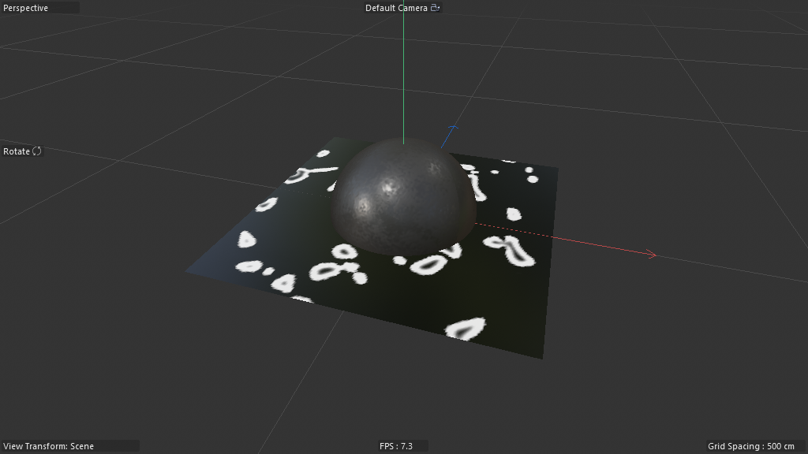
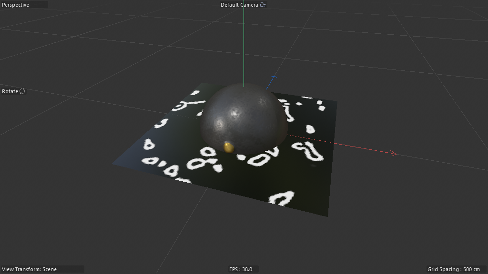
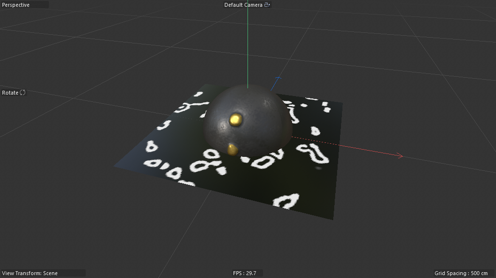
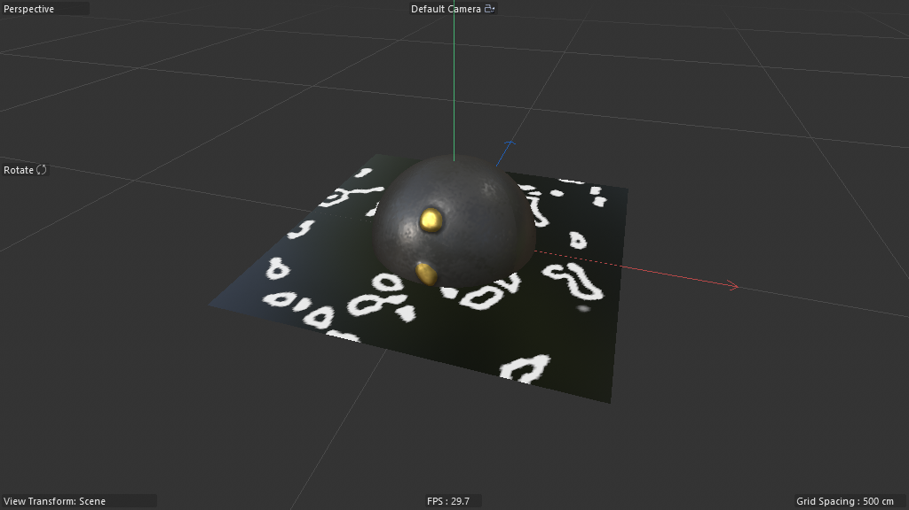
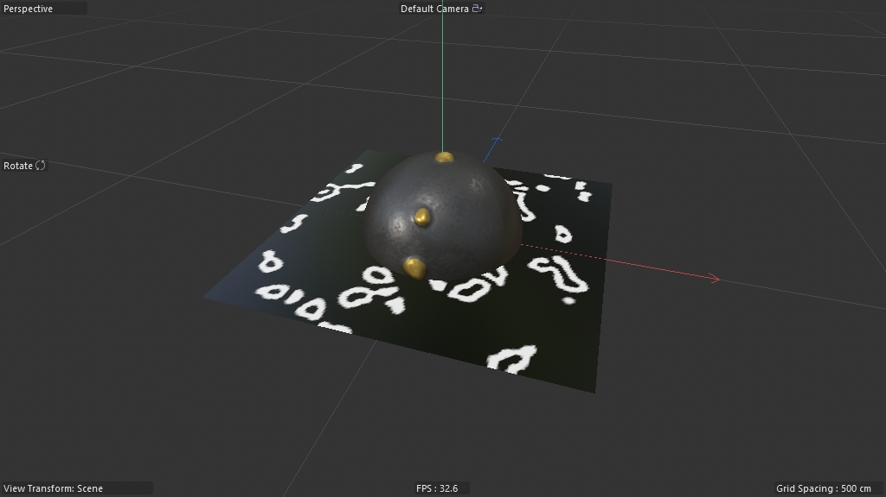

# Scene Study — Reaction Diffusion (Gray-Scott on a Mesh)

**Source:** `DRuckli/Reaction_Diffusion_Tut-Files_01/Reaction_Diffusion_Tut-Files_01.c4d`
**Studied:** 2026-05-01
**Methodology:** validated 8-step (load fresh → annotations → frame sweep → AM-param probe → predict-then-observe → dataflow trace → architectural decomposition → record/study).

## What this scene does

Runs a Gray-Scott reaction-diffusion (RD) simulation directly on a polygonal
mesh's vertices. Two coupled chemicals (one fed, one decayed) interact with
neighbor-mediated diffusion until self-organizing patterns emerge — the
classic Turing-pattern blobs/spots/labyrinths. Output is two-fold:

1. A **vertex map** painted on the mesh tracking per-vertex chemical
   concentration (visible as the white-on-black blobby patterns).
2. An optional **displacement along normal** driven by the chemical
   value (the yellow horn-bumps growing out of the Sphere by frame 600).

Two parallel setups in the scene:

- **Advanced** — Sphere host + 91-node Neutron graph, exposes 18 sliders
- **Simple** — Plane host + 33-node Neutron graph, exposes 4 sliders

The simple setup is the pedagogical core; the advanced setup adds
exposure-mapping, displacement profiling, and post-blur.

## Critical discovery — Neutron nodespace

This scene's hosts (type `180420500`, "Scene Nodes Generator") use
**`net.maxon.neutron.nodespace`**, not `net.maxon.nodespace.scene`. This is
a different graph engine from the Nodes Mesh (180420600) seen in scene 02.
The visual node language is similar but the Python access path is:

```python
nbr = host.GetNimbusRef("net.maxon.neutron.nodespace")
ng = nbr.GetGraph(maxon.NODE_KIND.NODE)
root = ng.GetViewRoot()
```

**This is gotcha #56 worth committing to the API doc.**

## Object tree

```
========= Adavanced Setup ==========  (Null)
  Reaction_Diffusion          (180420500 — Scene Nodes Generator, 91 graph nodes)
  Null
    Cube                      (input — apparently unused)
    Sphere                    (input — fed via legacyobjectaccess "Sphere")
  Random Field exp            (440000281 — drives "exposure" injection)
  Random Field Neighbors      (440000281 — randomizes neighbor selection)
========= Simple Setup ==========  (Null)
  Reaction_Diffusion_Simple   (180420500, 33 graph nodes)
  Plane Simple                (5168 — input)
  Random Field Chemical       (440000281 — injects chemical via vertex selection)
```

The Random Fields are doc-level **C4D Field objects** (not Scene Nodes
nodes). The graph reads them via `getvertexselectiondata` ("Points Info"),
which surfaces vertex selection data populated by the Field tag on the
input geometry.

## Frame evolution (default settings)

| Frame | Image |
|---|---|
| 0   |  |
| 30  |  |
| 60  |  |
| 120 |  |
| 300 |  |
| 600 |  |

**What you see:**

- The **Plane** carries the simple-setup's vertex map. At f0 it has
  scattered white spots (initial chemical seed). By f600 those spots have
  reaction-diffused into characteristic blob/island patterns.
- The **Sphere** carries the advanced-setup's output. At f0 it's plain
  grey. By f600 it has 3 yellow displacement horns growing where the
  chemical concentration crossed the displacement threshold.

The pattern continues to evolve indefinitely if you scrub past f600.

## The 18 AM-exposed sliders (Advanced host)

Discovered via `effectivename` on each `floatingio` graph node:

| # | Name | Role |
|---|---|---|
| 1 | Activate Post Blur | toggle — gates the post-blur pass |
| 2 | Activate Displacement | toggle — gates normal-displacement output |
| 3 | Add new Chemical | scalar — chemical injection rate from Random Field |
| 4 | Blur Amount 1 | scalar — primary diffusion blur strength |
| 5 | Blur Amount 2 | scalar — secondary diffusion blur strength |
| 6 | Post Blur Amount | scalar — additional smoothing on output |
| 7 | Neighbors Count | int — neighbors used for diffusion stencil |
| 8 | Neighbors Min | int — clamp for sparse meshes |
| 9 | Neighbors Max | int — clamp for dense meshes |
| 10 | Maximum Distance | float — radius cutoff for neighbor lookup |
| 11 | Exposure Strength (×2) | scalar — exposure curve gain |
| 12 | Exposure Min | scalar — exposure curve floor |
| 13 | Exposure Max | scalar — exposure curve ceiling |
| 14 | Exposure Lift | scalar — exposure curve offset |
| 15 | Chemical | scalar — current chemical reservoir |
| 16 | Displacement Profil | spline — curve shaping displacement vs concentration |
| 17 | Displacement Height | scalar — displacement amplitude |

The Simple host exposes only 4: **Blur Amount 1**, **Blur Amount 2**,
**Neighbors Max**, **Exopure Strength** (sic — likely "Exposure Strength").

## Architectural decomposition

The graph is organized into **7 named scaffold groups** in the Advanced
version (scaffold nodes carry `effectivename` labels acting as
graph-internal section dividers):

1. **Get Chemical** — reads previous-frame chemical concentration from Memory
2. **Get Neighbors** — computes vertex neighborhood via Closest Points
3. **Get Exposure** — reads Random Field exp values
4. **Calculate Displacement Amount** — maps chemical → displacement scalar
5. **Assemble Arrays** — accumulates per-vertex results into output arrays
6. **Post Blur Chemical** — optional smoothing pass
7. **Displace along Normal Direction** — applies displacement to vertex positions

### The core idea node — `memory@`

The **Memory** primitive (named "Difussion Solver" in the graph) IS the
feedback-loop mechanism. Wire trace on the Simple host:

```
INPUTS to Memory:
  Blur Amount 1     ← floatingio: Blur Amount 1
  Blur Amount 2     ← floatingio: Blur Amount 2
  Neighbors Array   ← Group._0 (computed from Closest Points + Iterate Collection)
  Exopure Strength  ← floatingio: Exopure Strength
  Chemical Array    ← Group._0  ← Wire Rerouter ← initial seed
  Chemical Array    ← Group._0  ← previous-frame Memory output  ⟵ THE FEEDBACK
OUTPUTS from Memory:
  Output            → Group.dependency
  Output            → Group._0 (next-frame data carrier)
  Chemical Array    → Difussion Solver._0  ⟵ MEMORY FEEDS ITSELF
  Chemical Array    → Group._0
  Chemical Array    → Collect React.out (to vertex map)
```

**Critical insight:** `memory.<port>._0` self-binding is the canonical
"persist this value across frames" idiom in Neutron. It's analogous to a
Loop Carried Value but at the per-frame timestep level rather than
per-iteration. Combined with the explicit `loopcarriedvalue` ("Blur React
value") in the Advanced graph, the scene has TWO levels of state:

- per-frame: the Memory primitive (feedback in time)
- per-iteration-within-a-frame: the LCV (feedback in space — for the blur kernel)

### The Laplacian — `nearestneighbor@`

The **Closest Points** node provides the neighborhood lookup that
implements the discrete Laplacian:

```
INPUTS:
  Geometry          ← input mesh (the Sphere/Plane)
  Query Position    ← Iterate Collection.out (per-vertex iteration)
  Maximum Neighbors ← floatingio: Neighbors Max
OUTPUTS:
  Nearest Indices   → array of neighbor vertex IDs
  Distances         → per-neighbor distance (for distance-weighted blur)
```

For each vertex (driven by `containeriteration` "Iterate Collection"),
look up its K nearest neighbors. Sum/average their chemical values to
get the local Laplacian. That feeds into the reaction step.

### The OM bridge — `legacyobjectaccess@`

The **Sphere** legacyobjectaccess node is the OM→graph bridge. Note: in
the Simple host, the legacyobjectaccess is also named "Sphere" (likely a
copy-paste leftover) but its `Object` input is wired to the host's
root.in which receives "Plane Simple" from the OM. Lots of output ports
because legacyobjectaccess exposes EVERY classic-object property
(Position/Rotation/Scale/Visibility/etc.) but only the geometry-relevant
ones (`Op`, `Point Array`, `Local Matrix`) are wired in this scene.

### Output emission — `geometry@`

The **Geometry Op** node is the canonical output sink in Neutron (the
analogue of `set_property`+`root.geometryout` in scene 02's nodespace):

```
INPUT:
  Geometry  ← Set Vertex Map.geometryout
OUTPUT:
  Op        → Geometry Op.input  (the host's geometry output port)
```

So the final wire is: `Set Vertex Map → Geometry Op → host geometry`.

## What's clever about this topology

1. **Memory primitive as PDE state**. The Gray-Scott PDE requires
   carrying `u(x,t)` and `v(x,t)` from frame to frame. Memory's
   `chemicalarray._0 → memory.chemicalarray.in` self-loop does exactly
   this — without any explicit time integration loop. The graph
   evaluates once per frame and the Memory contents persist. **This is
   the highest-leverage pattern in the scene.**

2. **Random Field as initial-condition seeder**. RD needs a noisy
   initial condition or it stays uniform forever. The C4D Field object
   (a doc-level `mograph.FieldObject`) paints a vertex selection on the
   mesh; `getvertexselectiondata` reads it as a scalar field. The
   `floatingio` "Add new Chemical" gates how much of that random seed
   is injected per frame.

3. **K-nearest-neighbor Laplacian** instead of mesh-edge Laplacian. The
   classical Gray-Scott on a regular grid uses 4- or 8-neighbor
   stencils. On an irregular polygonal mesh you'd normally use the
   adjacency graph (incident edges), but **the scene cheats elegantly**
   by using `nearestneighbor` (KD-tree-style spatial query) with
   `Maximum Distance` cutoff. This is robust to mesh quality — works
   on any point cloud, not just well-conditioned meshes — and tunable
   via `Neighbors Min/Max/Count` for sparse vs dense input.

4. **Exposure curve** (Advanced only). The `maprange` + `arithmetic`
   exposure section maps raw chemical concentration through a gain/
   floor/ceiling/lift curve before writing to the vertex map. This is
   tone-mapping for a PDE — lets the artist choose where in the
   concentration range the visible "edges" appear.

5. **Spline-curve-driven displacement profile**. The advanced graph
   includes a `spline@` node ("Bevel Profil") consumed by the
   displacement step. The artist can author an arbitrary curve (in the
   Spline Editor) shaping how chemical → displacement: linear, easeIn/
   easeOut, S-curves, plateau, etc. **This is the "make any PDE artist-
   tunable" trick.**

6. **Conditional gates** — two `if@` nodes ("If Post Blur",
   "If Displacement") let the user toggle whole sections on/off via
   floatingio booleans. This is the canonical "make heavy passes
   optional" pattern.

## Scaffolding (skip when recreating)

- 7 `scaffold` nodes — they carry section labels but contribute no
  geometry/data themselves. Pure organization.
- 18 `reroute` nodes — wire-routing only, no semantics.
- `multransform_5 / combine / mat / sqrpart / sqrtrans / vectrans` —
  Neutron root-template internals (auto-managed).
- `context_externaltimeinput / context_notime / builder` — framework
  scaffolding for the Neutron host.

## Pattern tags

`feedback_loop`, `simulation_bridge`, `point_stream_iteration`,
`parameter_exposure`, `legacy_object_bridge`, `noise_driven`,
`spline_pipeline`, `field_weighting`, `array_processing`, `time_animation`

## What I'd need to know to recreate this from scratch

| Capability | Have? |
|---|---|
| Create Scene Nodes Generator (180420500, Neutron nodespace) | ⚠️ — different from 180420600. cinema4d-mcp `add_node` may need a separate path. |
| Create `memory` node and wire its self-feedback (`out._0 → in._0`) | ❌ — not in any current recipe. NEW PRIMITIVE. |
| Create `nearestneighbor` with K-neighbor + max-distance | ✅ — should be straightforward via add_node. |
| Wire `containeriteration` per-vertex over input geometry's points | ✅ — pattern from scene 02. |
| Synthesize 18 typed AM ports (mostly Float, 2 Bool toggles, 1 Spline) | ✅ for Float/Int/Bool. ❌ for Spline-typed param. |
| Create C4D Field object at doc level + bind to vertex selection on input mesh | ✅ — doc-level Field creation is supported. The bind via FieldList tag is custom but doable. |
| `getvertexselectiondata` to read vertex selection inside graph | ❌ — not yet documented. NEW PRIMITIVE. |
| Read Random Field's contributions as a per-vertex scalar field | ✅ if vertex selection bridge works. |

**Recreation difficulty: Hard.** The Memory primitive's self-feedback
binding pattern is the keystone — once that's mapped to a recipe,
everything else is sliders + standard nodes. The `getvertexselectiondata`
+ Field-object bridge is a separate research lane.

## Lessons for cinema4d-mcp

1. **Type 180420500 ≠ 180420600.** The "Scene Nodes Generator" is the
   modern Neutron-engine variant; "Nodes Mesh simple" is the older
   nodespace. They share UI but have separate Python access paths.
   Update the dissect_capsule helper to detect both.

2. **`memory@` is THE feedback-loop primitive.** Any scene doing
   per-frame state retention (cellular automata, PDEs, growth
   simulations, particle accumulators) will use it. Worth a dedicated
   recipe: `R7_memory_feedback`.

3. **`nearestneighbor@` + `containeriteration@` is the canonical
   per-vertex spatial-query pattern.** The Gray-Scott Laplacian here
   is just one application; the same pattern serves
   field-from-points-cloud, mesh smoothing, custom blur kernels, etc.
   Worth recipe `R8_per_vertex_neighbor_query`.

4. **C4D Field objects bridge into Scene Nodes via vertex selection.**
   The Field paints selection data on the host's input geometry; the
   graph reads that selection via `getvertexselectiondata`. This is
   the documented C4D-Field-to-Neutron bridge — important for any
   scene that wants to drive a graph parameter from a Field's spatial
   falloff.

5. **Spline-typed AM sliders exist** (`Displacement Profil`). The
   floatingio for a Spline-typed port surfaces a Spline curve editor
   in the Attribute Manager. cinema4d-mcp doesn't synthesize
   Spline-typed AM ports yet — gap to fill.

## The minimal reproducible subgraph — the crown jewel

If I had to extract ONE recipe from this scene worth shipping in the
MCP knowledge layer, it would be:

### `R7_memory_feedback_pde_solver`

**Purpose:** Run any per-vertex PDE (reaction-diffusion, heat equation,
Cahn-Hilliard, etc.) on a polygonal mesh with K-nearest-neighbor
diffusion stencil, animated frame-by-frame via the `memory@` primitive.

**Node count:** ~9 (the irreducible core)

**Nodes:**

```
1. legacyobjectaccess  (OM→graph bridge for input mesh)
2. geometrypoints      (extract point array)
3. containeriteration  (per-vertex iterator)
4. nearestneighbor     (K-NN per vertex — the Laplacian stencil)
5. memory              (per-vertex chemical state, self-fed via .out._0 → .in._0)
6. arithmetic          (the reaction-step math: u' = u + dt*(D*Laplacian + f(u,v)))
7. set                 (write per-vertex result to vertex map)
8. geometry            (output sink)
9. → root.geometry_input
```

**Exposed AM params (minimum):**

- `Diffusion Rate` (Float) — D coefficient
- `Reaction Rate` (Float) — k in f(u,v)
- `Neighbor Count` (Int) — K in K-NN

**Why it's a great recipe:**

- Maps directly to a textbook discrete-PDE formulation that CS/physics
  users already know.
- Memory's self-feedback is the ONE primitive that lets a graph carry
  state across frames in Neutron. Recipe demonstrates the pattern in
  isolation.
- Generalizes far beyond Gray-Scott: same skeleton runs heat equation,
  cellular automata, custom paint-spread, voxel-style propagation.
- Tiny graph (9 nodes) for a massive capability gain.

**Candidate for: `data/recipes/r7_memory_feedback_pde.json` after the
scene_nodes_synthesize_port handler gains Spline-type support.**
