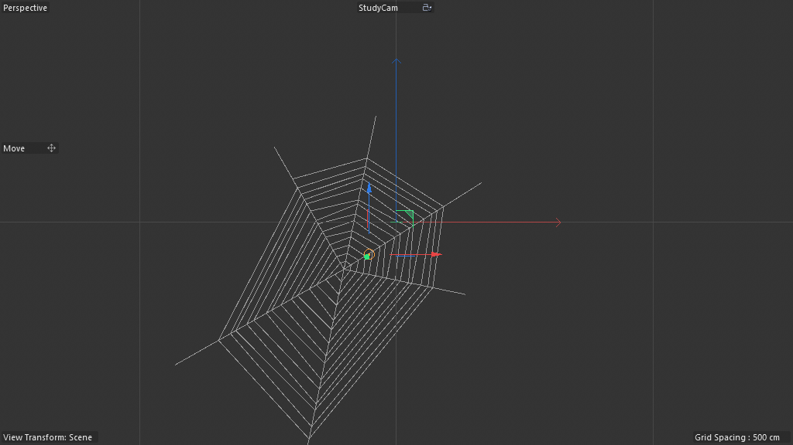

# Scene Study — Spiderweb (Generative Multi-Segment Spline)

**Source:** `DRuckli/Spiderweb_Tuturial-Files_01/Spiderweb_Tutorial_01.c4d`
**Studied:** 2026-05-01
**Methodology:** validated 8-step (no time-stepping needed — static).

## What this scene does

Generates a procedural spider web spline from N anchor points read from
the children of an OM Null. The web has the canonical structure:

- N **radial threads** from each anchor to the center
- A **spiral thread** wrapping concentric rings between the radials
- **Per-segment jitter** for organic look

All packed into a single multi-segment spline output via the
`assembler@` (Assemble Spline) node.



## Object tree

```
Nodes Spline           (180420700 — Scene Nodes Generator / Neutron, 42 graph nodes)
  Spline               (5101 — boundary spline, possibly visual reference)
  Center Point         (5140 — center anchor null)
```

The Nodes Spline reads "Children" of an externally-bound Null
(presumably a parent of Center Point or similar) for the radial-anchor
positions. Since this scene uses `legacyobjectaccess` named "Null" and a
`children@` "Children Op" reading from it, the workflow is:

1. User points the host's "Null Obj" parameter at any OM Null
2. That Null's children become the boundary anchors
3. The web is procedurally re-built whenever anchor positions change

## Critical gotcha — plugin ID alone is NOT enough to know the nodespace

This scene's host is type `180420700` ("Nodes Spline") but uses
`net.maxon.neutron.nodespace`, **not** `net.maxon.nodespace.scene` as
gotcha #56's table suggested. The earlier scene-02 study saw a
180420700 host on the older nodespace. So:

**Plugin ID 180420700 can host EITHER nodespace. Always probe
`host.GetAllNimbusRefs()` before assuming.**

This updates gotcha #56 — the plugin-ID→nodespace table needs to be a
"common case" rather than authoritative. Updated language committed.

## AM-exposed parameters (root-direct, NO floatingio)

This scene uses the root-direct AM exposure pattern (no floatingio
wrappers). 9 named root inputs surfaced via `root.GetInputs()`:

| # | Name | Role |
|---|---|---|
| 1 | Op | output port (the spline) |
| 2 | Use Null Obj | toggle — use bound Null's children as anchors |
| 3 | Null Obj | OM-bound Null whose children are anchor positions |
| 4 | Loop Count | spiral ring count |
| 5 | Loop Start | start parameter for spiral (inner radius/angle) |
| 6 | Loop End | end parameter for spiral (outer radius/angle) |
| 7 | random | randomization seed for jitter |
| 8 | Children | overall children-count target |
| 9-17 | Input | 9 generic floating inputs |

The 9 generic "Input" entries are likely the per-section tunable
parameters consumed inside the 4 scaffold groups. Without floatingio
wrappers their AM names are generic, which is a UX trade-off.

## Architectural decomposition

The graph organizes into **4 named scaffold sections** (`scaffold@`
nodes carry semantic labels in Neutron):

1. **Spiral Thread** — generates the concentric ring spiral
2. **Single Thread calculation** — produces ONE straight thread between two anchors
3. **All Threads** — iterates over all anchor pairs to produce all radials
4. **Randomize** — applies jitter to thread points for organic look

### The `children@` node — OM iteration primitive

```
children(Children Op) inputs:
  Children  ←  Root.in@<hash>  (a numeric param? or selector?)
  Op        ←  Root.in@<hash>  (the bound Null OM object)

children(Children Op) outputs:
  Array     →  Group.children  (the array of child positions)
  Op        →  Children Op.input
```

`children@` is the canonical "enumerate OM children" primitive. Given
an OM-bound parent, output an Array of child positions/objects. This
replaces the more common pattern of multiple `legacyobjectaccess` for
each child — cleaner for variable-count anchor counts.

### The `assembler@` node — final spline assembly

```
assembler(Assemble Spline) inputs:
  Segments  ←  Append Elements.arrayout  (topology — segment counts)
  Points    ←  Concatenate.arrayout      (concatenated point positions)
outputs:
  Geometry  →  Bezier Spline Assembler.geometryout  (root template)
```

`assembler@` is THE multi-segment spline output primitive. You provide
two parallel arrays:
- **Points**: a flat list of all points in all segments
- **Segments**: a parallel list of segment-counts (e.g. `[20, 20, 20, 50]`
  meaning 4 segments with 20/20/20/50 points each)

The Assembler then computes the topology — which points form which
spline segment. Output is wired into the root template's
`Bezier Spline Assembler.geometryout` for emission.

**This is `R12_multi_segment_spline_assembler` — the canonical
Nodes-Spline output recipe.**

### The 3 `append@` nodes — building points + segments

| Append # | Role | Wires |
|---|---|---|
| #0 | Per-thread point accumulator | Value ← Iterate Collection.out (per-iteration vertex position) |
| #1 | Segment counts list | Array ← Fill Array.arrayout, Value ← Get Count.countout |
| #2 | Cross-segment accumulator | Value ← Get Element._0 (combines spiral with radials?) |

3 separate Appends because the graph builds 3 parallel arrays:
- the points themselves (per-thread)
- the segment counts (one entry per thread)
- the combined-output points (radials + spiral concatenated)

### The `spline@` "Spline Mapper" — curve falloff per thread

```
spline(Spline Mapper) inputs:
  Input  ←  Divide.out  (likely radius/maxRadius normalized 0..1)
outputs:
  Result          →  Group.result (the curve-mapped value)
  Left Tangents   →  Group.tangentsleftout
  Right Tangents  →  Group.tangentsrightout
  Points          →  Group.pointsout
```

The Spline Mapper is a curve-editor primitive. Artist draws an
arbitrary curve in the AM; the graph queries `curve(t)` for any
`t ∈ [0,1]`. Used here for per-thread shape modulation — e.g. a thread
that bulges in the middle, or curves toward the center near its
endpoints.

This is the **Spline-typed-AM-port pattern** — same as scene 03's
"Bevel Profil" but exposed differently.

### Iteration topology

4× `containeriteration@` "Iterate Collection" — a multi-level nested
iteration:

1. **Outer**: iterate over anchor pairs (each radial thread)
2. **Inner**: iterate over points along each radial (sub-divisions)
3. **Spiral**: iterate over spiral rings
4. **Per-spiral-point**: iterate over points along each spiral ring

Plus 2× `range@` driving the iteration counts (one for radials, one
for spiral).

### Math chain

9× `arithmetic@` for Add/Multiply/Divide/Subtract/Array Average:
- compute interpolated positions along threads (lerp between anchor pairs)
- compute spiral angles (per-ring θ + per-point Δθ)
- compute spiral radii (range-mapped per-ring radius)
- average (Array Average) for centroid calculation

Plus `hash@` for randomization, `negate@` / `clamp@` / `scale@` for
value transforms.

## What's clever

1. **One graph, one spline output, multiple segment types.** Radials
   and spiral rings are separate segments inside ONE assembled spline.
   The `assembler@` segments-array trick is the load-bearing primitive
   here — without it you'd need separate Nodes Spline hosts per
   segment type.

2. **`children@` for variable-count input.** Instead of hardcoding 6
   `legacyobjectaccess` nodes, the graph reads N children of a single
   bound Null. Anchor count is data-driven by the OM tree.

3. **Concatenate + parallel Append for topology bookkeeping.** Each
   thread's points get appended to a flat list; each thread's
   point-count gets appended to a segments list. The two arrays stay
   in lockstep — assembler reads both and reconstructs topology.

4. **Spline Mapper for per-thread shape modulation.** Artist-authored
   curve drives thread shape without touching the graph.

5. **No `memory@` — pure procedural.** This scene rebuilds entirely
   each frame from inputs. No state, no sequential evaluation needed.
   Ideal for procedural artist-shippable tools.

## Pattern tags

`geometry_generation`, `spline_pipeline`, `array_processing`,
`legacy_object_bridge`, `parameter_exposure`, `parametric_primitive_chain`,
`noise_driven`

(NO `feedback_loop`, NO `simulation_bridge`, NO `time_animation` —
this is a static procedural scene.)

## Rebuild recipe

1. Create a Nodes Spline (180420700) host. Add a Null OM-binding parameter.
2. Inside the Neutron graph: add `children@` node bound to that Null
   parameter — outputs Array of child positions.
3. Use `getcount@` ("Get Count") to determine N (anchor count).
4. Build a `range@` with `end ← N` to drive the radials iteration.
5. `containeriteration@` over the children Array — for each pair (i, i+1):
   a. Compute thread interpolation: lerp between anchor[i] and anchor[i+1] (or anchor[i] and center).
   b. Apply Spline Mapper for shape modulation.
   c. Append each interpolated position to the global Points array.
   d. Append the thread's point-count to the Segments array.
6. Build a separate spiral generator: another `containeriteration@`
   over `[0..LoopCount]` rings × `[0..points_per_ring]` per ring.
   Each ring sits at radius lerp(LoopStart, LoopEnd, ring_idx/LoopCount)
   and angles `θ = 2π*pt_idx/N` per point. Append spiral points to
   the global Points array, append spiral count to Segments.
7. `concat@` the radials + spiral into a single Points array.
8. `assembler@` (Assemble Spline) consumes Points + Segments → emits Geometry.
9. Wire to root spline output.
10. Optional: `hash@` of point index + `random` slider drives
    per-vertex jitter offset.

## Minimal reproducible subgraph — `R12_multi_segment_spline_assembler`

The crown jewel for ANY scene that wants to output a multi-segment
spline (web, mesh-edge skeleton, ivy bundle, network of paths).

**Purpose:** Assemble a single Nodes-Spline output containing N
arbitrary segments from a flat Points array + parallel Segments
counts array.

**Node count:** 5 (the irreducible core)

**Nodes:**

```
1. (upstream point generator — buildfromsinglevalue or containeriteration)
2. append (Points array — accumulates all points across all segments)
3. append (Segments array — accumulates per-segment point-counts)
4. concat (optional — combines multiple Points arrays)
5. assembler (Segments + Points in → Geometry out → root spline)
```

**Exposed AM params (minimum):**
- None mandatory — the upstream point generator decides shape
- Recommended: a Spline Mapper for per-segment curve modulation

**Value proposition:** Generalizes far beyond spider webs:
- Ivy growing across a surface (each ivy strand = a segment)
- Network diagrams with many edges as a single spline
- Mesh-edge skeleton (each edge = a segment)
- Path bundles, light streaks, hair tufts
- ANY scene where N independent splines need to be packed into one
  artist-friendly Nodes-Spline output instead of N separate hosts

**Recipe candidates from this scene:**

- `R12_multi_segment_spline_assembler` — the 5-node Points+Segments+Assembler core
- `R13_om_children_enumeration` — `children@` + `legacyobjectaccess` for variable-count OM input

## Lessons for cinema4d-mcp

1. **Plugin ID 180420700 can host EITHER nodespace.** Update gotcha
   #56 wording: ID alone isn't enough; always probe.
2. **`children@` is the canonical OM-children-iteration primitive.**
   Worth a recipe alongside `legacyobjectaccess`.
3. **`assembler@` Assemble Spline is THE multi-segment spline output
   primitive.** The Points + Segments parallel-array pattern is
   load-bearing for ANY procedural spline scene.
4. **9 generic `Input` AM ports = root-direct exposure without
   floatingio labels.** Possibly an artifact of pre-floatingio scene
   authoring; modern scenes should use floatingio for labeled UX.
5. **No memory@ = no sequential-stepping requirement.** Detect
   pure-procedural scenes vs simulation scenes by checking for any
   `memory@` node — affects MCP test loops.

## Recreation difficulty

**Medium.** Easier than scenes 03/04 because:
- No Memory primitive (no per-frame state)
- No simulation feedback wires
- Pure point-generation + assembler

But still requires:
- `children@` node creation (new primitive, not yet in MCP)
- `assembler@` Points+Segments parallel-array wiring
- Spline-typed AM port for the Spline Mapper

Once `children@`, `assembler@`, and Spline-typed root-direct ports are
exposed in cinema4d-mcp, this is a 12-node recipe an LLM can author.
