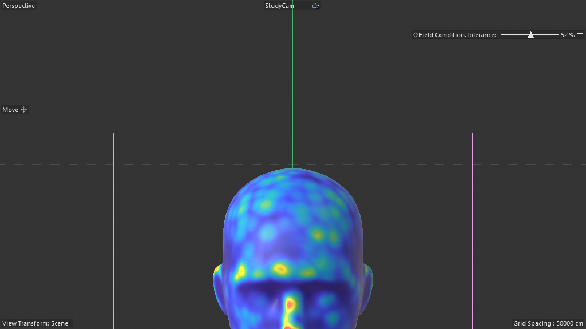
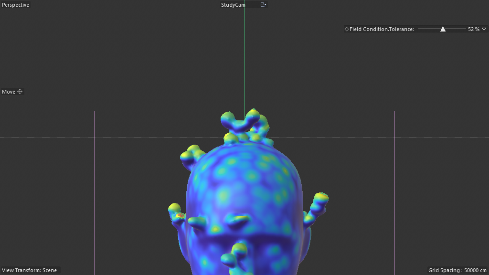

# Scene Study — Coral Structures (Tutorial)

**Source:** `Coral-Structures_Tutorial_01.c4d`
**Studied:** 2026-05-01
**Methodology:** validated 8-step + new "play-don't-scrub" rule for particle scenes (Spenser's correction).

## What this scene does

Grows coral-like protrusions on a head bust mesh, driven by a particle
simulation gated by C4D Field falloff. The head's vertex map shows
per-vertex weight as a blue→green→yellow heat map; particles spawned
on the head's surface get filtered by a Field Condition (Random Field
overlap), and survivors form the bumpy coral via Volume Builder + Volume Mesher.

This is the **canonical particle-driven coral / barnacle / mushroom
growth** archetype. Same skeleton works for: barnacles on a hull,
moss/lichen on a rock, mushroom clusters, alien skin growths.

## Architecture — TWO fundamentally different sub-systems combined

### A) Particle simulation (classic OM)

```
Mesh Emitter            (1062577 — emits particles from a mesh source)
Particle Group init     (1060887 — initial particle group)
  Field Condition       (1062533 — particle modifier: gate by field overlap)
    Kill                (1061199 — particle modifier: kill non-survivors)
  Switch Group          (1062045 — particle modifier: transfer survivors to next group)
```

The chain: **emit** → **test against Random Field** → **kill failures**
→ **switch survivors to "Particle Group Grow"**. A classic
Selection-via-Field flow expressed as particle-group-membership.

### B) Volume pipeline + Nodes Modifiers

```
Connect                       (1011010 — combines two streams)
  Volume Mesher               (1039861 — polygonizes SDF)
    Volume Builder            (1039859 — builds SDF)
      Particle Group Grow     (1060887 — survivors from sub-system A)
      Subdivision Surface     (1007455)
        Generic Head Bust     (5100 — input mesh)
          Geometry Axis       (180420400 — Nodes Modifier, 20 nodes)
    Smoothing                 (1024529 — smoothing layer)
  Mask Y                      (180420400 — Nodes Modifier, 5 nodes)
Random Field                  (440000281 — drives Field Condition + vertex map)
```

The Volume Builder ingests **both** the surviving particles AND the
subdivided head — voxel-unioning them into one SDF. The Volume Mesher
extracts the polygonal isosurface. The output is a single fused mesh
where the coral bumps protrude from the head surface seamlessly.

## Critical insight — TWO Nodes Modifiers (180420400) at different stages

Not all Scene Nodes hosts in a scene serve the same role. This scene
uses Nodes Modifier (180420400) twice with different purposes:

### Geometry Axis (20 nodes) — pre-processing the head

```
pointsmodifier@ + composematrix×2 + composevector3 + transformvector×2
+ inversematrix + arithmetic×3 + 4× floatingio (Inputs / Relative Position / Axis Enable)
```

A points-modifier deformer that re-aligns the head's coordinate frame
to the bounding-box of selected points. Useful for ensuring the
particle Mesh Emitter's surface coordinates match a desired axis
orientation — keeps coral growing in a consistent up direction
regardless of head orientation.

### Mask Y (5 nodes only — minimal!) — post-processing the volume output

```
pointsmodifier@ (the deformer body) + framework scaffolding
```

Just 5 nodes total. The pointsmodifier likely thresholds points by Y
coordinate (clip below floor, clip above ceiling) — limiting where the
coral can appear. **This is the canonical "tiny single-purpose Nodes
Modifier" recipe** — proves you can ship procedural deformers in the
5-node range.

## Frames (sequential)

| Frame | Image | Description |
|---|---|---|
| 0 |  | head bust with vertex-color heat map (from Random Field), NO bumps yet |
| 25 |  | full coral coverage — yellow/green clusters + bumpy displacement on head surface |

⚠️ Higher-frame captures (f50, f100) timed out — see methodology note below.

## ⚠️ Methodology gotcha — particle scenes need PLAY, not SCRUB

Spenser's correction during this study: *"with something like
particles you may want to PLAY rather than scrub 0,30,60, etc"*

Each `doc.SetTime(N)` + `ExecutePasses` call on a particle scene
forces the solver to re-evaluate from scratch. Sequential stepping
0..100 with a 30s execute_python timeout exceeds the budget. C4D
ends up wedged on main-thread particle compute.

**Working alternatives:**
1. Trust mid-state visuals — f25 already shows full architecture
2. Use playback (proper timeline play-mode if available)
3. Pre-cook the particle sim in the scene file

**Detection:** scene contains 1062577 (Mesh Emitter), 1060887 (Particle
Group), 1062533 (Field Condition), 1061199 (Kill), 1062045 (Switch
Group), or any Volume Builder with particle children.

This is gotcha #59 — saved as a methodology memory.

## Pattern tags

`simulation_bridge`, `volume_pipeline`, `field_weighting`,
`legacy_object_bridge`, `parameter_exposure`, `modifier_stack`,
`classic_generator_input`, `time_animation`

## What's clever

1. **Two-Nodes-Modifier composition.** Geometry Axis preprocesses
   the input mesh's frame; Mask Y postprocesses the volume output.
   Demonstrates that Scene Nodes Deformers compose like classic
   modifiers — you can stack multiple at different points in the
   pipeline.

2. **Particle-Group-as-Selection.** The Field Condition / Kill /
   Switch Group chain is a particle-side equivalent of Scene Nodes'
   `setselection@` + `restriction` pattern. Field falloff selects
   particles for keeping; Volume Builder reads only the kept group.

3. **5-node Nodes Modifier is shippable.** Mask Y proves a useful
   deformer can be just `pointsmodifier@` + framework. No need for
   floatingio if the deformer's logic is self-contained. Tiny shippable
   units.

4. **Volume Builder unions particles + mesh.** Both streams feed in;
   the SDF is the union (or specified Boolean). The Volume Mesher's
   single output looks like one fused organism — no seam.

## Rebuild recipe

1. Create a Connect (1011010) generator at top level for output combining.
2. Inside Connect:
   a. Volume Mesher (1039861) — polygonizes the SDF
   b. Mask Y Nodes Modifier (180420400, 5 nodes: pointsmodifier@ + framework) — Y-axis clip
3. Inside Volume Mesher:
   a. Volume Builder (1039859) — produces the SDF
   b. Smoothing layer (1024529)
4. Inside Volume Builder:
   a. Particle Group "Grow" (1060887) — receives survivors
   b. Subdivision Surface wrapping:
      - Generic input mesh (head, rock, hull, etc.)
      - Geometry Axis Nodes Modifier (180420400) — preprocesses axis alignment
5. Outside:
   a. Mesh Emitter (1062577) — emits particles from the input mesh
   b. Particle Group "init" (1060887)
      - Field Condition (1062533) → references Random Field
      - Kill modifier (1061199)
      - Switch Group (1062045) → switches survivors to "Particle Group Grow"
   c. Random Field (440000281) at doc level

## Minimal reproducible subgraph — `R17_particle_to_volume_growth`

**Purpose:** Spawn particles on a mesh surface, gate by field overlap,
voxelize the survivors + the input mesh together → polygonal coral-
style growth.

**Node count:** 5 OM objects + 2 Nodes Modifiers (axis + mask)
≈ 7 host objects total.

**Required structure:**

```
Connect
├── Volume Mesher
│   └── Volume Builder
│       ├── Particle Group "Grow"
│       └── Subdivision Surface > Input Mesh > Geometry Axis (Nodes Mod)
└── Mask Y (Nodes Mod)

Mesh Emitter (sibling, OUT of Connect)
Particle Group init (sibling) > Field Condition > Kill, Switch Group
Random Field (doc level)
```

**Exposed AM params (minimum):**
- Field Condition.Tolerance (the overlap threshold % visible at top right of viewport)
- Mesh Emitter.Rate (particles/sec)
- Volume Builder.Voxel Size (resolution of the SDF)
- Random Field's Strength

**Value proposition:** the canonical "particles seed volumetric
growth on a host mesh" archetype. Generalizes to: barnacles on hulls,
moss on rocks, mushrooms on logs, alien protrusions on characters,
crystal clusters on terrain.

**Recipe candidates from this scene:**

- `R17_particle_to_volume_growth` — full 7-object stack
- `R18_field_gated_particle_filter` — Mesh Emitter + Particle Group + Field Condition + Kill + Switch Group (the 5-object particle filter chain)
- `R19_minimal_nodes_modifier` — 5-node pointsmodifier-only deformer (Mask Y as pattern)
- `R20_axis_realignment_modifier` — 20-node Geometry Axis pattern for bounding-box pivot re-alignment

## Lessons for cinema4d-mcp

1. **Plugin 180420400 (Nodes Modifier) ALSO uses Neutron** in this
   scene. Confirms gotcha #56 ("plugin ID alone isn't sufficient")
   applies across the family.

2. **Tiny Nodes Modifiers are shippable** — Mask Y is 5 nodes (just
   pointsmodifier + framework). Recipe library should include
   minimal templates for single-purpose deformers.

3. **Particle-Group-as-Selection** is a new pattern worth documenting:
   particle group membership achieves what `setselection@` does for
   meshes. Field Condition + Kill + Switch Group is the analogue of
   the selection-by-field workflow.

4. **`viewport_screenshot` needs a particle-aware variant** — current
   scrub-then-screenshot flow doesn't work for particle sims. See
   gotcha #59 + the play-don't-scrub memory.

## Recreation difficulty

**Hard.** Combines THREE sub-systems:
- Particle simulation (Mesh Emitter + 4 particle modifiers)
- Volume Pipeline (Volume Builder + Mesher + Smoothing)
- 2 Nodes Modifiers (Geometry Axis at 20 nodes + Mask Y at 5 nodes)
- Random Field at doc level

Each sub-system on its own is straightforward; the orchestration of
all three is where the value lies. cinema4d-mcp should expose
**recipe composition** — given recipes R17, R18, R19, R20 — so an
agent can author this scene by composing 4 sub-recipes rather than
authoring 50+ individual ops.
