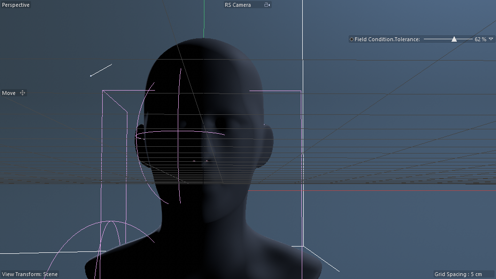

# Scene Study — Coral Structures (Render Variant)

**Source:** `Coral-Structures_Render_01.c4d`
**Studied:** 2026-05-01
**Twin of:** scene 07 (Coral Structures Tutorial). This is the
**production-render-ready** variant of the same architecture.

## What's the same as scene 07

The core particle→volume pipeline is identical:

```
Mesh Emitter → Particle Group Init → Field Condition → Kill / Switch Group
              → Particle Group Meshing
              → Volume Builder + Subdivision Surface (head + Geometry Axis Nodes Mod)
              → Volume Mesher → Smoothing
              → Connect → final mesh
```

Same `R17_particle_to_volume_growth` recipe applies directly.

## What's NEW (the production-render layer)

### 1. Lighting rig (4 lights)

```
LIGHTS (Null)
├── BG Light            (1036751)
├── Null > Key Light    (1036751)
├── Rim Light           (1036751)
└── Bouncecard          (5168 — bouncing plane)
```

Standard 3-point lighting + a BG fill + a bouncecard for fill.
**This is the canonical 4-element production lighting rig** — worth
recipe `R21_production_lighting_rig`.

### 2. Procedural backdrop (180420600 — Nodes Mesh!)

```
Backdrop  (180420600 — Nodes Mesh simple, INSIDE the scene at top level)
```

A procedural background plane authored as a Scene Nodes Generator —
demonstrates that even render-side scaffolding can be Scene Nodes.
This is one Nodes-Mesh host doing background-plane duty without any
of the simulation work happening in scene 07's hosts.

### 3. RS Camera (Redshift integration)

```
RS Camera  (1057516 — Redshift Camera plugin)
```

Confirms the scene is authored for the **Redshift renderer**.
Different from scene 07 which had no specific camera — Tutorial just
uses C4D's perspective view.

### 4. Two Spherical Fields for region-specific gating

```
Spherical Field Face       (440000243 — at face position)
Spherical Field Shoulder   (440000243 — at shoulder position)
```

Where the Tutorial used ONE Random Field, the Render variant uses
**two Spherical Fields** at specific anatomical positions — Face and
Shoulder. This produces TWO localized coral patches instead of a
random distribution. The Field Condition particle modifier presumably
references both fields (OR/AND combine).

### 5. Plain falloff field as child of head

```
Generic Head Bust
├── Geometry Axis    (180420400 — Nodes Modifier)
└── Plain            (1021337 — Plain falloff field)
```

A Plain falloff field as direct child of the head — provides additional
field-painted vertex selection on the head's surface, layered with the
Spherical Fields.

### 6. Normal Masking — THIRD Nodes Modifier

Where Tutorial used "Mask Y" (5-node Y-axis clip), Render uses
**Normal Masking** (180420400) — likely filters output points by their
surface normal direction. e.g., only keep coral on upward-facing
surfaces (not under the chin).

This is a different deformer body — same plugin ID, same Nodes
Modifier shell, different graph internals. Yet another reminder that
**plugin ID alone tells you nothing about graph content**.

### 7. Geometry Axis appears TWICE

```
Subdivision Surface > Generic Head Bust > Geometry Axis     (1st instance)
... and ...
Volume Builder > Subdivision Surface > Generic Head Bust > Geometry Axis  (2nd instance)
```

The same head + Geometry Axis stack appears at TWO levels:
- As an OM-level deformed mesh (for visual reference / rendering)
- Inside the Volume Builder (for SDF unioning with particles)

**Twin-instance pattern for render scenes**: same stack instanced
twice for different downstream purposes. Probably a duplicate (not
true Instance) for performance/cache reasons.

### 8. Two production materials

```
BG       (5703 — Redshift Material; backdrop)
Corals   (5703 — Redshift Material; the procedural mesh)
```

Note: scene 07 (Tutorial) had no materials — vertex-color heatmap was
the visualization. Render variant uses RS Materials (5703) for proper
shading.

## Frame

| Frame | Image | Description |
|---|---|---|
| 0 |  | head bust + spherical field gizmos visible from RS Camera, no coral yet |

f20 capture timed out (same particle-compute issue as scene 07 — see
play-don't-scrub gotcha #59).

## Pattern tags (additional to scene 07's set)

`+production_lighting`, `+render_engine_specific (Redshift)`,
`+twin_scene` (Tutorial / Render variant), `+procedural_backdrop`

## What's clever about the Tutorial→Render pattern

1. **Tutorial scene = bare architecture for learning.** Minimal
   visualization, no render config, single Field. Focus on the graph
   logic.

2. **Render scene = production-ready wrap.** Same architecture +
   lighting + camera + materials + region-specific fields + extra
   post-process modifier (Normal Masking instead of Mask Y). Ready
   to render straight to RS.

3. **Same recipe (R17), different scaffolding.** This is the
   archetypal "twin scene" pattern — minimal demo + rendered version
   share core; second scene wraps with production layer. Recipes
   should be DECOUPLED from rendering — R17 is the architecture,
   R21 is the lighting rig, R22 is the RS material setup, etc.

## Lessons for cinema4d-mcp

1. **Twin scenes confirm recipes** — when two scenes in a folder
   share a core architecture, the recipe is solid. The Tutorial proves
   the minimal construction; the Render variant proves it composes
   with production scaffolding.

2. **Procedural backdrops via Nodes Mesh (180420600)** are a
   lightweight pattern — single Nodes-Mesh host with simple primitive
   logic. Worth a recipe.

3. **Render scenes need Recipe Composition.** R17 (architecture) +
   R21 (lighting) + R22 (RS materials) + R23 (procedural backdrop) +
   R24 (camera + render config) = production-ready. Single recipe
   that combines all of them is a valuable orchestration target.

4. **Three Nodes Modifiers in one scene proves stacking is real.**
   180420400 hosts can be chained pre-input, mid-pipeline, and
   post-output. Each plays a different role with the same plugin ID.

## Twin-of relationship

This scene shares 100% of its core graph with scene 07. The
delta-record approach (only document differences) is the right
representation for twin scenes. INDEX.json marks `twin_of: 7` so
queries can find both together.

## Recreation difficulty

**Hard** (same as scene 07) **+ render layer**. Adding lighting +
RS camera + materials + procedural backdrop + region fields adds ~10
more objects and 2 more material setups, but composes naturally if
recipes R17, R21, R22, R23, R24 exist independently.
