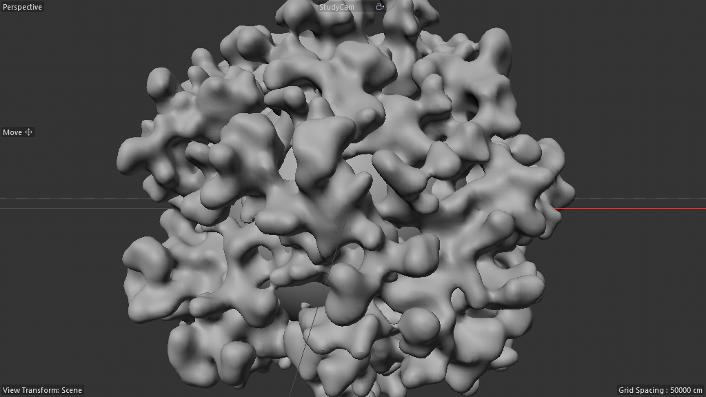

# Scene Study — Crystal Cutter (01-Basic-GeoSolver)

**Source:** `Crystal_Cutter_Tut-Files_01/01-Basic-GeoSolver.c4d`
**Studied:** 2026-05-01
**Methodology:** validated 8-step + KillDocument-after-finish hygiene.

## What this scene does

The **foundational substrate** of the Crystal Cutter family — a
generic "perpetual reactionary growth" engine. Each frame:

1. The current state is read from "previous frame storage"
2. A deformer (Displacer in this demo) modifies it
3. Volume Builder voxelizes the displaced state
4. Volume Mesher polygonizes → new "current state"
5. That state is stored for next frame

**Spenser's quote (the canonical interpretation):**
> "essentially just a memory function driving perpetual reactionary
> growth — using a displacer here so you could use really any deformer
> and it just continues to redeform the new solved state"

The Displacer is the **swappable deformer slot**. Replace it with
Bend/Twist/Wind/Smoothing/Subdivide/FFD/etc and you get an entire
family of growth simulations from the SAME 4-object OM stack. That's
why this scene is the foundational substrate — every Crystal Cutter
variant downstream just plugs different deformers into this slot.

## Frame at f30



After 30 frames of Sphere → Displace → Voxelize → polygonize → Displace
→ Voxelize → polygonize → ..., the original sphere has accumulated
into a beautiful organic blobby shape — like a clump of putty or a
coral colony. Pure procedural emergence from a 4-object OM stack.

## Object tree — the WHOLE pattern in 5 lines

```
Init State          (Connect 1011010 → Sphere)            ← seed
Solved State        (Connect 1011010)                     ← per-frame solver output
  Volume Mesher
    Volume Builder
      State from previous Frame  (Connect Instance → Store for next Frame)
        Displacer                ← THE SWAPPABLE DEFORMER SLOT
Store for next Frame  (180420600 — Nodes Mesh, 5 nodes: memory@ + framework)
```

Five OM objects total (excluding the Sphere seed). That's it.

## Architecture — frame-feedback via OM-orchestrated memory@

### "Store for next Frame" — the externalized memory primitive

A 5-node Nodes Mesh (180420600) containing nothing but `memory@` +
framework scaffolding (`context_externaltimeinput`, `context_notime`).
Wires:

```
memory@ inputs:
  Geometry    ← Root.geometry      (the host's input)
  Variable 1  ← Group._0           (LCV-style scope binding)
  Variable 1  ← Root.geometry      (initial seed)
memory@ outputs:
  Output      → Group.dependency
  Output      → Group._0
  Variable 1  → Memory._0          (self-feedback for next frame)
  Variable 1  → Group._0
  Variable 1  → Memory.in@<hash>   (self-feedback secondary)
```

This is the **purest possible Memory primitive container** — 5 nodes,
zero AM exposure, single-purpose. Whatever feeds this Nodes Mesh's
host input gets remembered for next frame. **THIS IS A RECIPE WORTH
SHIPPING.**

### "State from previous Frame" — Connect Instance pointing at Store

A regular C4D Connect Instance (5126) with `INSTANCEOBJECT_LINK` set
to "Store for next Frame". Whatever Store-for-next-Frame is rendering
right now, the Connect Instance reflects. So inside the Volume Builder,
the "previous frame state" is just `Store.cache` — and Store's cache
IS the previous Memory output (because that IS its host's geometry
emit).

### Solved State Connect — the per-frame solver wrap

Just a Connect generator wrapping the Volume-Mesher-Volume-Builder-
Instance-Displacer stack. Per frame:
- Volume Builder reads State-from-previous-Frame + Displacer
- Volume Mesher polygonizes
- Connect emits the result
- That result IS what Store-for-next-Frame stores for the next frame

### Init State — frame-0 seed

Just a Connect-wrapping-a-Sphere. Provides the initial geometry for
the FIRST iteration. After frame 0, the loop runs on its own outputs.

## Pattern tags

`feedback_loop`, `simulation_bridge`, `volume_pipeline`,
`time_animation`, `modifier_stack`

## What's clever — THE killer architectural insight

1. **Memory primitive externalized into a tiny dedicated host.** The
   5-node "Store for next Frame" Nodes Mesh has ONE job: hold state
   between frames. Separating this from the simulation logic means
   you can **swap the simulation logic without touching the memory
   substrate**. The 5-node memory holder is a permanent fixture; the
   Volume Builder + Displacer + Connect chain is the changeable part.

2. **Connect Instance as "previous frame reference".** The OM
   Instance's `INSTANCEOBJECT_LINK` mechanism means anywhere in the
   scene that wants "the previous frame's state" can just create
   another Connect Instance pointing at Store-for-next-Frame.
   Multiple consumers of previous-frame state, single producer.

3. **Deformer slot is universally swappable.** Replace Displacer
   with:
   - `Bend` → bending growth (twisting tower)
   - `Twist` → spiraling accumulation
   - `Wind` → flowing crystal lattice
   - `Smoothing` → self-smoothing erosion
   - `Subdivide` → recursive subdivision growth
   - `FFD` → user-painted custom deformation
   - `Squash & Stretch` → pulsing organic shapes
   - `Spline Wrap` → growth along a curve
   - Any combo of the above

   Each frame applies the deformer to last frame's state and
   voxel-unions back. Different deformer = different growth
   character. SAME stack architecture.

4. **OM-orchestrated, NOT graph-internal.** Unlike scene 03 (Reaction
   Diffusion) where the entire feedback loop lives inside one big
   Neutron graph, here the orchestration is OM-level: 5 generator
   objects choreograph the loop. **This is more inspectable and
   tweakable for an artist** — you can drop in any deformer
   visually, no graph editing needed.

5. **5-node memory holder is the smallest possible useful Scene
   Nodes host.** Proves there's a "memory primitive container"
   recipe at minimum-viable scale.

## Pattern tags from this scene's discoveries

Adding to the controlled vocabulary:

- `om_orchestrated_feedback` — frame-feedback choreographed via OM
  generators rather than graph-internal `memory@` wiring.
- `swappable_deformer_slot` — architecture has a designated slot
  where any deformer can plug in to change the simulation character.
- `externalized_memory_host` — Memory primitive isolated into a
  dedicated tiny host (vs being mixed with simulation logic).

## Rebuild recipe

1. Create "Init State" Connect (1011010) generator. Inside it: a
   Sphere (or any seed mesh).
2. Create "Solved State" Connect (1011010) generator. Inside it:
   a. Volume Mesher (1039861)
   b. Inside Volume Mesher: Volume Builder (1039859)
   c. Inside Volume Builder:
      - Connect Instance (5126) named "State from previous Frame"
      - Inside it (or as child): Displacer (1018685) — or ANY deformer
3. Create "Store for next Frame" Nodes Mesh (180420600) at top level.
   Build its graph with: a single `memory@` + framework. Wire
   `memory.Variable_1.out → memory.in@<hash>` for self-feedback.
4. Set Connect Instance's INSTANCEOBJECT_LINK to "Store for next Frame".
5. Wire Solved State's output to "Store for next Frame"'s input
   (somehow — likely via parenting or via a wire from Solved State's
   children-Group emit).

## Minimal reproducible subgraph — `R28_perpetual_reactionary_growth`

**Purpose:** Generic frame-feedback growth engine where any deformer
slots in to drive perpetual self-reactionary geometry evolution.

**Node/object count:** 5 OM objects + 1 minimal Nodes Mesh (5 graph nodes)

**Structure:**

```
Init State (Connect) > seed mesh
Solved State (Connect)
  Volume Mesher
    Volume Builder
      Connect Instance (link = Store for next Frame)
        ★ DEFORMER (Displacer / Bend / Twist / Smoothing / etc)  ← THE SLOT ★
Store for next Frame (Nodes Mesh, 5-node: memory@)
```

**Exposed AM params (minimum):**
- Deformer-specific (Displacer's strength, Bend's angle, etc.)
- Volume Builder.Voxel Size — feedback resolution
- Init State seed mesh choice

**Value proposition:** ONE skeleton, INFINITE growth simulations.
Drop in different deformers without touching the feedback substrate.
Every Crystal-Cutter variant downstream is just THIS scene with a
different deformer in the slot.

**Generalizes to:**
- Crystal growth (with appropriate displacer noise textures)
- Lava/magma flow (with Wind deformer)
- Self-smoothing erosion (with Smoothing deformer)
- Recursive subdivision (with Subdivide deformer)
- Spiral accumulation (with Twist deformer)
- Curve-following growth (with Spline Wrap)
- Pulsing organic shapes (with Squash & Stretch)

**Recipe candidates:**
- `R26_externalized_memory_buffer` — 5-node Nodes Mesh = pure memory primitive holder
- `R27_om_feedback_via_instance` — Connect Instance pointing at memory holder for "previous frame"
- `R28_perpetual_reactionary_growth` — full 5-object stack with swappable deformer slot

## Lessons for cinema4d-mcp

1. **OM-orchestrated feedback is the artist-friendly cousin of
   `memory@` graph feedback.** Same primitive, more swappable.
   Recipe library should have BOTH styles.

2. **5-node Nodes Mesh = pure memory primitive container.** Tiny,
   single-purpose, 100% reusable. Worth shipping as a default
   asset / template.

3. **Connect Instance.INSTANCEOBJECT_LINK is the per-frame state
   visibility primitive.** Anywhere that needs "previous frame's
   geometry" can subscribe via a Connect Instance pointing at the
   memory holder.

4. **Deformer slot pattern (`swappable_deformer_slot`) is a recipe
   composition primitive.** Recipes can declare "fill this slot with
   any deformer of category X" — letting agents propose alternatives
   to the artist.

5. **Same 5-line stack covers Crystal Cutter / lava / erosion /
   recursive growth / etc.** ONE stack, MANY visual outcomes. Maximum
   leverage per recipe.

## Recreation difficulty

**Medium.** No memory@ wiring complexity (the memory is in a stock
5-node Nodes Mesh, easily templated). The feedback orchestration is
purely OM-level — Connect Instance + parent/child links + a deformer
that fits in the slot. Most artists could rebuild this scene
visually in 10 minutes once they see the pattern.

## Status: Folder progress

Scene 09 = first of 4 scenes in Crystal_Cutter folder. Next:
- Scene 10: 02_Crystal_Cutter-Tutorial-File (the main tutorial — likely R28 with crystal-specific deformer setup)
- Scene 11: 04_Crystal_Cutter_Preview_File (small preview variant)
- Scene 12: 03_Crystal_Cutter_final-Render (production render variant)

Closing this scene before moving on (KillDocument hygiene).
