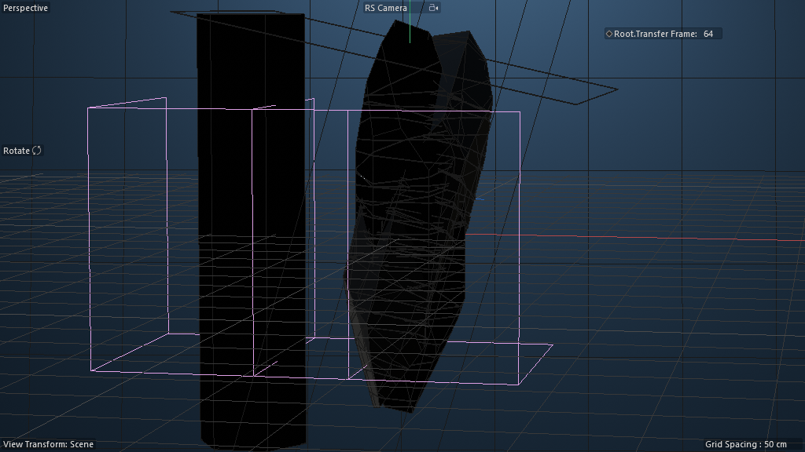
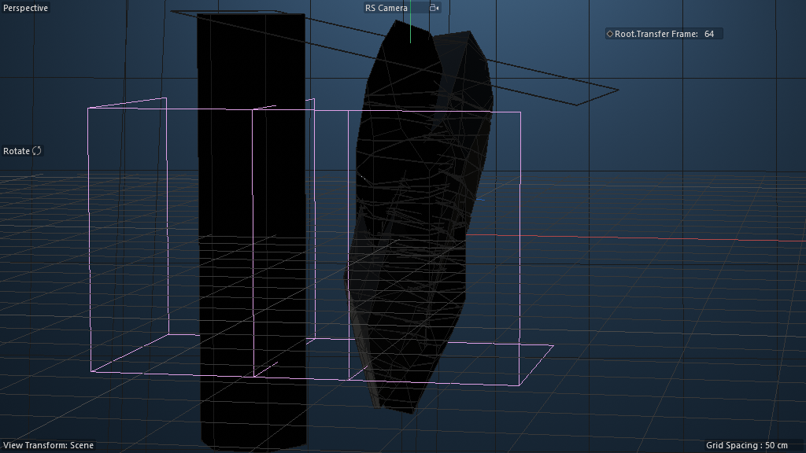

# Scene Study — Crystal Cutter (02-Tutorial)

**Source:** `Crystal_Cutter_Tut-Files_01/02_Crystal_Cutter-Tutorial-File.c4d`
**Studied:** 2026-05-01
**Built on:** scene 09's `R28_perpetual_reactionary_growth` foundation.

## What this scene does

Generates a procedural faceted crystal by **chaining TWO R28 solver
stacks** with **Legacy Boole** (Boolean subtraction) as the deformer
slot. Each frame, a moving cutter is Boolean-subtracted from the
previous frame's geometry — accumulating cuts that produce
crystal-like faceted topology.

**Two-pass architecture with TWO cutter shapes:**

1. **Tip Cutting** — uses a **TALL BLOCK CUTTER** (Cube dimensions
   117 × 573 × 254 — vertical block). Spinning this through the
   cylinder cuts vertical edges/faces → produces pointed crystal tips.

2. **Horizontal Cutting** — uses a **PLANE CUTTER** (Cube dimensions
   300 × 0.5 × 300 — essentially a thin disc, 600× aspect ratio!).
   Sweeping this thin plane through the geometry slices horizontal
   cross-sections → produces faceted middle bands.

Combined: vertical edges + horizontal slices = full crystal faceting
from two simple Boolean cutters of different shapes.

Final output → Fracture (5100 PolygonObject) + Random + Force MoGraph
wrap for breakup/scatter dynamics.

## Critical insight — Cube-as-Plane is the cutter trick

Discovered after Spenser's correction: *"there is a plane cutter I
believe and some other stuff going on in the mix"*. By scaling a
regular Cube primitive to a 600× aspect ratio (300 × 0.5 × 300), it
functions as a flat plane while remaining a closed-volume Boolean B.

**Why use Cube-as-Plane vs an actual Plane primitive?** Boolean
operations need closed volumes for the math to work cleanly. A Plane
primitive (5168) is a 2D mesh without thickness — Boolean can't
properly subtract it. A 0.5-unit-thin Cube IS a closed volume that
visually behaves like a plane cut.

This is `R33_cube_as_plane_cutter` — the Boolean-cut "plane" idiom.

## Frame at f30 (mid-cut) and f99 (heavily-cut)

| Frame | Image |
|---|---|
| 30 |  |
| 99 |  |

By f30 the cylinder has clearly become a faceted crystal with pointed
tip and angular sides. **FPS=250 with max=130** means the timeline
drives ITERATION COUNT, not real-time animation — each frame is one
Boolean cut.

## Object tree — TWO R28 stacks chained

```
LIGHTS                         (RS Area Light + BG plane + Bouncecard)
RS Camera

Tip Cutting                    (sub-tree — first R28 solver)
├── Cutting Cube > Spin > Angel > Cube     (the "blade" — spinning cube)
├── Random Angle (Field 440000281)         (randomization)
├── Init State (Connect) > Cylinder         (seed: a cylinder)
├── Solved State (Connect)
│   └── Legacy Boole (1010865)              ← THE DEFORMER SLOT (Boolean!)
│       ├── Store for next Frame Instance   (previous-frame state, the A in A∖B)
│       └── Cutting Cube Instance           (the spinning cube, the B in A∖B)
└── Store for next Frame (180420600 — 5-node memory@ Nodes Mesh)

Horizontel Cutting             (sub-tree — second R28 solver)
├── Cutting Cube > Move Down > Spin > Angel > Cube
├── Random Angle (Field)
├── Init State (Connect) > ★ Solved State Instance ★    ← CHAINED!
│                          (input is the FIRST solver's output)
├── Solved State (Connect)
│   └── Legacy Boole (1010865)
│       ├── Store for next Frame Instance
│       └── Cutting Cube Instance
└── Store for next Frame (180420600 Nodes Mesh)

Connect                        (final-output wrapper)
└── Fracture > Solved State    (MoGraph fracture wraps the final result)

Fracture (5100 PolygonObject)  (pre-fractured pieces)
Random (1018643)                (Random effector)
Force (180000103)               (physics force)
```

## Architecture insights

### 1. Boolean as the swappable deformer slot

In scene 09 the slot was a Displacer. Here it's a **Legacy Boole** —
Boolean A∖B subtraction. The previous-frame state is A; the
spinning Cutting Cube is B. Per frame: A∖B becomes the new state.

**Generalize:** ANY Boolean-capable mesh occupies B → cuts of any
shape. Subtracted spheres = drilled holes; subtracted cylinders =
slots; subtracted complex shapes = inverse-stamp patterns. The
crystal cutting is just one application of the **Boolean-as-deformer
pattern**.

### 2. R28 solver stacks CHAIN via Connect Instance

The **most important discovery in this scene**: Horizontal Cutting's
"Init State" is a Connect Instance pointing at Tip Cutting's "Solved
State". This means:

```
Solver A (Tip Cutting) finishes (or runs in parallel)
         ↓ Connect Instance
Solver B (Horizontal Cutting).Init State = Solver A's output
         ↓
Solver B runs its own R28 loop on top of Solver A's geometry
```

This is **R28 composition** — two perpetual-growth engines stacked,
where the second's seed is the first's solved state. **Recipe
candidate:** `R29_chained_solver_stacks` — chain N solver stacks for
multi-stage iterative geometry.

### 3. Spinning cutter primitive

The "Cutting Cube > Spin > Angel > Cube" chain is the cutter
primitive: a Cube nested in nested Nulls (Spin / Angel) that rotate
each frame. This makes the Boolean-subtracted cube hit the geometry
from a different angle each iteration → produces faceted (not just
gridded) cuts.

`Random Angle` field probably randomizes Spin's rotation per frame
for non-uniform faceting.

### 4. Move Down null in Horizontal Cutting

The Horizontal Cutting stack adds a "Move Down" Null between Cutting
Cube and Spin. Each frame the cutter moves down (Y translation) AND
spins — producing horizontal bands of cuts at decreasing heights.

### 5. Final MoGraph wrap (Fracture + Random + Force)

After both solvers produce the cut crystal, the output wraps in a
classic MoGraph chain:
- Fracture splits the crystal into pieces
- Random effector randomizes piece positions/rotations
- Force applies physics (gravity / push / etc.)

So the scene has THREE compositional layers:
- L1: R28 solver foundation (perpetual reactionary growth)
- L2: Two solvers chained via R29 (multi-pass cutting)
- L3: MoGraph dynamics wrap (fracture + force on the result)

This is **maximum recipe leverage** — each layer is independent and
composable.

## Pattern tags

`feedback_loop`, `simulation_bridge`, `time_animation`,
`om_orchestrated_feedback`, `swappable_deformer_slot`,
`externalized_memory_host`, `chained_solvers`,
`mograph_bridge`, `production_lighting`, `render_engine_specific`

## What's clever

1. **Boolean as the deformer slot** — proves R28's universal
   applicability extends beyond simple deformers like Displacer/Bend
   into mesh Boolean operations.

2. **R28 chaining via Connect Instance** — the "Init State Instance"
   trick lets you stack solvers. Each solver's Init reads from the
   previous solver's Solved State. **Multi-stage procedural geometry
   without graph-internal complexity.**

3. **High FPS as iteration counter** — FPS=250 with max=130 means
   "run 130 iterations." Frame number = iteration index. Decouples
   real-time playback semantics from solver-step semantics. Simple
   trick, big leverage.

4. **Spinning cutter primitive** generalizes the "moving B in A∖B
   Boolean" pattern. Different motion paths (spin / translate / FFD)
   produce different cut patterns.

5. **Three compositional layers** (R28 foundation, R29 chaining,
   MoGraph wrap) demonstrate how recipes stack. Each layer's input is
   the previous layer's output — no monolithic megagraph.

## Rebuild recipe

1. Apply R28_perpetual_reactionary_growth (scene 09's foundation)
   TWICE for two solver stacks.
2. First solver (Tip Cutting):
   - Init State Connect → Cylinder
   - Solved State Connect → Legacy Boole(Connect Instance to Store, Cutting Cube Instance)
   - Cutting Cube = Connect wrapping nested Nulls (Spin/Angel) wrapping a Cube
   - Random Angle Field for spin randomization
   - Store for next Frame = 5-node Nodes Mesh (memory@ + framework)
3. Second solver (Horizontal Cutting):
   - Same structure as Tip Cutting BUT
   - Init State = Connect Instance pointing at FIRST solver's Solved State
   - Add Move Down Null between Cutting Cube and Spin for vertical stride
4. Top-level: Connect generator wrapping Fracture (containing the
   final Solved State) + Random + Force for MoGraph dynamics.
5. Add RS Camera + RS Area Light + BG plane + Bouncecard for
   production rendering.
6. Set FPS to high value (e.g. 250) to drive iteration count via timeline.

## Minimal reproducible subgraph — `R29_chained_solver_stacks`

**Purpose:** Chain N R28 solver stacks where each subsequent stack's
seed is the previous stack's solved output. Multi-stage iterative
geometry without graph-internal complexity.

**Structure:**

```
Solver_1 (R28)
├── Init State (Connect) > seed mesh
├── Solved State (Connect) > deformer_chain(Store_1 Instance)
└── Store_1 (5-node memory@ Nodes Mesh)

Solver_2 (R28)
├── Init State (Connect) > Solved State Instance link → Solver_1's Solved State
├── Solved State (Connect) > deformer_chain(Store_2 Instance)
└── Store_2 (5-node memory@ Nodes Mesh)

(repeat as many solvers as needed)
```

**Exposed AM params (per solver):**
- Solver-specific (deformer parameters)
- Solver-specific timing (skip count, multiplier, etc.)

**Value proposition:** Multi-stage procedural geometry. Apply
different deformer-classes at each stage:
- Stage 1: Boolean cuts (faceting)
- Stage 2: Smoothing (rounded edges)
- Stage 3: Displacer (surface texture)
- Stage 4: Bend / Twist (final pose)

Each stage's solver runs its R28 loop independently → final result is
the composition. **This is THE pattern for procedural-pipeline
authoring.**

**Recipe candidates from this scene:**

- `R28b_boolean_deformer_slot` — R28 with Legacy Boole as the slot deformer
- `R29_chained_solver_stacks` — Connect-Instance-based solver chaining
- `R30_spinning_cutter_primitive` — Cube wrapped in Spin/Angel nulls for rotational Boolean cutting
- `R31_iteration_count_via_fps` — high-FPS / max-frame to drive iteration count via timeline (decouple from real-time)
- `R32_mograph_dynamics_wrap` — Fracture + Random + Force OM-level wrap for any procedural mesh output

## Lessons for cinema4d-mcp

1. **Boolean as a deformer slot** is a recipe variant worth shipping
   alongside Displacer / Bend / Twist / Smoothing. Same R28 stack,
   different slot occupant.

2. **Connect-Instance solver chaining** (R29) is the universal
   composition primitive for procedural-pipeline authoring. Recipe
   library should encode this as a meta-recipe.

3. **FPS-as-iteration-counter** is a useful idiom — high FPS +
   short timeline = many iterations packed into a short frame range.
   Recipe should declare expected iteration count so artists know
   what timeline length to use.

4. **MoGraph wrap is independent of the procedural mesh** — ANY
   procedural mesh can be Fracture + Random + Force wrapped without
   touching its internal logic. Recipe should make this composition
   trivial.

5. **Three compositional layers** (R28, R29, MoGraph) prove recipes
   stack cleanly. cinema4d-mcp should support multi-layer recipe
   composition where each layer's output is the next layer's input.

## Recreation difficulty

**Hard** but composable. Each layer is medium-difficulty alone:
- R28 (scene 09): medium — 5 OM objects + 5-node Nodes Mesh
- R29 chaining: just Connect Instance INSTANCEOBJECT_LINK from one Solved State to another
- Boolean slot variant: just swap Displacer for Legacy Boole + provide a B mesh
- MoGraph wrap: Fracture + Random + Force, standard MoGraph

Total: ~20 OM objects, 2× 5-node Nodes Mesh, 1 RS Camera + lights.

## Status

Scene 10/4 in Crystal_Cutter folder. Closing this scene. Next:
- Scene 11: 04_Crystal_Cutter_Preview_File (small variant)
- Scene 12: 03_Crystal_Cutter_final-Render (production wrap)
