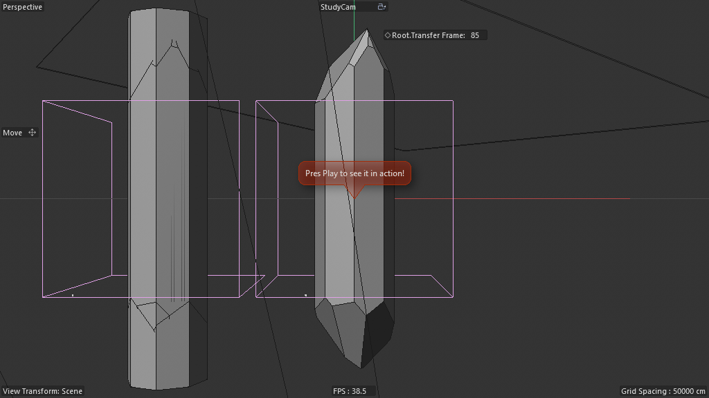

# Scene Study — Crystal Cutter (04-Preview)

**Source:** `Crystal_Cutter_Tut-Files_01/04_Crystal_Cutter_Preview_File.c4d`
**Studied:** 2026-05-01
**Variant of:** scene 10 (Crystal Cutter Tutorial). This is the **clean,
minimal-Scene-Nodes** preview/refinement variant.

## Spenser's hypothesis (confirmed)

Quote (without having opened the scene): *"the scene nodes here are
very minimal and please correct me if im wrong — I actually havent
even looked at this scene yet but its doing a ton of procedural cuts
with a memory node frame per frame?"*

✅ **All three points confirmed:**

1. **Scene Nodes are MINIMAL** — only the two `Store for next Frame`
   Nodes Mesh hosts (180420600), each containing 5 nodes total
   (`memory@` + framework). Total Scene Nodes graph footprint: 10
   nodes across the entire scene. The hero work happens 90% in
   classic OM.

2. **Memory node frame-per-frame** — exactly. The 5-node `memory@`
   container holds the previous frame's geometry; Connect Instance
   reflects it; Legacy Boole subtracts the moving cutter; result
   becomes next frame's memory.

3. **Tons of procedural cuts** — over 100 frames, hundreds of
   Boolean A∖B subtractions accumulate into the faceted crystal.

## Author's annotation — "Press Play"

The scene's top-level "NOTE" Null carries an Annotation tag with the
text:

> **"Pres Play to see it in action!"** (sic)

**This is FIRST-PARTY confirmation of gotcha #59.** The author
explicitly instructs users to PLAY (not scrub). Scrubbing via
`SetTime(N)` per-frame breaks the simulation; only sequential
playback unfolds the cuts correctly.

When studying any procedural scene with a NOTE/INFO null, **read its
annotation FIRST** — the author may have left explicit operational
guidance.

## Frame at f50



Captured after sequentially stepping 0..50. Shows partial crystal
formation — faceted edges starting to emerge after ~50 Boolean
subtractions of the moving cutters.

### Spenser's live-play observation

While studying this scene, Spenser pressed Play in C4D and confirmed:

> **"tons of variable linear cuts on the low poly crystal"**

The "low poly crystal" detail is signature of the architecture:
**Boolean cuts produce flat planar faces, not curved surfaces.** The
result is genuinely low-poly — N flat facets where N is roughly the
iteration count of the two solvers combined. No smoothing pass = no
rounded edges = quintessential gemstone look.

"Variable linear cuts" describes the per-frame randomization
(Angle + In/Out / Spin Random Fields) producing different cut angles
each iteration — no two adjacent facets are parallel, giving the
crystal its irregular gem-like character.

## Object tree (after stripping clutter — none was present)

```
NOTE                           (Null, carries author annotation)
Corners Cuts                   (sub-tree — first R28 solver)
├── Cut Cube                   (Connect — the cutter wrap)
│   ├── Continouse Spin > Rotate Angle > Move in and out > Cut Cube 0
│   │                                                       (5159 — 500×589×200 BLOCK)
│   └── Spin                   (additional motion null)
├── Angle (Field 440000281)    (randomizes Rotate Angle)
├── In and Out (Field 440000281) (drives Move in and out)
├── Init State (Connect) > Cylinder
├── Solved State Corner Cut (Connect) > Legacy Boole(...)
└── Store for next Frame (180420600 — 5-node memory@)

Split Cuts                     (sub-tree — second R28 solver, CHAINED)
├── Cut Cube
│   └── Move top to Bottom > Random Spin > Rotate Angle > Cut Cube 0
│                                                          (5159 — 600×600×1 ULTRA-THIN PLANE)
├── Angle (Field)
├── Spin (Field)
├── Init State (Connect) > Solved State Corner Cut Instance  ← CHAINED
├── Solved State Splits (Connect) > Legacy Boole(...)
└── Store for next Frame (180420600 — 5-node memory@)
```

**Cleaner naming than scene 10:**
- "Corners Cuts" instead of "Tip Cutting"
- "Split Cuts" instead of "Horizontal Cutting"
- "Solved State Corner Cut" / "Solved State Splits" — explicit per-stage labels
- "Cut Cube 0" labels show this is the 0-th cutter in a sequence (room for 1, 2, 3 if you wanted more cuts)

## What's different vs scene 10

| Aspect | Scene 10 (Tutorial) | Scene 11 (Preview) |
|---|---|---|
| Vertical cutter dims | 117 × 573 × 254 (block) | 500 × 589 × 200 (block, larger) |
| Plane cutter dims | 300 × 0.5 × 300 (1500× ratio) | 600 × 600 × 1 (600× ratio, larger) |
| Motion controls per cutter | Spin, Angel, optional Move Down | Spin + Rotate Angle + Move in/out (3 nulls) |
| Random Fields per stack | 1 (Random Angle) | 2 (Angle + In and Out, OR Angle + Spin) |
| Annotation | None | "Pres Play to see it in action!" |
| Render-side scaffolding | RS Camera + 4-light rig | None (pure preview) |
| FPS | 250 | 200 |
| MAX frame | 130 | 100 |
| MoGraph wrap | Fracture + Random + Force | None |

This scene is the **architectural CORE** of the Crystal Cutter family
— scene 10 adds production rendering, scene 12 (final-Render) adds
materials. **Scene 11 is the recipe lift-out.**

## Architectural insights (additional to scene 10's)

### 1. Three motion nulls per cutter > two

Scene 10 used: `Spin > Angel > Cube` (2 nulls + 1 cube). Scene 11
uses: `Continuous Spin > Rotate Angle > Move in and out > Cut Cube 0`
(3 nulls + 1 cube). The extra null lets:

- **Continuous Spin** rotate the cutter around the world Y axis
- **Rotate Angle** rotate the cutter around its own local axis (independent)
- **Move in and out** translate the cutter radially (in/out from origin)

Each layered null adds a degree of freedom to the cutter motion.
**More dimensions of cutter motion = richer cut patterns**.

### 2. Two Random Fields per cutter, not one

Scene 10 had 1 Random Angle field per stack. Scene 11 has 2 fields
per stack (Angle + In/Out, OR Angle + Spin). Each field drives a
different motion null. **Independent randomization sources for
independent motion axes** — produces less-correlated, more organic
cut distributions.

### 3. Even-thinner plane cutter (600× aspect)

Scene 10's plane cutter: 0.5 thick. Scene 11's: 1.0 thick (but with
600×600 face vs 300×300 → larger face). The 600× aspect ratio is
extreme — yet still functions as closed-volume Boolean B.

### 4. "Cut Cube 0" naming — extensibility hint

The "0" suffix suggests the architecture EXPECTS you to add Cut Cube 1,
Cut Cube 2, etc. — multiple cutters per solver, each producing
different cut shapes. **This is recipe extensibility hint built into
the scene's naming convention**.

## Pattern tags

Same as scene 10 minus production_lighting / render_engine_specific
since the preview has no rendering scaffolding.

`feedback_loop`, `simulation_bridge`, `time_animation`,
`om_orchestrated_feedback`, `swappable_deformer_slot`,
`externalized_memory_host`, `chained_solvers`,
`cube_as_plane_cutter`

## What's clever (additional to scene 10)

1. **Annotation tag with PLAY directive** — author left explicit
   operational guidance ("Pres Play to see it in action!"). Scenes
   with annotations should be READ FIRST before any analysis.

2. **Three-null motion control hierarchy** > two-null. Each null adds
   a motion DOF; richer cut patterns emerge from compound motion.

3. **Two-field randomization** decorrelates motion axes — more organic
   cuts than single-field-driving-everything.

4. **"Cut Cube 0" extensibility naming** — invites adding more cutters
   per solver. Recipe should expose this as a "cutter array" pattern.

5. **Minimal Scene Nodes footprint (10 nodes total).** This scene
   PROVES the recipe value: the hero pattern (R28 + R29) needs only
   the smallest possible Scene Nodes container. Everything else is
   classic OM. **Maximum leverage per Scene Nodes node.**

## Rebuild recipe

Same as scene 10 + 11-specific refinements:

1. R28 solver with Legacy Boole as deformer slot (×2)
2. Three motion nulls per cutter (Continuous Spin + Rotate Angle + Move in/out)
3. Two Random Fields per cutter (Angle + In/Out OR Spin)
4. Cube-as-plane cutter (1.0-unit thick, 600× face) for Split Cuts
5. Block cutter (500×589×200) for Corners Cuts
6. Chain Split Cuts to Corners Cuts via Init State Connect Instance
7. Annotation tag on a top-level NOTE Null with "Press Play" directive

## Minimal reproducible subgraph — `R34_minimum_scene_nodes_footprint`

**Purpose:** Achieve a complex procedural simulation (R28 + R29) with
the SMALLEST possible Scene Nodes graph — push the orchestration to
classic OM, keep `memory@` containers minimal.

**Total Scene Nodes graph nodes: 10** (across 2 solvers, 5 each).

**Structure:** identical to scene 10 + 11, but the lesson is:
- Don't put orchestration logic in the graph
- Use `memory@` ONLY for state retention
- All flow control, math, motion → classic OM (Connects, Instances, Fields, Nulls)

**Value proposition:** Maximum architectural leverage per Scene Nodes
graph node. Easier to author (artists fluent in classic C4D); easier
to debug (every wire visible in OM tree); easier to share (recipes
become "OM templates with stock memory@ wrapper").

**Recipe candidate:** `R34_minimum_scene_nodes_footprint` — the
"Scene Nodes light" architectural style.

## Lessons for cinema4d-mcp

1. **Minimum-footprint Scene Nodes is a recipe style** worth
   distinguishing. Some scenes maximize Scene Nodes power
   (scene 03 RD, 88 nodes); others minimize it (scene 11 Preview,
   10 nodes). Different recipes for different artist preferences.

2. **READ ANNOTATIONS FIRST** — author-left guidance trumps any
   automated probing. Update methodology checklist: step 0 = grep
   for Annotation tags before anything else.

3. **Naming conventions reveal extensibility intent** — "Cut Cube 0"
   suggests room for 1, 2, 3. Recipes should detect such hints and
   expose them as parameters.

4. **Motion-null hierarchies are recipe-able** — Continuous Spin +
   Rotate Angle + Move in/out is a reusable "compound motion" pattern.
   Worth recipe `R35_compound_motion_null_hierarchy`.

## Recreation difficulty

**Medium-Easy** — same as scene 10's R28+R29 stack, but with cleaner
naming and no production-rendering scaffolding. Once R28 and R29 are
in the recipe library, this scene is ~15 OM operations + 2 stock
5-node Nodes Mesh templates.
