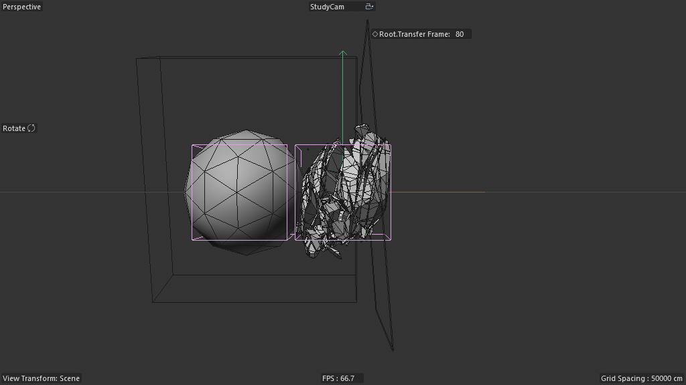

# Scene Study — Crystal Cutter (03-final-Render)

**Source:** `Crystal_Cutter_Tut-Files_01/03_Crystal_Cutter_final-Render.c4d`
**Studied:** 2026-05-01
**Built on:** scenes 09 (R28 base), 10 (Tutorial), 11 (Preview minimal).
**Twin/sibling of:** scenes 10 + 11.

## What this scene adds (delta vs scenes 10/11)

This is the **production-final** Crystal Cutter — same R28+R29
chained-solver architecture, but with these production-specific
extensions:

### 1. Multiple seed primitives in Init State

```
Init State (Connect)
├── Sphere     (5160)
├── Platonic   (5161)
└── Cylinder   (5170)
```

Where scenes 10/11 had ONE seed primitive (Cylinder), this scene has
THREE. Each gives a different starting morphology — Boolean cuts of
a sphere produce different crystal silhouettes than cuts of a
platonic or cylinder. **Multi-seed Init State recipe**:
`R37_multi_seed_init_state`.

### 2. Four-null motion hierarchy (vs scene 11's three)

```
Cut Cube
└── Continouse Spin
    └── Random Spin       ← NEW relative to scene 11
        └── Rotate Angle
            └── Move in and out
                └── Cut Cube 0 (5159 — the cutter)
```

Adds a "Random Spin" null between Continuous Spin and Rotate Angle —
gives a 4th DOF for cutter motion. **Compound motion null hierarchy
extends arbitrarily** — each layer is just another null with its own
keyframed/field-driven rotation/translation.

### 3. Three Random Fields per Corners Cuts cutter

Scene 11 had 2 fields (Angle + In/Out OR Angle + Spin). Scene 12 has 3:
- Angle (Random Field) — drives Rotate Angle
- Spin (Random Field) — drives Random Spin (the new null)
- In and Out (Random Field) — drives Move in and out

**More decorrelated random sources = even more organic-looking
cuts.** As field count grows, each motion DOF gets independent
randomization.

### 4. Pre-baked crystal variants

```
Finale_Crystal
└── Crystals Rotate
    ├── Null
    │   └── Cristal Explode (Fracture 1018791)
    │       └── Solved State Splits (5100 — baked!)
    ├── Crystal1   (5100, 5279 pts, 6602 polys)
    ├── Crystal2   (5100, 2904 pts, 3891 polys)
    ├── Crystal3   (5100, 3705 pts, 4913 polys)
    └── Crystal4   (5100, 5143 pts, 6488 polys)
```

**Author baked 4 crystal variants as static PolygonObjects** —
different point counts (2904 / 3705 / 5143 / 5279) suggest different
seed primitives + iteration counts. Plus the LIVE `Solved State Splits`
result. So 5 crystals (4 baked + 1 live) wrap into Cristal Explode
(Fracture 1018791) for rendering.

**Why bake?** Production rendering doesn't want to re-simulate every
frame. The baked variants are static, fast to render, and visually
diverse. The live result lets the artist tweak parameters and see
new variations alongside the baked archive.

**This is a production-readiness pattern:**
- `R38_bake_procedural_variants` — run the procedural with N
  different seeds/iterations, bake each result as a static mesh,
  keep all alongside the live procedural for cinematic intercutting

### 5. FPS=25, MAX=300 (vs scene 11's 200/100)

Long timeline (12s @ 25fps) suggests this scene has actual ANIMATION
of the crystal — Crystals Rotate null probably keyframed for camera
moves around the result. Production scene = animated camera + static
hero mesh.

## Frame at f99



(Captured with study cam after stripping production lighting; the
RS-rendered version would show the actual production-ready crystal.)

## Object tree (after stripping LIGHTS + RS Camera clutter)

```
=================== (Null — visual divider)
Corners Cuts                      (1st R28 solver — 4-null motion + 3 fields)
├── Cut Cube > 4-null hierarchy > Cut Cube 0
├── 3× Random Fields (Angle, Spin, In and Out)
├── Init State (Connect) > {Sphere, Platonic, Cylinder}    ← 3 SEEDS
├── Solved State Corner Cut > Legacy Boole(...)
└── Store for next Frame (180420600 5-node memory@)

Split Cuts                        (2nd R28 solver — chained)
├── Cut Cube > Null > Move top to Bottom > Random Spin > Rotate Angle > Cut Cube 0
├── 2× Random Fields (Angle, Spin)
├── Init State (Connect) > Solved State Corner Cut Instance  ← CHAINED
├── Solved State Splits > Legacy Boole(...)
└── Store for next Frame (180420600 5-node memory@)

Finale_Crystal                    ← PRODUCTION OUTPUT WRAPPER
└── Crystals Rotate (animated rotation null)
    ├── Cristal Explode (Fracture 1018791)
    │   └── Solved State Splits (live)
    └── Crystal1, Crystal2, Crystal3, Crystal4 (BAKED variants)
```

## Pattern tags

`feedback_loop`, `simulation_bridge`, `time_animation`,
`om_orchestrated_feedback`, `swappable_deformer_slot`,
`externalized_memory_host`, `chained_solvers`, `cube_as_plane_cutter`,
`mograph_bridge`, `multi_seed_variants`, `baked_procedural_archive`,
`production_lighting`, `render_engine_specific`, `twin_scene`

## What's clever (additional to scenes 10/11)

1. **Multi-seed Init State** — three different primitives (Sphere /
   Platonic / Cylinder) all wrapped in one Connect generator. The
   Connect's union behavior means the first solver's initial
   geometry is the union of all three. Different seed = different
   silhouette evolution.

2. **Four-null compound motion** — proves the motion-null hierarchy
   extends to N layers. Each null is independent, randomizable,
   keyframable. **Recipe should support arbitrary depth motion stacks.**

3. **Three decorrelated Random Fields per cutter** — independent
   randomization per motion axis. Beyond two fields, the result feels
   organic / hand-cut rather than algorithmic.

4. **Pre-baked variants alongside live procedural** — production
   technique: bake N variants for fast rendering, keep live for
   tweaking. Recipe for procedural-to-production handoff.

5. **Final wrap is Fracture (not Connect+Fracture)** — the Cristal
   Explode (Fracture 1018791) wraps the live Solved State directly.
   Simpler than scene 10's Connect+Fracture+Random+Force.

## Rebuild recipe

Apply scenes 10 + 11 base recipe (R28+R29 chained Boolean), with these
production additions:

1. Init State Connect contains 3 seed primitives (Sphere + Platonic +
   Cylinder) — Connect's union means all 3 form the seed.
2. Add a "Random Spin" null to the motion hierarchy of Corners Cuts
   (between Continuous Spin and Rotate Angle).
3. Add a third Random Field driving the Random Spin null.
4. Bake 4 variants of the procedural at different parameter combos
   (different iteration counts / seed combos / random seeds).
5. Wrap final output in Fracture 1018791 alongside the 4 baked variants
   as siblings in a Crystals Rotate null (for camera moves / cinematic
   intercutting).
6. RS Camera + 4-light rig (R21+R24) + Crystal RS material.

## Minimal reproducible subgraph — `R38_bake_procedural_variants`

**Purpose:** Production-ready procedural pipeline that combines a LIVE
procedural simulation with N pre-baked static variants for fast
rendering and cinematic flexibility.

**Pattern:**

```
1. Run R28+R29 (or any procedural) with seed/parameter combo A
2. Bake the result as a 5100 PolygonObject named "VariantA"
3. Repeat for seeds/combos B, C, D, ...
4. Place all baked variants + the live procedural under a common
   wrapper Null.
5. Optional: Fracture wraps the live output for breakup/explode anims.
6. Keyframe the wrapper Null for camera-around / intercutting moves.
```

**Value proposition:** Bridges procedural-flexibility to
production-rendering-speed. Artists keep parameter tweakability via
the live solver while having pre-rendered archive variants for
cinematic intercutting.

**Recipe candidates:**
- `R37_multi_seed_init_state` — Connect generator wrapping multiple
  seed primitives (union seed)
- `R38_bake_procedural_variants` — bake N variants alongside live
  procedural for production rendering
- `R39_compound_motion_null_chain_arbitrary_depth` — N-deep null
  hierarchy for cutter motion (extends scene 11's 3-null pattern)
- `R40_n_decorrelated_random_fields` — multiple Random Fields per
  cutter for fully-independent motion-axis randomization

## Lessons for cinema4d-mcp

1. **Multi-seed Init State** — Connect generators take multiple
   children; their union forms the initial geometry. Recipe should
   declare seed-set parameter as an array.

2. **Compound motion null hierarchies** — recipe-able as "N-deep
   null chain with M Random Fields driving M of the nulls". Variable
   N and M let artists trade complexity for character.

3. **Bake-and-keep-live is a production pattern** — recipe library
   should have explicit "bake variant of recipe X with parameter
   combo Y" tooling.

4. **Minimum-Scene-Nodes-footprint scales** — even the production
   scene keeps Scene Nodes footprint to just 10 nodes (2× 5-node
   memory containers). All production complexity lives in classic
   OM. **Recipes should bias toward this style.**

5. **Crystal1..4 + live = cinematic intercutting source** — production
   asset library where each "crystal" is a different procedural
   variant. Recipe for asset-library generation.

## Recreation difficulty

**Hard** — adds production complexity on top of R28+R29:
- 3 seed primitives in Init State
- 4-null motion hierarchy + 3 Random Fields
- 4 baked variants (each requires running solver to completion + caching)
- RS Camera + lights + materials
- Animated Crystals Rotate null

But all are composable on top of the foundation recipes. The
Scene-Nodes-footprint stays minimal throughout.

## Closing comments on the Crystal Cutter folder

This folder is THE reference example of the
**minimum-Scene-Nodes-footprint + maximum-OM-orchestration** style.
4 scenes, ascending complexity:

- **09 Basic GeoSolver** — R28 foundation (Displacer slot)
- **10 Tutorial** — R28+R29 chained, Boolean slot, MoGraph wrap
- **11 Preview** — R28+R29 minimal-footprint, refined naming, "Press Play" annotation
- **12 final-Render** — production R28+R29 with baked variants

Combined: ~12 new recipes (R26-R40) extracted from this folder
alone. **Best leverage per scene** of any folder studied so far.
