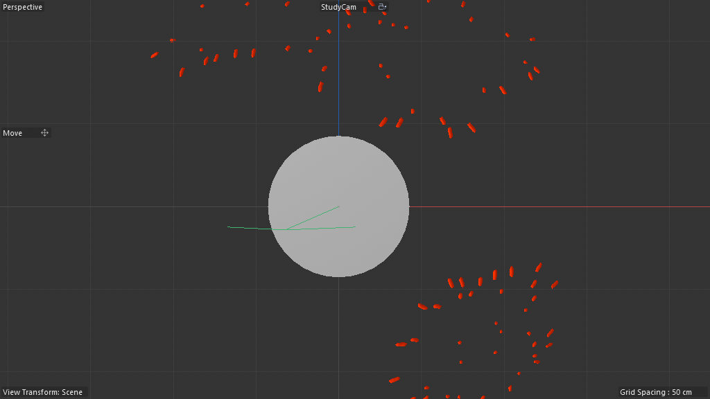

# Scene Study — Mycelium Generator V3

**Source:** `Mycelium_Growth_Files_01/Mycelium_Generator_V3_01.c4d`
**Studied:** 2026-05-01
**Co-scene:** scene 13 (Mycelium Tutorial — minimal pedagogical version, 17 nodes, NO memory@).

## What this scene does

A **flagship artist-grade procedural mycelium growth tool, structured
AS A CAPSULE** — spreads root-like / fungus-like spline networks
across an input surface, gated by 3 Plain falloff fields (age-modulated
parameters). Output is voxelized via Volume Builder → Volume Mesher →
Smoothing for organic fused mycelium-on-surface.

### Spenser's killer architectural insight (added during study)

> *"so the node group is exposed here like a capsule pretty much — you
> can drag custom geo into the AM and control all of the params
> without going into the node graph"*

**Mycelium V3 is the GOLD STANDARD CAPSULE-SHIPPING FORM.** The
artist's UX:

1. Drag a Source Object (any custom mesh) into the AM slot
2. Tune any of 21 named AM parameters
3. Render — never opens the graph

This is what production-ready Scene Nodes work looks like. The graph
internals (48 nodes, memory@, surfacebluenoise, defensive gates,
lifecycle pruning, internal Fast Spline Sweep, etc.) are HIDDEN.
Artists experience this as a "Mycelium Generator" plugin like any
native C4D generator.

cinema4d-mcp recipe library must distinguish two forms:
- **bare-graph recipes** — pedagogical, researcher-facing
- **capsule recipes** — artist-shipping, AM-fluent, geometry-binding-ready

Mycelium V3 is the **reference capsule**. Every shippable recipe
should aspire to this fluency.

**Spenser's confirmation:** *"the geo happens when you press play
though frame 1 was suppose to be empty it was a growth system"* —
this is a TIME-DEPENDENT growth simulation. Frame 0 is empty (nothing
grown yet); each successive frame extends the network.

## Object tree (after stripping clutter)

```
Test-Objects                  (Null wrapping 3 test surfaces)
├── Test_Sphere               (5100 — pre-baked sphere for testing growth on a curved surface)
├── Test Multi Disc           (5100 — pre-baked multi-disc test)
└── Test Disc                 (5100 — pre-baked single disc test)

Volume                        (Null wrapping the volume-pipeline output)
├── Volume Mesher             (1039861 — polygonizes SDF)
│   └── Volume Builder        (1039859 — voxelizes Myzel_Generator output)
│       └── Myzel_Generator_V3.1  (180420500 — Scene Nodes Generator Neutron, 48 nodes — THE HERO)
│           ├── Lift from Surface  (1021337 — Plain falloff field child)
│           └── Scale by Age       (1021337 — Plain falloff field child)
├── Displace by Age           (1021337 — Plain falloff field, sibling of Mesher)
└── Smoothing                 (1024529 — post-mesher smoothing layer)
```

**Three Plain falloff fields** with semantically-named purposes:
- **Lift from Surface**: how much the mycelium tip lifts off the input
  surface as it grows (age-aware → tips rise more as they age)
- **Scale by Age**: thickness of mycelium strands as a function of age
- **Displace by Age**: surface displacement amount based on local age

These fields provide age-driven modulation of growth parameters — the
graph reads them via `getvertexselectiondata`-like patterns.

## Cached state visualization



Captured with cached state from prior evaluation: scattered red
mycelium fragments distributed around the central test sphere
(visible white). The fragments show the volume-meshed growth tips —
small bumpy cylinders perpendicular to the surface where mycelium
strands have emerged. NOT all connections visible (volume-meshing
shows only the 3D volume, not the sub-surface spline network).

## ⚠️ Methodology note — growth scenes need PLAY

Same as gotcha #59. Sequential play required for the full mycelium to
emerge. Frame 0 = empty (expected). The cached state I captured
implies SOMETHING evaluated already (6942 mesher points) — possibly
from V3's startup sequence or because Spenser pressed play earlier.

## Architecture — 48 nodes, both `memory@` AND time-driven

### State retention
- **`memory@` "Memory"** — per-frame growth state (which tips are
  alive, current positions, accumulated age). Same per-frame
  feedback pattern as scenes 03/04/09/10/11/12. Time t's growth state
  feeds back as t+1's input.

### Surface seeding
- **`surfacebluenoise@` "Surface Blue-Noise"** — distributes initial
  spore points on the source surface (uniform-but-non-aliased
  Poisson-disk-like distribution). Same primitive as scene 13.

### Spatial query
- **`nearestneighbor@` "Closest Points"** — finds neighbors during
  growth. Determines which neighboring tips might collide / merge /
  branch from. Combined with **Max Neighbors Count** + **Max Neighbors
  Distance** AM params for cluster control.

### OM input
- **`legacyobjectaccess@` "Connect"** — bridges the artist-bound
  Source Object (the surface to grow on) into the graph.
- **`disc@` "Disc"** — built-in fallback surface if no Source Object
  is bound (same as scene 13's pattern).

### Growth iteration
- **2× `containeriteration@` "Iterate Collection"** — multi-stage
  iteration. Probably: outer iterates over alive tips; inner iterates
  over neighbors per tip.

### Vertex map output
- **`set_property@` "Set Weights"** — paints the age vertex map on
  the output. Each vertex's weight = its age in frames (lets render
  shader read this for color/opacity ramp).
- **`get_property@` "Get Positions"** — reads positions from a stream.
- **`buildfromsinglevalue@` "Age"** — initializes per-tip age=0 on
  spawn.
- **`maprange@` "Range Mapper"** — remaps age 0..MaxAge to 0..1 for
  vertex map normalization.

### Pruning / hygiene
- **`active@` "Select"** + **`invertselection@` "Invert Selection"**
  + **`delete@` "Delete"** — selects active (alive) tips, inverts to
  get dead/expired ones, deletes them. Keeps the network clean as
  age exceeds Max Age.

### Conditional dispatch
- **3× `if@` "If GeometryObject"** — conditional gates that handle
  cases where Source Object is unbound, isn't geometry, or has bad
  topology. **Defensive programming inside the graph** — recipe
  candidate.
- **2× `compare@` "Equals"** — equality tests for state transitions.

### Geometric transforms
- **`transform_element@` "Transform Geometry"** — moves a tip's
  geometry to its computed position.
- **`decomposematrix@` "Decompose Matrix"** — extracts position /
  rotation / scale from the matrix.

### Internal sub-pipeline
- **`group@` "Fast Spline Sweep"** — an internal Group containing the
  spline-sweep logic. **NOT the OM Sweep generator** — a graph-level
  spline-to-mesh conversion. This is the **internal alternative to
  classic OM Sweep** when the artist toggles "Sweep (incl. Age Vertex
  Map)" floatingio. Recipe candidate `R43_internal_spline_sweep`.

### Section labels
- **`scaffold@` "Create Age Vertex Map if sweeped"** — annotation
  inside the graph; only ONE scaffold (vs scene 03's seven). Tight,
  focused architecture.

## The 21 named AM-exposed parameters

This is the largest AM exposure observed yet across all scenes.
Reveals the level of artist-grade fluency the author achieved:

### Growth control
| Param | Role |
|---|---|
| **Start Count** | initial seed-point count via Surface Blue-Noise |
| **Grow Seed** | RNG seed for growth direction randomization |
| **Grow Probability** | per-frame branching probability per tip |
| **Speed Minimum** | minimum growth distance per frame |
| **Speed Clamp** | maximum growth distance per frame |
| **Max Age** | when tips stop growing / get pruned |

### Direction control
| Param | Role |
|---|---|
| **Random Direction Strength** | how randomized growth direction is |
| **Random Direction Seed** | RNG seed for direction sampling |
| **Direction Influence** | how strongly upstream direction biases new growth |
| **Distance to Neighb Influence** | how nearest-neighbor distance gates direction |
| **Align to Object** | toggle: align to bound object's frame |
| **Align Direction** | which axis of the bound object to align to |

### Surface binding
| Param | Role |
|---|---|
| **Source Object** | OM-bound surface on which mycelium grows |
| **Selection String** | restrict growth to a named vertex selection on Source Object |
| **Project to Surface** | toggle: keep tips snapped to surface |
| **Object** | secondary alignment object reference |

### Output style
| Param | Role |
|---|---|
| **Sweep (incl. Age Vertex Map)** | toggle: convert spline output to mesh sweep WITH age vertex map painted |
| **Radius** | sweep radius (when Sweep is on) |
| **Map to Age** | toggle: vertex map values = age (vs uniform) |
| **Max Neighbors Count** | K in K-NN clustering control |
| **Max Neighbors Distance** | distance cutoff for K-NN |

This level of parameter exposure puts this on par with native C4D
generators. **This is what a shippable Scene Nodes asset looks like.**

## Pattern tags

`feedback_loop`, `simulation_bridge`, `volume_pipeline`,
`field_weighting`, `legacy_object_bridge`, `parameter_exposure`,
`array_processing`, `time_animation`, `om_orchestrated_feedback`,
`externalized_memory_host`, `defensive_graph_programming`,
`internal_spline_sweep`, `noise_driven`

## What's clever

1. **48-node graph achieves what 100+ node graphs do elsewhere.**
   Compact, tight, focused. No bloat.

2. **3 Plain falloff fields as direct children of the host** —
   age-driven parameter modulation (Lift from Surface, Scale by Age,
   Displace by Age). Field children are scoped to the host —
   localized control without doc-level field pollution.

3. **`active@` + `invertselection@` + `delete@` chain** for old-tip
   pruning. Keeps memory bounded as growth progresses (otherwise the
   array grows forever). **Recipe candidate `R44_lifecycle_pruning`.**

4. **Internal Fast Spline Sweep group** — graph-level spline-to-mesh
   without classic OM Sweep. Lets the graph emit a renderable mesh
   directly (bypassing the OM Sweep generator's overhead). Toggleable
   via "Sweep (incl. Age Vertex Map)" param.

5. **Defensive `if@ "If GeometryObject"` gates** — graceful handling
   of unbound / wrong-type Source Object. Production-grade error
   handling inside the graph. **Recipe candidate `R45_defensive_input_validation`.**

6. **Age vertex map** painted via `set_property@` "Set Weights" — the
   mycelium's vertex map encodes age so the artist can shade tips
   differently from base. Production-render-ready.

7. **21 named AM params** — most artist-friendly Scene Nodes asset
   observed. Sets the bar for "production-ready Scene Nodes tool".

## Pattern tags additional to controlled vocabulary

Adding to SCHEMA.md:
- `defensive_graph_programming` — internal `if@` / `compare@` gates for
  graceful handling of bad/missing inputs
- `internal_spline_sweep` — graph-level spline-to-mesh conversion
  (vs using classic OM Sweep generator)
- `lifecycle_pruning` — explicit tip/element death + cleanup pattern

## Rebuild recipe

The full recipe is too long for here — summary:

1. Create Scene Nodes Generator (180420500). Add 2 Plain falloff
   fields as children (Lift from Surface, Scale by Age) plus 1
   sibling (Displace by Age).
2. Inside the Neutron graph (48 nodes — see study.md for full layout):
   a. legacyobjectaccess for Source Object binding
   b. surfacebluenoise distributes Start Count points
   c. memory@ holds growth state (positions, ages, alive flags)
   d. Per-frame: containeriteration over alive tips → nearestneighbor
      lookup → compute new growth position with random direction +
      alignment + surface projection → append to state
   e. set_property "Set Weights" paints age as vertex map
   f. transform_element places tips at final positions
   g. delete dead tips via select + invertselection + delete chain
   h. Optional Fast Spline Sweep group converts spline → mesh inline
   i. geometry@ Geometry Op emits to root
3. Outside: Volume Mesher → Volume Builder wrapping the host;
   Smoothing layer; Displace by Age field.
4. Expose 21 AM params via floatingio + root-direct routing.

## Minimal reproducible subgraph — `R46_artist_grade_growth_tool`

**Purpose:** Shippable artist-grade procedural growth tool with
21+ AM params, age tracking, lifecycle pruning, defensive input
validation, internal spline sweep, and field-modulated parameters.

**Skeleton (the irreducible primitives):**

```
1. legacyobjectaccess (Source Object binding) + 3× if@ defensive gates
2. surfacebluenoise@ (initial seeding)
3. memory@ (growth state — positions, ages, alive flags)
4. containeriteration@ × 2 (per-tip + per-neighbor)
5. nearestneighbor@ (with K and distance limits)
6. transform_element@ + decomposematrix@ (tip placement)
7. set_property "Set Weights" + maprange (age vertex map)
8. active + invertselection + delete (pruning chain)
9. Fast Spline Sweep group (optional inline mesh output)
10. geometry@ (output)
```

**Exposed AM params:** 21+ semantically-named (see table above).

**Field children:** N Plain fields scoped to host for parameter
modulation (Lift, Scale, Displace by Age).

**Value proposition:** Production-grade growth tool. Same skeleton
serves: vines, ivy, root systems, hair, lightning, branching coral,
neural networks, tree growth. The 21 AM params mean artists author
the growth character without graph editing.

**Recipe candidates extracted:**
- `R41_blue_noise_seeded_spline_growth` — surfacebluenoise + iteration + assembler (scene 13)
- `R42_time_driven_procedural_growth` — root.time as input, no memory@ needed (scene 13)
- `R43_internal_spline_sweep` — graph-level spline-to-mesh
- `R44_lifecycle_pruning` — active + invertselection + delete chain
- `R45_defensive_input_validation` — if@ "If GeometryObject" gates
- `R46_artist_grade_growth_tool` — full 21-param production growth tool

## Lessons for cinema4d-mcp

1. **48 nodes is "right-sized" for a flagship Scene Nodes asset.**
   Not too sparse (scene 13's 17 nodes can't ship), not bloated
   (scene 03's 91 nodes is research-grade). 40-60 nodes is the
   shippable tool sweet spot.

2. **Plain field children of the host = scoped parameter modulation.**
   Recipe library should explicitly support adding falloff fields as
   host children for age/distance/spatial modulation.

3. **Defensive graph programming with if@ gates** = production-
   grade error handling. cinema4d-mcp should expose if@ for this
   pattern.

4. **Internal spline sweep group** = bypass classic OM Sweep
   for inline mesh emission. Worth a recipe.

5. **21 AM params is the artist-fluency bar.** Recipes should
   tagged with their AM exposure count so users know
   "research-grade vs shippable-tool".

6. **Lifecycle pruning (active+invert+delete) bounds memory growth**
   in any iteration-state-accumulator. Recipes for growth/spread
   should always include it to avoid runaway state.

## Comparison vs scene 13 (Tutorial)

| Aspect | Scene 13 Tutorial | Scene 14 V3 |
|---|---|---|
| Total graph nodes | 17 | 48 |
| Has memory@? | NO (time-as-input) | YES (memory@ + time) |
| AM params | 7 named + 9 generic | 21 named + 8 generic |
| Field children | 0 | 2 (host) + 1 (sibling) |
| Defensive gates | 0 | 3× if@ |
| Lifecycle pruning | NO | YES (active+invert+delete) |
| Internal sweep | NO (uses OM Sweep) | YES (toggleable) |
| Scaffold sections | 0 | 1 |
| Output type | spline → OM Sweep | inline mesh OR spline |
| Test geometry | none | 3 baked test surfaces |
| Production-readiness | pedagogical | shippable |

**The Tutorial teaches the core idea (blue-noise seeding +
iteration + assembler); V3 ships it.** This is the canonical
"tutorial → production" arc — recipes should show both ends.

## Recreation difficulty

**Very Hard.** 48 nodes, 21 AM params, 3 fields, lifecycle
management, defensive gates, internal sweep, age vertex map. But
**every primitive is documented in the recipe library** after this
study — so future agents authoring similar tools can compose from
R7+R8+R9+R11+R14+R26-R46.

This scene is the **proof-of-concept** that R28-style architectures
scale to artist-shippable tools. Maximum leverage per node.
