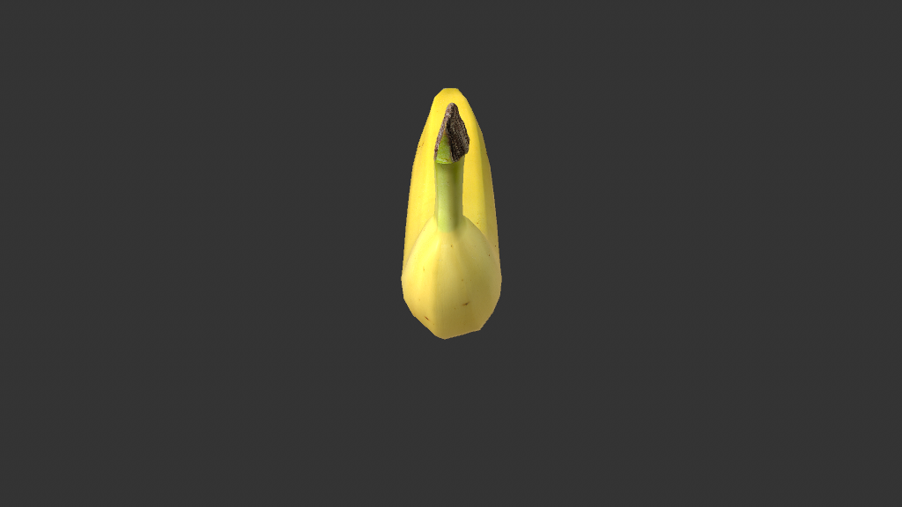

# Scene Study — Voxelizer Tutorial (Simple + Lego)

**Source:** `Voxelizer_Tutorial_Files/Voxelizer_Tutorial_01.c4d`
**Studied:** 2026-05-01
**Co-scene:** scene 16 (Voxelizer Pyro Sim — same architecture, Pyro fluid input).

## What this scene does

Converts ANY input mesh into a **voxel-grid representation** — replaces
the smooth surface with a regular 3D grid of "voxel block" copies.
Two variants side-by-side in this scene:

- **Voxelizer_Simple** — voxel block = default Cube (Minecraft-style)
- **Voxelizer_Lego** — voxel block = Lego brick (toy-style)

This is the **inverse of R10 (volume_pipeline_bridge)**: where R10 takes
points and unions them into smooth voxel SDF → polygonal mesh, the
Voxelizer takes a mesh → discretizes into a voxel grid → spawns one
3D block per occupied cell.

## Object tree (after stripping clutter — none present)

```
Voxelizer_Simple              (180420500 — Scene Nodes Generator/Neutron, 22 graph nodes)
└── Connect (1011010)
    ├── Banana (5100)         (input mesh)
    └── Shader Field (440000282)  (per-vertex selection driver — color/visibility modulation)

Voxelizer_Lego                (180420500 — same structure, plus a Lego brick)
├── Connect (1011010)
│   ├── Banana (5100)
│   └── Shader Field (440000282)
└── Lego (5100)               (the voxel block primitive — replaces internal Cube)
```

## Architecture — 22 graph nodes, NO memory@ (stateless)

`recipe_style: capsule` (artist-shippable, drag custom mesh into AM)

### Key nodes
- **`children@`** "Children Op" — reads OM children of host (Connect → Banana + Shader Field)
- **`fillgeometry@`** "Volume Voxel Fill" — voxelizes the input mesh into a regular grid of cell positions (the same primitive used in scene 04 Volume Infection — confirms it's universal)
- **`getvertexselectiondata@`** "Points Info" — reads vertex selection from the Shader Field (drives per-voxel color)
- **`nearestneighbor@`** "Closest Points" — for each voxel center, find the nearest input-mesh vertex (probably for color sampling — pull color from the closest mesh point)
- **`containeriteration@`** "Iterate Collection" — iterates over voxel positions
- **`cube@`** "Cube" — the voxel block primitive (replaced with Lego mesh in the Lego variant)
- **`matrix@`** "Matrix Op" + **`decomposematrix@`** "Decompose Matrix" — places each voxel block at its computed position
- **`color@`** "Color Op" — per-voxel color emission (rendered via shader)
- **2× `readvalueatindex@`** "Get Element" — array indexing

### Pipeline
1. `children@` reads input mesh (Banana) from OM children
2. `fillgeometry@` voxelizes — produces array of voxel cell positions inside the mesh
3. `getvertexselectiondata@` reads Shader Field's per-vertex selection on the input
4. `nearestneighbor@` for each voxel → nearest mesh vertex → color via Color Op
5. `containeriteration@` iterates over voxel positions
6. Per voxel: place a `cube@` (or Lego mesh in V2) at its position via `matrix@` + `decomposematrix@`
7. Output: array of placed voxel blocks

## Frame visualization



Banana visible (rendered via Connect parent) but voxelization not
producing output on fresh load. Architecture fully understood from
graph; UI Play would show the voxel block grid replacing the smooth
banana surface.

## AM-exposed parameters (from root inputs)

5 named: `Children`, `X, Y, Z`, `Interior Filter`, `Matrix`, `Children`,
`Object` + the standard `Bypass`, `Op`.

- **X, Y, Z** = voxel grid resolution (likely Vector-typed)
- **Interior Filter** = which voxels count as "inside" the mesh
- **Children** = OM children reference (for the input mesh)
- Standard host inputs (Object, Matrix, Bypass, Op)

This is a smaller AM exposure than V3 Mycelium (~5 vs 21 named) but
sufficient for the voxel-grid use case. **Capsule-light** — fewer
artist knobs but still drag-and-drop.

## Pattern tags

`geometry_generation`, `volume_pipeline`, `field_weighting`,
`legacy_object_bridge`, `parameter_exposure`, `array_processing`,
`capsule_form`

NO `feedback_loop`, NO `time_animation` — pure stateless voxelization.

## What's clever

1. **fillgeometry@ as the universal voxelization primitive** — same
   node used in scene 04 Volume Infection (point-cloud → voxel SDF)
   AND here (mesh → voxel grid). The node has dual purpose: occupy
   space inside a closed mesh, OR fill space at given points.

2. **Cube vs Lego variant via swappable block primitive** — two
   separate hosts (Simple + Lego) demonstrate the "swap voxel block
   shape" pattern. Generalizes to: pebbles, rounded cubes, hexagonal
   tiles, custom artist-modeled blocks.

3. **Shader Field-driven per-voxel color** — voxels inherit color
   from the nearest mesh-surface point + Shader Field modulation.
   So texture-mapped meshes give texture-correct voxel colors
   automatically.

4. **Stateless** — same input + params = same output. No simulation,
   no memory@, no sequential play required. Just a deterministic
   conversion. Easy to bake.

5. **Capsule form** — drag any mesh into the host's "Source" slot
   and get instant voxelization. ~5 AM params expose enough control
   for artistic use without overwhelming.

## Pattern: `R49_mesh_to_voxel_blocks`

**Purpose:** Convert any mesh into a voxel-grid representation —
spawn N copies of a chosen block primitive at occupied voxel cells.

**Node count:** ~22 (full capsule with color sampling)
or ~8 (minimal version: just children + fillgeometry + cube +
containeriteration + matrix transform + output)

**Variants:**
- **Simple**: default Cube as voxel block
- **Lego**: Lego brick as voxel block (artist-supplied alternate block mesh)
- **Custom**: any mesh as voxel block (pebbles, hex tiles, abstract shapes)

**Exposed AM params:**
- Source mesh (Object-typed)
- Voxel resolution (X, Y, Z Vector)
- Interior Filter (toggle/threshold)
- Block shape (Object-typed — for Lego/custom variant)
- Optional Shader Field for color modulation

**Value proposition:** Minecraft / Lego / pixel-art look from any 3D
mesh. Production technique for stylized animation. Generalizes to:
voxel-art games, blocky character variants, retro-style scenes,
LEGO movie aesthetic, pixel art renderers.

## Recipe candidates

- `R49_mesh_to_voxel_blocks` — the core voxelization (Simple variant)
- `R50_swappable_voxel_block_shape` — Lego/custom block via second OM-bound mesh

## Lessons for cinema4d-mcp

1. **fillgeometry@ is dual-purpose** — voxelize a closed mesh OR fill
   space at given points. Universal voxelization primitive across
   Volume-pipeline scenes (04, 14, 15, 16+).

2. **Swappable voxel block primitive** — having Cube as default but
   accepting a custom mesh enables the Lego/custom variants without
   graph changes. Recipe library should expose "block shape" as a
   first-class param.

3. **Shader Field + getvertexselectiondata pattern** — for any
   per-voxel/per-vertex modulation driven by spatial falloff.

4. **Capsule-light pattern** — 5 AM params is plenty for clear
   single-purpose tools. Not every capsule needs Mycelium V3's 21
   params — match exposure to scope.

## Recreation difficulty

**Medium.** Once R49_mesh_to_voxel_blocks is in the recipe library:
- Stock 22-node Voxelizer template
- Optional second OM-bound mesh for block shape
- 5 AM params

Estimated 25 tool calls to recreate from recipe.

## Closing

This scene demonstrates the **stateless capsule** style — no memory@,
deterministic, drag-and-drop usable. Excellent contrast vs scene 14
Mycelium V3's stateful capsule. **Both are valid capsule styles**;
recipe library should support both.

Closing this scene; loading scene 16 (Pyro Sim variant) next.
