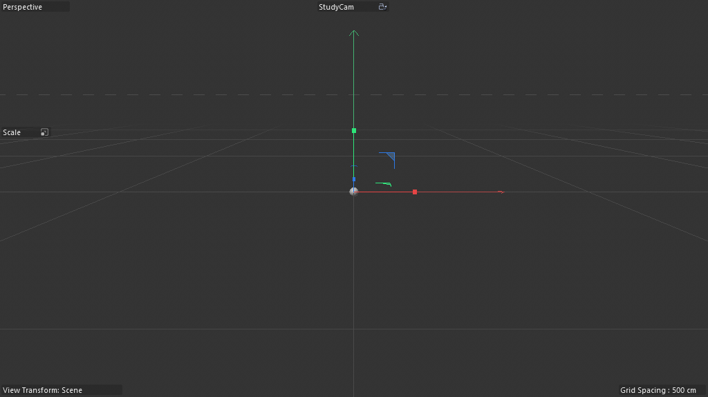

# Scene Study — Voxelizer Pyro Sim — SKIPPED (broken scene, architectural-only)

**Source:** `Voxelizer_Tutorial_Files/Voxelizer_Pyro-Sim_01.c4d`
**Studied:** 2026-05-01
**Co-scene:** scene 15 (Voxelizer Tutorial — same Voxelizer graph, static mesh input).
**STATUS:** Spenser flagged this scene as MISSING SOME LINKS — broken
on disk. Skipping deep study; documenting architectural pattern
(R52) only for recipe library reference.

## What this scene does

**Animated voxel-block fire/smoke**: a Pyro simulation drives the
input to the Voxelizer, producing per-frame voxelization of the
fire/smoke volume into Lego bricks. As the Pyro evolves, the Lego
pattern animates with it.

This is **R49 (mesh-to-voxel-blocks) composed with Pyro simulation**
— same Voxelizer architecture as scene 15, but the mesh input is
LIVE per-frame Pyro density isosurface instead of static banana.

## Object tree (after stripping clutter — none present)

```
Pyro Output                  (1059580 — Pyro simulation output)
Sphere                       (5160 — Pyro emitter source)
Volume Loader density        (1039866 — loads density volume from Pyro cache)
Volume Loader color          (1039866 — loads color volume from Pyro cache)
Voxelizer                    (180420500 — Scene Nodes Generator/Neutron, 22 nodes)
├── Connect (1011010)
│   └── Volume Mesher (1039861)
│       └── Volume Builder (1039859) ← consumes Pyro density volume
└── Lego (5100)              (Lego brick voxel block — same as scene 15 Voxelizer_Lego)
```

**Pipeline:**
1. Sphere primitive emits Pyro fire/smoke (Pyro Output runs the sim)
2. Volume Loader density loads the cached density grid each frame
3. Volume Loader color loads cached color (per-voxel temperature/material)
4. Volume Builder + Volume Mesher polygonize the density isosurface → mesh
5. Voxelizer (R49) treats this per-frame mesh as input
6. Spawns Lego bricks at occupied voxel cells; per-brick color from
   Volume Loader color via the Color Op
7. Result: Lego bricks dance with the fire animation

## Architecture

The Voxelizer graph is **architecturally identical to scene 15's
Voxelizer_Simple** — 22 nodes, same primitives:

- `children@`, `fillgeometry@`, `getvertexselectiondata@`,
  `nearestneighbor@`, `containeriteration@`, `cube@` (replaced by Lego),
  `matrix@`, `decomposematrix@`, `color@`, 2× `readvalueatindex@`

The **delta is the INPUT pipeline**:

- Scene 15 Tutorial: `Connect > Banana + Shader Field` (static mesh + field)
- Scene 16 Pyro: `Connect > Volume Mesher > Volume Builder > (Pyro)` (animated mesh from sim)

So the Voxelizer doesn't care WHAT mesh feeds it — could be static,
animated, sim-driven, etc. **The recipe (R49) is input-source-agnostic.**

## Pyro integration architecture

**Pyro Output (1059580)** is C4D 2026's Pyro simulation generator.
The two **Volume Loaders (1039866)** load the cached density and color
grids each frame:

- Volume Loader density → Volume Builder input (defines the SDF surface)
- Volume Loader color → Color Op input (per-voxel temperature → color)

**This is `R52_pyro_to_voxelizer_pipeline`**:
1. Pyro Output simulates fire/smoke
2. Volume Loaders read its cached grids per-frame
3. Volume Builder + Mesher polygonize density isosurface
4. Voxelizer (R49) discretizes into voxel blocks
5. Color from Volume Loader color drives per-block color

Generalizes to: **any volume sim → block-grid render**. Cloud sim →
voxel clouds, water sim → voxel droplets, smoke → voxel haze, etc.

## Capture state



Pyro requires UI Play for cache simulation. Volume Mesher pcount=0
without playback. Architecture confirmed via graph probe.

## Pattern tags

`geometry_generation`, `volume_pipeline`, `simulation_bridge`,
`field_weighting`, `legacy_object_bridge`, `parameter_exposure`,
`array_processing`, `time_animation` (via Pyro), `capsule_form`

## What's clever

1. **Voxelizer is input-source-agnostic.** Same R49 graph works on:
   - Static meshes (scene 15 Tutorial — Banana)
   - Pyro-simulated meshes (scene 16 — fire/smoke)
   - Animated character meshes (potential)
   - Procedural meshes (potential)
   - Volume-mesher-output of any sim (cloth, soft body, water)

2. **R52 = R49 + Pyro pipeline.** Recipe composition: take static
   voxelizer + add Pyro simulation as input source = animated voxel
   fire. **No graph changes needed inside the Voxelizer.** Pure
   compositional power.

3. **Volume Loader as the "snapshot per-frame" primitive** — reads
   pre-cached Pyro grids, decoupling simulation from rendering. The
   Voxelizer then renders without needing to know about Pyro
   internals.

4. **Color flow is preserved through the volume pipeline** — Pyro
   color → Volume Loader color → Color Op → per-voxel color. Fire
   gradient (red → orange → yellow → smoke) carries to Lego bricks.

## Recipe candidates

- `R52_pyro_to_voxelizer_pipeline` — Pyro Output + Volume Loaders +
  Volume Builder + Volume Mesher feeding R49 Voxelizer

## Lessons for cinema4d-mcp

1. **Recipe composition power** — R49 + Pyro = R52, no R49 modification
   needed. Recipe library should support "compose recipe X as input
   to recipe Y" as a first-class operation.

2. **Volume Loaders are the per-frame snapshot primitive** — useful
   wherever a recipe needs cached-sim-state-per-frame as input.

3. **Voxelizer is the universal "discretize any mesh" primitive.**
   Recipes for Minecraft/Lego/pixel-art should all reuse R49.

## Recreation difficulty

**Medium** — given R49 in the recipe library, this scene adds:
- Pyro Output + Sphere emitter (~5 OM operations)
- 2 Volume Loaders (density + color)
- Volume Mesher + Volume Builder around them
- Wire the chain into Voxelizer's input

~15 additional operations on top of R49. Total: ~40 ops.

## Folder summary — Voxelizer Tutorial Files

Two scenes, same Voxelizer graph (22 nodes):
- **Scene 15 Tutorial** (Simple + Lego variants on static Banana)
- **Scene 16 Pyro Sim** (Lego variant on Pyro fire/smoke)

**Recipes extracted: R49, R50, R51, R52.** The Voxelizer is a
clean, single-purpose, capsule-light tool that demonstrates
**recipe composition** beautifully — same core architecture works
on any input source.

Closing this scene; loading Volume_Colorizer next.
