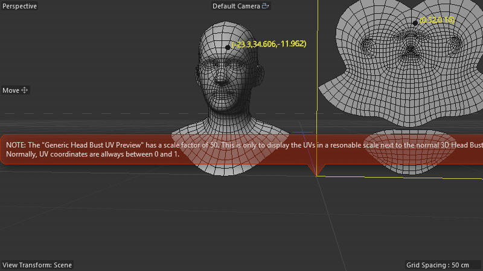

# Scene Audit — UV-Polygon-Info_Example_01

**Scene:** `UV-Polygon-Info_Example_01.c4d` (DRuckli asset library)
**Snapshot:** [`_snapshots_t0/UV-Polygon-Info_Example_01.c4d`](../_snapshots_t0/UV-Polygon-Info_Example_01.c4d)
**Type:** STATIC (no animation tracks; configuration-driven only)

## What it does

Side-by-side comparison: a 3D head bust on the left, an instance of the same head bust on the right that has been **flattened to its UV layout** via a Scene Nodes deformer. Yellow text labels overlay each vertex's 3D coordinates in the original mesh.

The right-hand "UV preview" is the same mesh's vertices repositioned to their `(U, -V, 0)` coords scaled ×50 (UV space is normally 0-1; scaled for display next to the 3D mesh).



> Author note (red overlay in viewport): "The 'Generic Head Bust UV Preview' has a scale factor of 50. This is only to display the UVs in a reasonable scale next to the normal 3D Head Bust. Normally, UV coordinates are always between 0 and 1."

## Object tree

```
INFO                              (Null)
UV Space                          (5186 — UV grid display)
Generic Head Bust                 (5100 — polygon mesh)
Generic Head Bust UV Preview      (5126 — Instance of Generic Head Bust)
└── Build UV Preview              (180420400 — SN Deformer — THE flattening engine)
Show Polygon Vertex Positions     (180420500 — SN Generator — vertex label overlay)
```

## Key Scene Nodes graphs

### `Build UV Preview` SN Deformer (23 nodes / 7 capsules / 26 wires)

The 3D→flat conversion engine. Top-level architecture:

```
INPUT GEOMETRY (instance of original 3D head)
       │
       ├──→ [get_property: UV] ──→ [set_property: UV] ───────┐
       │                                                       │
       └──→ [uvtomesh CAPSULE] ───→ [transform_element] ──→ [set_property: data3d (positions)] ──→ OUT
                       │
                       │ Inside uvtomesh:
                       │   • get(uv accessor)         — read UV per vertex
                       │   • containeriteration       — walk vertices
                       │   • splitvectorcomponents    — separate U, V
                       │   • invert(y)                — flip V (UV-y vs C4D-y convention)
                       │   • composevector3(u,-v,0)   — build flat-3D vector
                       │   • scale ×50                — display-friendly size (AM-exposed)
                       │   • set(data3d accessor)     — write new positions
                       │   • filter(or)               — selection mask
```

**Key node:** `uvtomesh` (`net.maxon.neutron.geometry.uvtomesh` capsule). Internally an iterator that reads UV per vertex and writes back as flat 3D position.

### `Show Polygon Vertex Positions` SN Generator (122 nodes / 21 capsules / 181 wires)

Visualization-only tool. Per vertex it generates:
- A small `sphere` marker at each vertex position
- A `text` label with the vertex's `(x, y, z)` coordinates
- Color-coded based on vertex selection / index

Heavy use of `transformmatrix`, `transform_element`, `text`, `annotation`, `color` — pure visualizer, no geometric output back to deformer chain.

## ⚡ The slider unlock — 3D ↔ flat morph (Spenser's question)

**YES — adding an animatable 3D↔flat slider is straightforward.** The current Build UV Preview is binary (always shows the flat result). To make it morph:

### Recipe — modify Build UV Preview to add a `factor` parameter

**New nodes to add (5):**
1. `get_property(data3d)` reading **original 3D positions** (parallel to existing UV `get_property`)
2. `arithmetic(blend)` or `mix` node taking `(orig_pos, uvtomesh_pos, factor)` per vertex
3. `floatingio` to expose `factor` to the AM as a 0.0-1.0 slider
4. (existing) `set_property(data3d)` already there — just rewire its input from `transform_element` to the new mix

**New wiring:**
```
INPUT GEOMETRY ─┬──→ [get_property: data3d] ─────────┐
                │                                       │
                └──→ [uvtomesh] → [transform_element] ─┤
                                                        ▼
                                              [mix(a, b, factor)] ──→ [set_property: data3d] ──→ OUT
                                                        ▲
                                              [floatingio: "Morph Factor"] ─┘  (AM slider 0-1)
```

At factor=0 → 3D head; factor=1 → flat UV layout; factor=0.5 → half-morphed. Animate the AM slider with a track for cinematic morph.

### Reverse direction (flat → 3D arbitrary surface)

The reverse the Python script did (project a flat-UV-positioned mesh onto a NEW 3D surface) is more involved but also feasible in SN:

**Option A — same source mesh:** trivial. Original positions ARE the inverse of the morph; just animate factor 1→0.

**Option B — different target surface (the Python script's actual use case):** needs:
1. Target surface as second input (via `legacyobjectaccess` of a target mesh)
2. `nearestneighbor` or raycast from each flat UV position onto target surface to find new 3D position
3. Optionally barycentric interpolation for smoothness

Existing nodes `nearestneighbor` (used in Plexus/Voxelizer) + `surfacebluenoise`-style projection primitives are already in our vocabulary — feasible without new infrastructure.

## Recreate-as-asset feasibility

- `uvtomesh` is a maxon-shipped capsule (atlas-verifiable). Phase-3 v9.2 should rebuild this scene at 100% nodes / high wire fidelity since the structure is fully covered by current asset_map.
- Worth confirming with a Phase-3 sweep run on this scene to validate.

## Creative intent

This scene is a **UV-debugging / reference / teaching aid**. An artist setting up shading or unwrapping benefits from seeing both:
- The 3D mesh (for spatial intuition)
- The flat unwrap (for shader-tile/seam reasoning)
- Per-vertex coordinate labels (for precise authoring)

The author built it as a self-contained capsule pair so any artist can drag it onto their own mesh and instantly get the side-by-side UV preview without manual work.

## Use as-is vs rebuild-from-scratch decision

**USE AS-IS for production.** This scene's value is the visualization tooling; replicating it just to show we can isn't worth the effort. Lock as a shortcut.

**REBUILD FROM SCRATCH for two reasons:**
1. **The slider unlock** — extending the existing Build UV Preview to add a morph factor is a meaningful new capability (and the rebuild verifies we understand the topology well enough to extend it correctly)
2. **Phase-3 fidelity validation** — running this through `sn_phase3_rebuild.py v9.2` cross-validates the methodology on a fresh DRuckli asset
