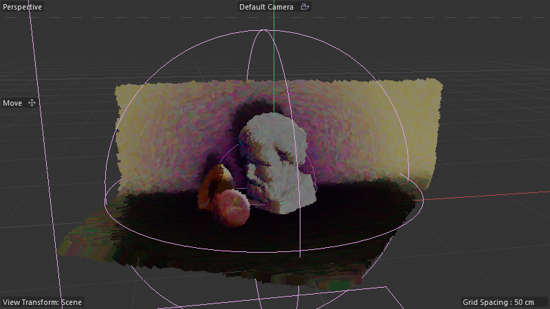

# Scene Audit — Paint_Strokes_Distribution_Example-Bust_01

**Scene:** `Paint_Strokes_Distribution_Example-Bust_01.c4d` (DRuckli asset library)
**Snapshot:** [`_snapshots_t0/Paint_Strokes_Distribution_Example-Bust_01.c4d`](../_snapshots_t0/Paint_Strokes_Distribution_Example-Bust_01.c4d)
**Type:** STATIC composition (no animation in main scene; 0-200 frame range available for variations)

## What it does

A **painterly still-life rendering pipeline** — bust + apple + orange on a curved backdrop, rendered as if hand-painted with brush strokes that follow surface flow. Each subject is a separate sub-tree with its own Connect → Flow Spline → Paint Strokes Distribution → Cloned Stroke planes.



> Beautiful painterly output: soft brush strokes, atmospheric color, stroke direction follows surface flow on each subject.

## Object tree

```
BUST                              (Null)
├── Connect Bust                  (Connect — collapses Bust into single mesh)
│   └── Bust                      (loft of head bust geometry)
├── Flow Spline                   (Spline driving stroke direction on bust)
└── Paint Strokes Distribution    (Distribution generator 190000011 — THE paint stroke engine)
    └── Strokes                   (Cloner)
        └── Plane.1, Plane.2, Plane  (3 stroke "tile" textures)

APPLE                             (Null) — same pattern: Connect / Flow Spline / Paint Strokes Distribution / 2 Strokes
ORANGE                            (Null) — same + Resample Spline SN deformer + Add Shadows MoGraph
BG                                (Null) — Connect / Backdrop SN / Select-by-Camera SN / Split SN / Flow Spline / Paint Strokes Distribution / BG Color effector + Random Field + Spherical Field
Overall Light Map                 (Connect — combines all 3 subjects + Backdrop, runs Light Vertex Map SN deformer)
Overall Random Scale              (MoGraph effector — uniform stroke size variation)
Overall Random Color              (MoGraph effector — uniform color variation)
```

## SN/Distribution hosts (10 across the scene)

| Host | Type | Nodes | Wires | Capsules | Role |
|---|---|---:|---:|---:|---|
| **Paint Strokes Distribution** | 190000011 (×4) | **514** | **812** | **75** | THE distribution engine — places oriented strokes on each subject |
| **Backdrop** | 180420600 (×2) | 72 | 96 | 12 | builds the curved backdrop geometry |
| **Select by Camera View** | 180420400 | 170 | 420 | 25 | selects geometry visible to active camera (occlusion-aware stroke placement) |
| **Split** | 180420400 | 6 | 3 | 0 | small util — splits geometry by selection |
| **Light Vertex Map** | 180420400 | 77 | 129 | 12 | bakes per-vertex lighting → vertex map → drives stroke color |
| **Resample Spline** | 180420400 | 2 | 0 | 0 | ultra-thin SN wrapper around resample-spline op |

## Paint Strokes Distribution — top-level node histogram

| Count | Node | Role |
|---:|---|---|
| 19× | floatingio | **19 AM-exposed parameters** — extensive artist control |
| 13× | scaffold | layout-only (organization for a 514-node graph) |
| 12× | reroute | wire organization |
| 11× | if | branching logic (selection / state-based behavior switches) |
| 7× | arithmetic | math |
| 6× | **readvalueatindex2** | array reads (note "2" suffix — newer/specialized variant) |
| 4× | container | data containers |
| 3× | group | sub-graph wrappers |
| 3× | containeriteration | per-stroke iteration |
| 3× | **get_information** | geometry property queries (likely flow-spline lookups) |
| 2× | **gradient** | color/value gradients (stroke color variation along flow) |
| 2× | normalize | direction normalization |
| 2× | transformvector | direction transformation |
| 2× | transform_element | apply transforms to geometry elements |
| 2× | transformmatrix | matrix construction for stroke orientation |
| 2× | get_property | reads UV / weight / etc. from input |
| 1× | **composedistributioncontainer** | THE new C4D 2026 distribution-output node — what makes this Cloner-compatible |
| 1× | **layer** | layered output (multi-stroke composite) |
| 1× | **image** | image-texture sampling (paints from a stroke texture map!) |
| 1× | **nearestneighbor** | neighbor query (avoid overlapping strokes / density spacing) |
| 1× | **align** | aligns each stroke to a direction vector — THE flow-following primitive |
| 1× | **dot** | dot product (likely for camera-facing or normal-facing tests) |
| 1× | scale + negate + decomposecontainer + booleanoperator + split + type | utility |

## The vertex-map spline-flow technique (Spenser's call-out)

Spenser said: "*it has some really interesting functionality and uses a unique spline flow built from a vertex map.*"

The pattern (decoded from the Flow Spline + Paint Strokes Distribution + Light Vertex Map combo):

1. **Light Vertex Map** SN deformer per subject — bakes a per-vertex value (likely lighting intensity, curvature, or a custom field) onto the mesh as a vertex map.
2. **Flow Spline** — a hand-drawn spline per subject indicating the desired brush-stroke direction.
3. **Paint Strokes Distribution** — for each stroke placement:
   - Reads the vertex map at the stroke's position → modulates color/density
   - Reads the Flow Spline's tangent direction at the closest point → orients the stroke (`align` node)
   - Samples the stroke `image` texture per stroke → individual brush-tile textures
   - `gradient` × 2 modulates color along the stroke length and per-stroke variation
4. **Layer** node composites the multi-stroke per-vertex contributions
5. **composedistributioncontainer** outputs a Cloner-compatible distribution → Cloner places real plane geometry per stroke

**The unique creative move:** combining vertex-map (color/intensity source) + spline (direction source) + image-texture (stroke shape source) into a single per-stroke evaluation. Most stippling/spray tools use only one of those. Doing all three creates the painterly cohesion.

## Per-subject breakdown

- **BUST**: 3 stroke planes — most strokes (most surface area + complex geometry)
- **APPLE**: 2 stroke planes — fewer, smaller surface
- **ORANGE**: 2 stroke planes + extra Add Shadows MoGraph + Resample Spline SN — adds shadow rim
- **BG**: 1 stroke plane + Backdrop SN (builds the curved BG sweep) + Select by Camera View (only paints visible BG) + Split SN + BG Color (with Random + Spherical fields for tonal variation)

## Composedistributioncontainer + new C4D 2026 Distribution generator

This scene exercises the new C4D 2026 architecture:
- `composedistributioncontainer` (SN node) packages per-stroke `(position, orientation, scale, color, image-uv)` into the Distribution container format
- The Distribution generator (190000011, "Paint Strokes Distribution") is a Cloner-compatible host that emits the distribution
- The Cloner consumes it and instances stroke planes accordingly

Spenser's atlas memory entry confirms this pattern — see [`reference_c4d_2026_distribution_capsule_vs_custom_graph.md`](memory) and [`reference_c4d_2026_distribution_family_inventory.md`](memory).

## Use as-is vs rebuild

**USE AS-IS for production.** This is a 514-node distribution engine that took serious time to author. Drop the Paint Strokes Distribution generator onto any subject + a Flow Spline + (optional) Light Vertex Map, customize the 19 AM params, ship.

**REBUILD VIA PHASE-3** for verification — the `composedistributioncontainer` + `image` + `align` + `gradient` + `layer` combo is novel vocabulary not yet in our atlas. Capturing the descriptor (514 nodes / 75 capsules) is real reference value.

**Critical observation for OUR own paint-stroke work:** the `align(input_vector, target_direction)` node is the primitive we should adopt for any "orient elements to a flow" task — it's been hiding in plain sight as the missing piece for direction-aware distributions.
