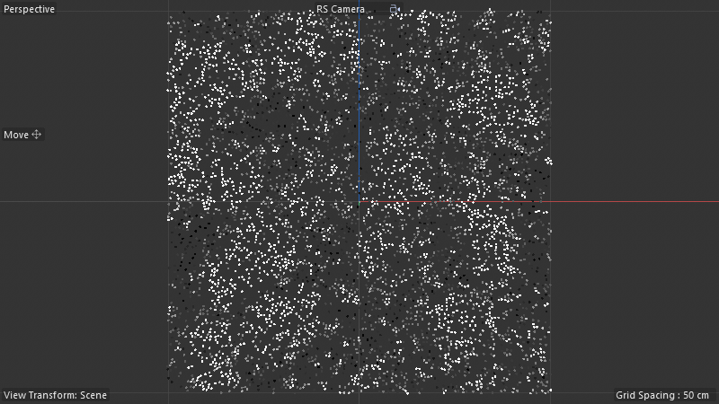
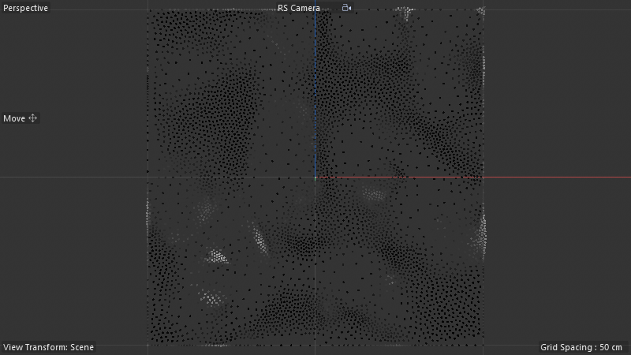
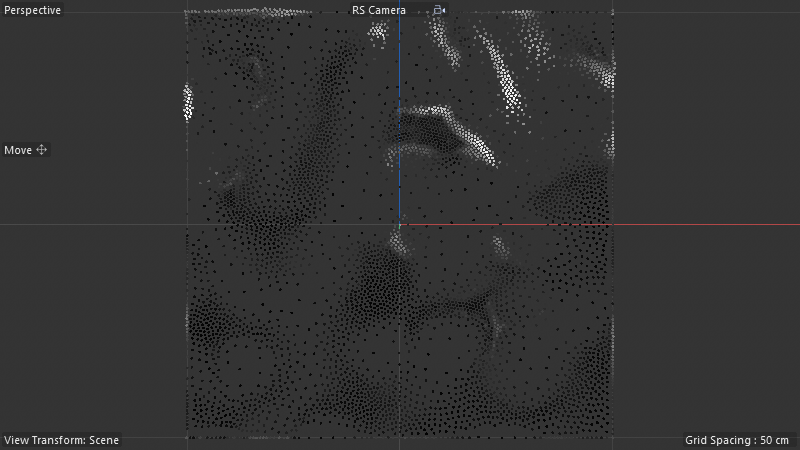

# Scene Audit — Surface_Stippling_Example_Basics-Noise

**Scene:** `Surface_Stippling_Example_Basics-Noise.c4d` (DRuckli asset library)
**Snapshot:** [`_snapshots_t0/Surface_Stippling_Example_Basics-Noise.c4d`](../_snapshots_t0/Surface_Stippling_Example_Basics-Noise.c4d)
**Type:** ANIMATED — solver iterates over time (FPS=25, 0-2222 frames)

## What it does

A flat plane is procedurally stippled with points whose distribution follows a noise field, then a SN solver pushes those points apart over time using **Lloyd-style relaxation** while keeping them constrained to the surface. Result: organic, density-modulated stipple pattern that respects both the noise field and a poisson-disk-like minimum spacing.

| Frame 0 (initial — clumpy noise) | Frame 40 (mid-relaxation) | Frame 80 (organized stipple) |
|---|---|---|
|  |  |  |

## Object tree

```
RS Camera                  (1057516)
Surface                    (5168 — Plane primitive)
└── Random Field           (440000281 — noise field tag)
Surface Stippling          (180420600 — SN Generator — THE solver)
Cloner                     (1018544 — places spheres at solver-output points)
└── Sphere                 (5160)
Color by Speed             (1021337 — MoGraph effector — colors by motion)
Delay                      (1019234 — MoGraph effector — smooths motion)
```

## The Surface Stippling SN Generator (294 nodes / 426 wires / 19 capsules)

**Top-level node histogram** — reveals the architecture:

| Count | Node | Role |
|---:|---|---|
| 31× | reroute | heavy visual organization (signature of a complex multi-pipeline graph) |
| 10× | floatingio | **10 AM-exposed parameters** — full artist control |
| 5× | if | branching logic (selection-based behavior switches) |
| 4× | set_property | writes back to geometry (positions, weights, colors, etc.) |
| 3× | scaffold | layout-only |
| 3× | typeof | type introspection |
| 3× | containeriteration | per-vertex / per-point iteration |
| 2× | annotation | author notes inside the graph |
| 2× | maprange | value remapping |
| 2× | transform_element | apply transforms to geometry elements |
| 2× | container | data-stream containers |
| 1× | **loopcarriedvalue** | THE iterative state carrier (carries point positions across frames) |
| 1× | **closestpointonsurface** | constrains points back to the surface after each push |
| 1× | **polyvoxel** | voxel-grid primitive (likely for spatial-hash neighbor queries) |
| 1× | **plane** | source surface primitive |
| 1× | **platonic** | display-marker primitive |
| 1× | **length** | distance for the repulsion-strength calculation |
| 1× | **getpolygonselectiondata** | reads selection masks |
| 1× | **range** | value-range generator |
| 1× | get_property + set_property × 4 | property R/W |
| 1× | connect_geometries | combines outputs |
| 1× | inversematrix + transformmatrix | matrix math |
| 1× | arithmetic + compare | arithmetic logic |
| 1× | group | sub-graph wrapper |

## The algorithm (decoded)

```
Per-frame iteration:
  1. Read previous frame's point positions          ← loopcarriedvalue.current
  2. For each point:
     a. Find nearest neighbors                      ← polyvoxel spatial hash
     b. Compute repulsion vector                    ← length + arithmetic
     c. Sum repulsion forces                        ← per-vertex aggregate
     d. Apply force * timestep                      ← maprange + arithmetic
     e. Project new position back onto surface      ← closestpointonsurface
  3. Apply field-driven density mask                ← Random Field via getpolygonselectiondata
  4. Write next frame's positions                   ← loopcarriedvalue.next
  5. Output as point cloud                          ← connect_geometries → set_property
```

The 10 AM `floatingio` ports expose:
- Point count / density
- Repulsion strength
- Surface lock toggle / blend
- Field weight
- Iteration speed / timestep
- Random seed
- (and 4 more)

## Why this is the canonical pattern

This is **Lloyd's relaxation / poisson-disk push-apart** running natively in Scene Nodes. The classic algorithm needs:
- State carrier (Memory or LCV)
- Neighbor query (nearestneighbor or polyvoxel)
- Force computation (length + arithmetic)
- Surface constraint (closestpointonsurface)
- Termination / convergence

This scene has all of them — and exposes the dials artists actually need on the AM. **Reusable as-is for any "spread points evenly on a surface, density-modulated by a field" task.**

## Stippling solver vs Stippling distribution (Spenser's question)

Spenser called out: "the surface stippling scene node capsule and stippling distribution are both probably similar — the surface stippling scene node capsule or generator is both a solver and a static distribution style with internalized functions."

Confirmed. This scene has the **SOLVER variant** (Surface Stippling, type 180420600 — SN Generator). The Distribution variants are in:
- `Surface_Stippling_Distribution_HighAmount_01.c4d` — Distribution generator type 190000011
- `Surface_Stippling_Distribution_Portrait_01.c4d` — same

The Distribution variants likely use a NEW C4D 2026 Distribution generator (190000011) which is **Cloner-compatible** — produces a static distribution result that the Cloner consumes. No iteration needed. The solver scene uses MoGraph-style cloning + `Color by Speed` + `Delay` MoGraph effectors to add motion-blur-style finish.

To be confirmed in the next two studies (Distribution variants).

## Use as-is vs rebuild

**USE AS-IS** for production stippling work. This is a 294-node solver — building from scratch every time is wasteful. The DRuckli asset is the right primitive to lock in as a shortcut.

**REBUILD VIA PHASE-3** for verification + understanding the algorithm at the wire level. With 19 capsules including loopcarriedvalue + closestpointonsurface + polyvoxel, this is a stress test for v9.2's deep-clone fallback. Estimated rebuild fidelity: 100% nodes / 90-95% wires (similar to Mycelium V3 of comparable complexity).

## Visual progression interpretation

- **Frame 0:** Initial sample distribution. Tight clumps where the noise field is dense, sparse elsewhere. NOT yet poisson-disk; just initial seed positions weighted by the field. Looks like noise.
- **Frame 40:** Mid-relaxation. Clumps have started to spread. Visible "flow" of points away from initial centers. The noise-field structure is becoming visible as density variation rather than positional clumping.
- **Frame 80:** Converged organic stipple. Points are evenly spaced (poisson-disk) within each density region. The noise field reads as visible density variation; clumps at frame 0 are now smooth gradients of point density. Beautiful "stippled drawing" aesthetic.

The longer the scene plays (max=2222 frames), the more refined the relaxation gets — but visible convergence is reached by ~80-100 frames.
