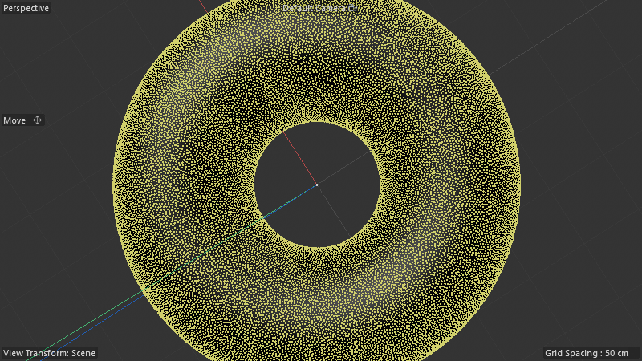
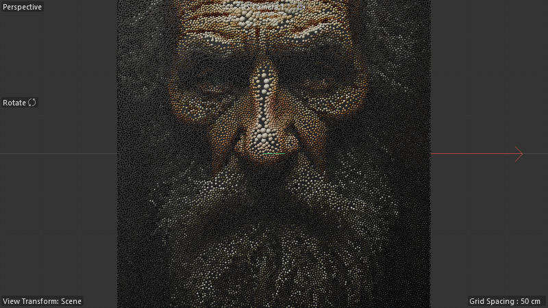
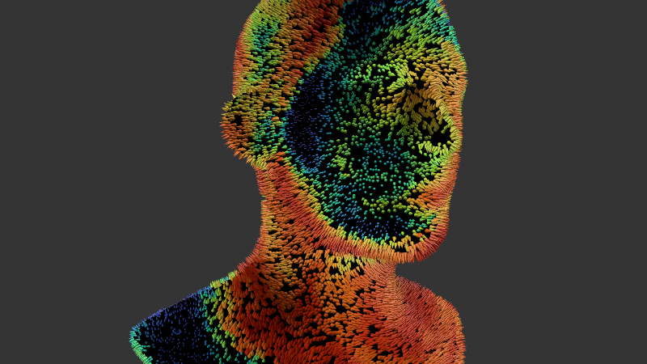
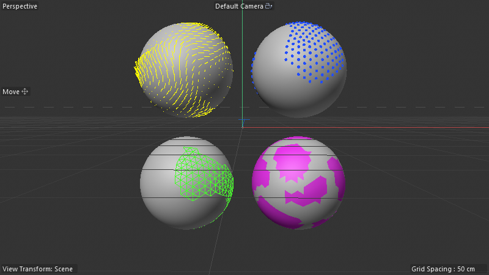

# Batch 1 — Stippling Distribution Variants + Visualizers

Combined audit doc covering 4 related scenes:

| Scene | Folder |
|---|---|
| Surface_Stippling_Distribution_HighAmount_01 | [`10_stippling_dist_highamount/`](10_stippling_dist_highamount/) |
| Surface_Stippling_Distribution_Portrait_01 | [`16_stippling_dist_portrait/`](16_stippling_dist_portrait/) |
| Surface_Stippling_Example_Spiky-Head | [`15_stippling_spiky_head/`](15_stippling_spiky_head/) |
| Visualizer_Examples_01 | [`17_visualizers/`](17_visualizers/) |

## A. Surface Stippling Distribution — HighAmount (torus)



**Object tree:** Torus + `Surface Stippling Distribution` (190000011, the C4D 2026 Distribution generator, **187 nodes / 264 wires / 14 capsules**) + Cloner.

**What it is:** STATIC distribution variant of the Surface Stippling family. Same node primitives as the solver but **no `loopcarriedvalue`** — the points are computed once-per-config from the noise field (no iterative push-apart). High-density variant (the "HighAmount" name).

**Compare to solver (Basics-Noise = 294 nodes / 19 capsules):**
- Solver = 294 nodes — needs LCV + closestpointonsurface + per-frame iteration logic
- Distribution = 187 nodes (~36% smaller) — pure static distribution, no time dependency
- The 14 capsules vs 19 reflects the missing iteration scaffolding

**Use as-is for production.** When you don't need animated push-apart, the Distribution variant is faster and cleaner.

## B. Surface Stippling Distribution — Portrait (face)



**Object tree:** RS Camera + Bouncecard + Surface (textured w/ portrait) + same `Surface Stippling Distribution` (187/264/14 — IDENTICAL graph) + Cloner with light setup.

**What it is:** SAME 187-node distribution graph as HighAmount, but with the **input surface textured with a photographic portrait** as a vertex-color/material map. The stippling density modulates with the photo's tonal values, producing a gorgeous stipple-art rendering of an old man's face.

**Key insight:** the Distribution capsule is INPUT-DRIVEN. Same graph, completely different output based on:
- The surface mesh
- Vertex colors / texture
- Field tags on the surface (controlling density mask)

**This proves the Distribution-capsule pattern's reusability.** The capsule itself is generic; the artistic output comes from how you feed it.

## C. Surface Stippling — Spiky Head (solver variant on a head mesh)



**Object tree:** Head + Random Vertex Map + `Surface Stippling` (180420600 SOLVER, 294/426/19 — same as Basics-Noise) + Generate Point Normals SN + Geometry Axis SN + Clon_onto_Points cloner.

**Three SN hosts:**
| Host | Type | Nodes | Wires | Capsules | Role |
|---|---|---:|---:|---:|---|
| Surface Stippling | 180420600 | 294 | 426 | 19 | THE solver (same graph as Basics-Noise) |
| Generate Point Normals | (180420400/500) | 13 | 16 | 2 | computes per-stipple-point normal direction |
| Geometry Axis | (180420400) | 23 | 28 | 4 | re-orients geometry along an axis |

**What it is:** The solver applied to a 3D head with a random vertex map driving density. Produces the iconic "spiky head" stippled portrait — colored spikes (orange→teal gradient) growing radially from the head surface, denser where the vertex map is brightest.

**The clever assembly:** Surface Stippling solver positions points on head surface → Generate Point Normals computes outward direction at each point → Cloner places oriented "spike" geometry (cone or platonic) at each point with per-point color modulation from vertex map.

**Use as-is for high-end stipple-art renders.** The solver+normals+cloner stack is reusable for any "spike out of a surface" aesthetic.

## D. Visualizer Examples — Selection visualizers (the DRuckli must-keep capsules)



**Object tree (8 hosts):**
| Host | Type | Nodes | Wires | Capsules | Role |
|---|---|---:|---:|---:|---|
| Sphere with Color Vectors | 180420600 | 119 | 188 | 24 | DEMO — sphere with vertex colors |
| Color as Vector Visualizer | 180420700 | 44 | 54 | 5 | OVERLAY — renders vertex colors as yellow direction strokes |
| Sphere with Point Selection | 180420600 | 120 | 163 | 24 | DEMO — sphere with point selection |
| Selection Visualizer Points | 180420600 | 43 | 45 | 6 | OVERLAY — renders selected points as blue dots |
| Sphere with Edge Selection | 180420600 | 123 | 166 | 25 | DEMO — sphere with edge selection |
| Selection Visualizer Edges | 180420600 | 40 | 44 | 5 | OVERLAY — renders selected edges as green wireframe |
| Sphere with Poly Selection | 180420600 | 462 | 643 | 93 | DEMO — sphere with polygon selection |
| Selection Visualizer Polys | 180420600 | 52 | 57 | 7 | OVERLAY — extrudes selected polys as bright pink fill |

**What they are:** Four reusable selection-visualizer SN Generators. Drop one onto your scene as a separate object (deformer-style overlay, no parent-child needed) and they read selection data + render visual highlights via small extrusions or marker geometry.

### Selection Visualizer Polys — graph decoded

The 52-node Polys visualizer graph topology:
```
Input geometry → reroute → [extrude offset=+0.2] → [split selected polys] ─┐
                                                                            ├→ connect_geometries → out
                                       → [extrude offset=−0.2] → [split selected polys] ─┘
       
[floatingio: depth slider 0.2] → reroute → drives both extrude offsets (one positive, one negated)
[getpropertynames] → reads polySelName → readvalueatindex2 → concat → if → drives selection string
```

It extrudes selected polygons SLIGHTLY outward AND inward, splits them out as a separate sub-mesh, then color-codes that sub-mesh as the highlight overlay. Single AM `floatingio` slider controls the highlight depth.

**Per Spenser's instruction: USE AS-IS, lock as shortcuts.** These are tested production tools. Studying them tells us:
- The "extrude both ways + split" pattern is the canonical "highlight a selection" trick in SN
- `getpropertynames` is THE node for dynamically grabbing attribute names (poly sel, edge sel, point sel, vertex map name, etc.) at runtime
- `readvalueatindex2` (note `2` suffix) is a specialized variant — worth investigating vs the standard `readvalueatindex`

## Cross-scene insights

1. **Solver vs Distribution split confirmed.** Distribution is ~36% smaller node-wise because it skips per-frame iteration. Same family, different time-axis behavior. Choose Distribution for one-shot density-driven point placement; Solver for animated push-apart.

2. **Image-based stippling works.** The Portrait variant proves you can drive density from a photographic image via vertex colors/material — the distribution capsule is generic.

3. **Solver scales to 3D surfaces** (Spiky Head proves this). Same 294-node solver works on a torus (flat-ish) AND a complex head mesh.

4. **Visualizer pattern is reusable.** All 4 selection visualizers share the same "extrude+split as overlay" architecture. Could codify as a "highlight selection" SN recipe template.

5. **`readvalueatindex2`** appears here AND in Paint Strokes Distribution (6×). New atlas vocabulary entry — likely handles a different array type (e.g. polymorphic or interned ID arrays).
