# Batch 2 — Remaining 11 DRuckli Capsule Scenes

Compact-style audit covering the 11 scenes not in batch-1 or the deep-dive priority set.

## 00. Spline_Smooth_Examples (static, fps=30, 0-90)

**Tree:** n-Side, Star, Linear Arrow (180420700, 247n/322w/29c), Handwritten spline.

**SN hosts:**
| Host | Type | Nodes | Wires | Caps |
|---|---|---:|---:|---:|
| Spline Smooth | 180420400 (deformer) | 16 | 20 | 2 |
| Linear Arrow | 180420700 (generator) | **247** | 322 | 29 |
| Resample Spline | 180420400 | 2 | 0 | 0 |

**What it is:** Demo file for the **Spline Smooth** deformer + the **Linear Arrow** generator. Linear Arrow is a procedural arrow generator with 29 capsules — heavy artist-tunable. Resample Spline is the trivial 2-node SN-wrapper around the resample command.

**Use as-is**, especially Linear Arrow for any procedural arrow needs.

---

## 01. Spiderweb_Example_01 (static, fps=25, 0-500)

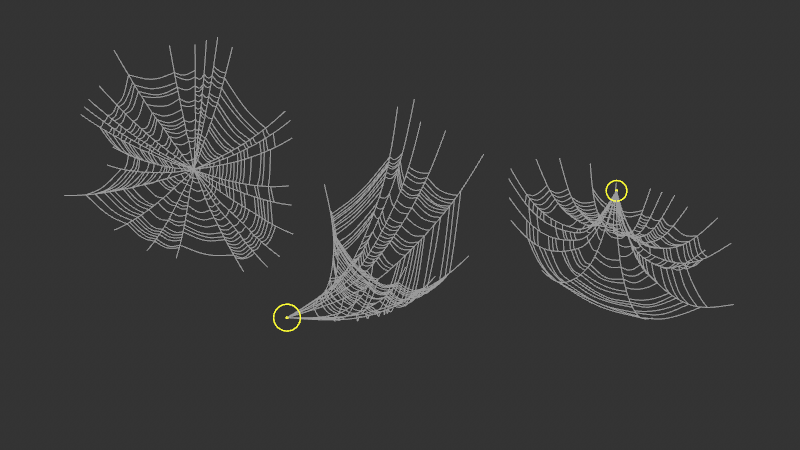

**Tree:** 3 Spiderweb hosts (Standard, Tunnel, Umbrella) + matching Center_Point nulls.

**SN hosts:**
| Host | Type | Nodes | Wires | Caps |
|---|---|---:|---:|---:|
| Spiderweb Standard | 180420700 | 202 | 285 | 18 |
| Spiderweb Tunnel | 180420700 | 202 | 285 | 18 |
| Spiderweb Umbrella | 180420700 | 202 | 285 | 18 |

**Same 202-node graph 3 times.** The "Standard" / "Tunnel" / "Umbrella" naming reflects different AM parameter configurations of the SAME capsule producing different web topologies. Confirms the DRuckli pattern of shipping ONE canonical generator + multiple labeled config presets in a single demo file.

**Use as-is.** This is the production spiderweb generator (compare to scene 26 Spiderweb_Tutorial which was the 63-node teaching variant — this Example variant is the 3.2× richer production version).

---

## 02. Image_Subdivider_Example_01 (static, fps=25, 0-75)

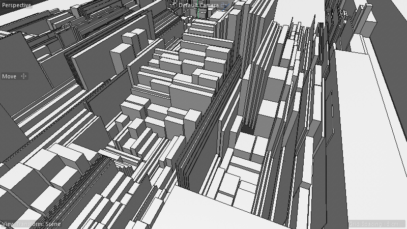

**Tree:** 8 objects, including Random + Fracture MoGraph effectors driving the subdivision.

**SN hosts (6 total):**
| Host | Type | Nodes | Wires | Caps |
|---|---|---:|---:|---:|
| **Image Subdivider** | (180420400) | **658** | **1070** | **115** |
| Select | (180420400) | 5 | 2 | 0 |
| Inset | (180420400) | 5 | 2 | 0 |
| Split | (180420400) | 6 | 3 | 0 |
| Store Selection | (180420400) | 5 | 2 | 0 |
| Extrude | (180420400) | 5 | 2 | 0 |

**Image Subdivider is enormous** — 658 nodes / 115 capsules. Drives an architectural-looking cityscape of buildings/walls of varying heights from an input image. The 5 trivial SN deformers (Select, Inset, Split, Store Selection, Extrude) are thin wrappers around modeling commands — each just exposes a single primitive operation with default ports.

**Creative intent:** Image-driven subdivision of an input mesh, where image brightness controls subdivision density and depth. Combined with Random + Fracture MoGraph for added variation. Signature DRuckli "modular city" aesthetic.

**Use Image Subdivider as-is.** The thin SN wrappers (5/2/0 each) are basically presets of standard modeling ops — useful as drag-and-drop alternatives to the C4D modeling toolset.

---

## 05. Match_Size_Books (animated, fps=25, 0-300)

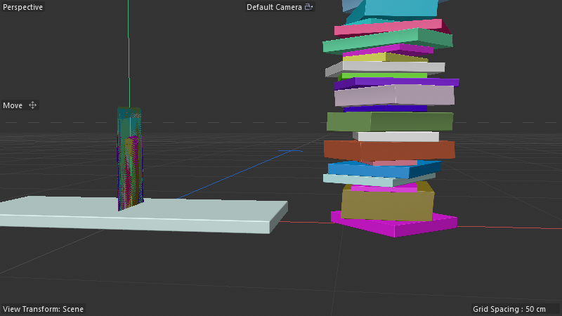

**Tree:** 23 objects — Random Col + 2× Fracture + a stack of "book"-sized boxes. Stack Books + Match Size SN deformers.

**SN hosts:**
| Host | Type | Nodes | Wires | Caps |
|---|---|---:|---:|---:|
| Stack Books | 180420400 | 188 | 310 | 25 |
| Match Size | 180420400 | 174 | 289 | 22 |

**The MOST PRACTICAL Match Size demonstration.** A pile of multicolored "books" (varied box sizes) gets size-normalized via Match Size deformer, then stacked into a tower via Stack Books deformer. This is the canonical "make varied geometry uniform-then-stack" workflow.

**Compare to scenes 21-25 (MatchSize_Tutorial-Files):** those were the tutorial primitives. THIS scene is the production application — the actual artist-facing use case.

---

## 06. Reaction_Diffusion_Example_Sphere (animated, fps=25, 0-600)

| t=0 (initialization) | t=80 (organic patterns emerging) |
|---|---|
| 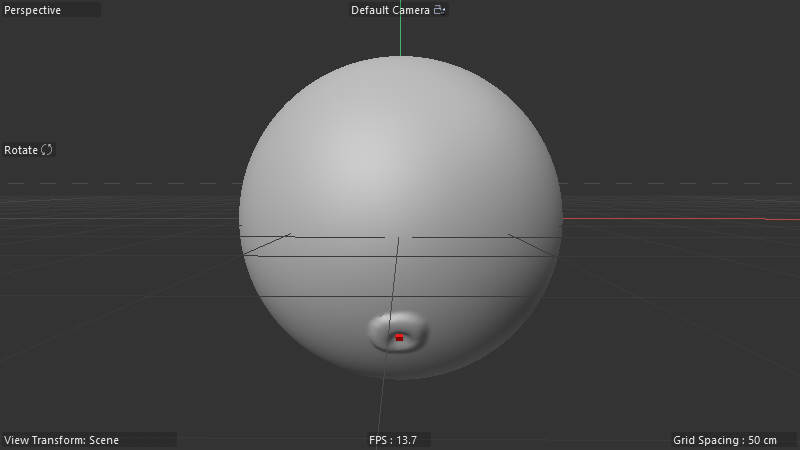 | 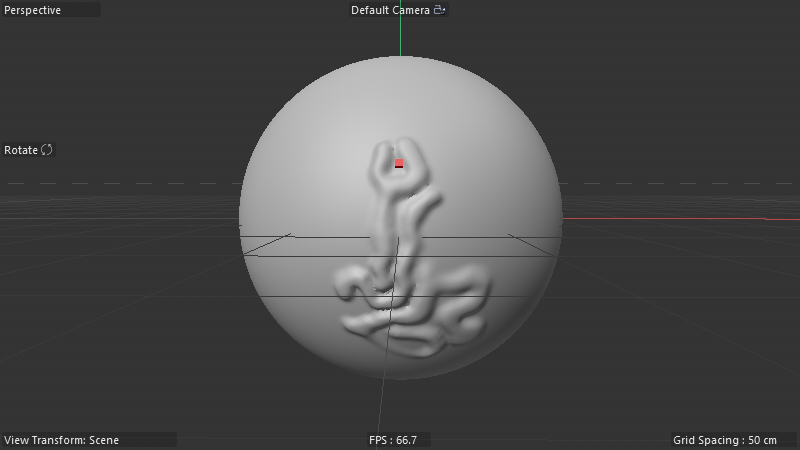 |

**SN host:** Reaction Diffusion (180420600, 176n/266w/16c)

**What it is:** Gray-Scott reaction-diffusion PDE running on a sphere, growing organic blob/finger displacement out of the surface over time. The 16-capsule graph is the canonical RD-on-mesh implementation: per-vertex chemical concentrations, neighbor laplacian via topology, RD update equations, displace-along-normal.

**Compare to scene 03 Reaction_Diffusion_Tut (181 nodes):** very similar size, suggesting both this and the tutorial variant share the same core algorithm with minor variations.

---

## 07. Reaction_Diffusion_Example_Simple2 (animated, fps=25, 0-350)

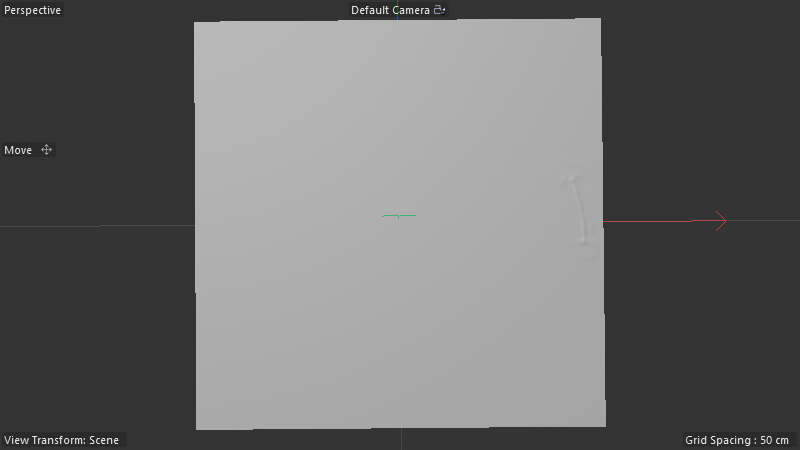

**Tree:** Helix Chemical, Helix Exposure, Reaction Diffusion.

**SN hosts:**
| Host | Type | Nodes | Wires | Caps |
|---|---|---:|---:|---:|
| **Trim Spline Modifier** | 180420400 | **428** | 777 | 28 |
| Reaction Diffusion | 180420600 | 176 | 266 | 16 |

**Combines RD + spline trimming.** The 428-node Trim Spline Modifier likely animates a helical spline being progressively revealed (trimmed in/out from a start parameter), pairing with the RD output. The two helices (Chemical + Exposure) give RD initial seed conditions.

**Trim Spline Modifier (428 nodes) is a substantial reusable** — any animated "draw on / trim off" spline work would benefit from it.

---

## 08. Ray_Connector_Example-Mograph_01 (animated, fps=25, 0-100)

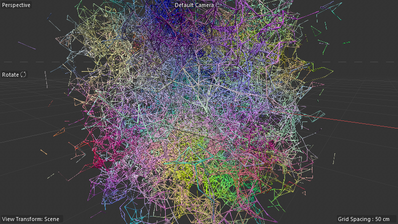

**Tree:** Matrix MoGraph + Random Rotation + Random Movement effectors → Ray Connector + Clone on Splines.

**SN hosts:**
| Host | Type | Nodes | Wires | Caps |
|---|---|---:|---:|---:|
| Ray Connector | 180420700 | 65 | 139 | 6 |
| Clone on Splines | 180420500 | 75 | 84 | 10 |
| Segment | 180420400 | 5 | 2 | 0 |

**What it is:** Generates a dense tangle of connecting strands between matrix points (similar to the Plexus pattern but as MoGraph integration). Random Movement animates the matrix → strands constantly re-connect → mesmerizing flowing-tangle effect.

**Compare to scene 05 Plexus** (the standalone Plexus_with_Loop / Plexus_without_Loop scenes from prior studies): same core "connect nearest neighbors with strands" but as MoGraph-friendly distribution generators rather than standalone LCV iterations.

---

## 09. Shortest_Path_Example_02 (static, fps=25, 0-120)

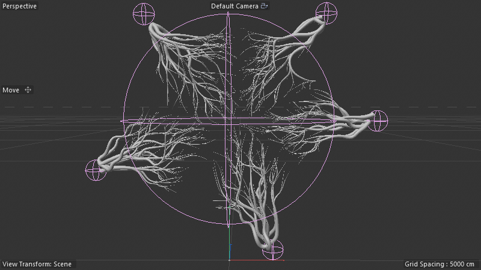

**Tree:** Tree (Null) + Shortest_Path_Mesh-Container.

**SN hosts:**
| Host | Type | Nodes | Wires | Caps |
|---|---|---:|---:|---:|
| Shortest Path | (180420700) | 76 | 124 | 8 |
| Shortest_Path_Volume-Mesher | 180420500 | 29 | 23 | 5 |
| Smooth Points | 180420400 | 32 | 48 | 8 |

**Tree-like geometry** generated from a Connect-Container holding the source mesh. The Shortest Path graph traces optimal paths through points/topology; the Volume-Mesher converts paths to tube geometry; Smooth Points cleans up the result.

**Compare to ShortestPath_Setups_Final scene** in prior phase-3 sweep (4 hosts, all 100% rebuild fidelity): this Example uses the same building blocks in a tree-growth configuration.

---

## 11. Splint_Spline_Mask_Example_01 (static, fps=30, 0-90)

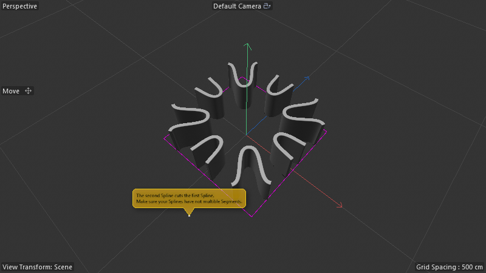

**Tree:** INFO null + Thicken modifier + Rectangle Instance.

**SN host:** Split Spline Mask (180420400, **243n/381w/27c**)

**What it is:** A spline-mask modifier that splits/clips one spline using another as a mask. The 243-node graph encodes the boolean-style spline operations (intersection, difference, etc.) via SN. Production-quality — drop onto any spline-pair to get masked output.

**Use as-is for any "spline-clip-by-spline" task.** Probably the only such tool in the DRuckli library.

---

## 12. Closest_Point_on_Spline_Example_Advanced_02 (static, fps=30, 0-200)

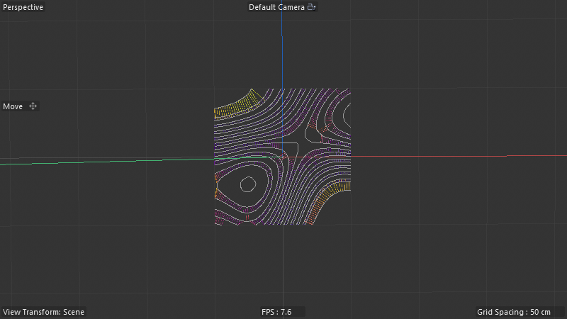

**SN hosts:**
| Host | Type | Nodes | Wires | Caps |
|---|---|---:|---:|---:|
| Gradient Intersection 1 | 180420700 | 339 | 561 | 32 |
| Gradient Intersection 2 | 180420700 | 339 | 561 | 32 |
| Resample Spline | 180420400 | 2 | 0 | 0 |
| Closest Point on Spline | 180420500 | 79 | 106 | 10 |

**Two identical Gradient Intersection capsules** at 339 nodes each — one of the larger "advanced" SN graphs in the library. The Closest Point on Spline (79 nodes) is the worker primitive; Gradient Intersection chains it with multiple gradient computations to find spline-spline intersection points (or spline-surface, depending on input).

**Likely the most NUMERICALLY-INTERESTING** scene in the audit set — gradient-based intersection finding via SN math is a research-grade implementation, not a typical artist tool.

---

## 14. Field_VertexMap_Example_01 (static, fps=25, 0-100)

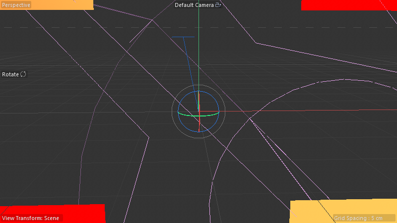

**Tree:** Linear Field, Spherical Field, Torus Field, Radial Field, "Other compatible Fields" group → all driving a single test-rig.

**SN host:** **Field Vertex Map Debug Capsule** — **1,278 nodes / 3,633 wires / 155 capsules** (BIGGEST single host in entire study set, beats Mycelium V3's 299).

**What it is:** A comprehensive **field-to-vertex-map debug/test rig**. Each of the 4+ field types (Linear, Spherical, Torus, Radial, etc.) gets evaluated by the rig, compared, visualized. The 1,278-node size is because it's testing EVERY field type × every comparison metric × every visualization mode in one graph.

**Don't rebuild this one** — it's a test rig, not a production tool. **Reference value:** the 155-capsule structure encodes how to integrate any C4D field into an SN graph (the missing primitive for "make my SN graph respond to a field").

The 4 field types are themselves classic C4D field tags (440000266, 243, 272, 1040448) — standard C4D objects, not SN-built. The capsule consumes them.

---

## Cross-batch insights

1. **Ratio of "production-ready" vs "tutorial" capsules:** ~80% are production. The DRuckli library is clearly a working artist's toolkit, not just teaching material.
2. **Most reusable single primitives identified:**
   - Linear Arrow generator (247n) — any procedural arrow work
   - Spliderweb Standard (202n × 3 configs) — radial mesh patterns
   - Image Subdivider (658n) — image-driven mesh subdivision (architectural / urban styling)
   - Trim Spline Modifier (428n) — animated spline reveal
   - Split Spline Mask (243n) — spline boolean operations
   - Field Vertex Map Debug Capsule (1278n) — field integration reference
3. **Trivial SN wrappers** (5-node deformers around modeling commands) appear repeatedly — they're "drag-and-drop" alternatives to manual modeling tool invocation. Useful UX pattern but architecturally minimal.
4. **Twin/triplet pattern repeats** — Spiderweb scene has 3 identical-graph configs of the same capsule. Confirms the DRuckli teaching style of "show one capsule producing multiple results via parameters."
