# Scene Study — Recursive Subdivision

**Source:** `the reference build/scene_02_reference/the recursive-subdivision practice scene`
**Studied:** 2026-05-01
**Methodology:** load fresh → frame sweep → annotation read → AM-param probe → predict-then-observe slider sweeps → dataflow trace → architectural decomposition

## What this scene does

Iterative random recursive subdivision of a flat plane. Starts as a square,
each iteration randomly extrudes a subset of polygons inward (creating
nested smaller polys) AND outward (raising blocks). Result: fractal-like
nested-blocks landscape where every level of recursion has its own depth.
Animates over time via the `Speed` parameter (the random seed is offset
by time so the pattern shifts).

Plane (parametric, in object tree) — the visible result is generated by
the **Nodes Mesh** child below it. The Nodes Spline sibling captures the
edges as splines for sweeping (in the render variant).

## Object tree

```
INFO (Null) — has Annotation tag with author note
Plane (5168) — base mesh primitive (the "input geometry")
RS Dome Light — render-only (skip)
Nodes Mesh (180420600) — the procedural recursive subdivision generator
Nodes Spline (180420700) — captures the same recursion as splines for sweep
```

## The author's note (Annotation tag on INFO null)

> "There is an initial update issue. To solve this: Go inside the 'Loop
> Carried Value' Node and rewire the first wire between the 'Variable 1'
> Input and the 'Explode Mesh Island' Node. Have fun :)"

Translation: on fresh load, the LCV→`explode_islands` wire doesn't
propagate the iteration result until manually re-wired. A known bug in
this scene's framework state.

## The 5 AM-exposed sliders (Nodes Mesh)

| Slider | Default | What I predicted | What I observed |
|---|---|---|---|
| **Iterations** | 6 | recursion depth | ✅ confirmed — 1 = single split, 10 = deeply nested fractal |
| **Global Seed** | 1245 | overall randomness | ✅ different layout per value |
| **Noise Type** | perlin (1000) | shape character | (didn't sweep — enum) |
| **Scale** | 0.01 | noise frequency | ✅ low = larger smooth blocks, high = small chaotic blocks |
| **Seed** | 123.0 | per-iteration random subset | ✅ different which-polys-get-extruded each iteration |
| **Speed** | 0.1 | animation rate over time | ✅ 0 = frozen pattern, 1.0 = full per-frame variation |

**Nodes Spline** has 0 AM sliders directly (it consumes from Nodes Mesh's output).

## Frame evolution (default settings)

| Frame | Image |
|---|---|
| 0 |  |
| 30 | 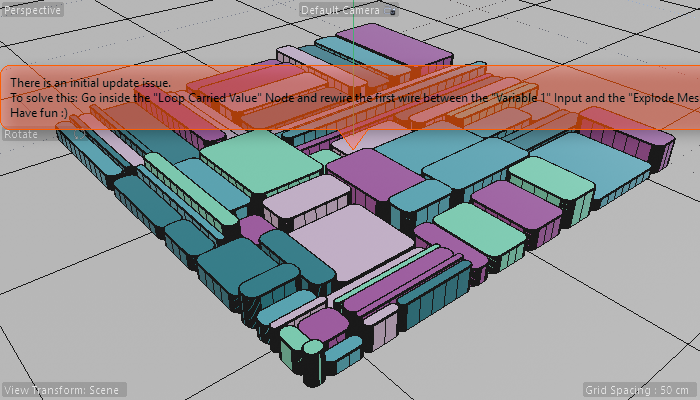 |
| 60 | 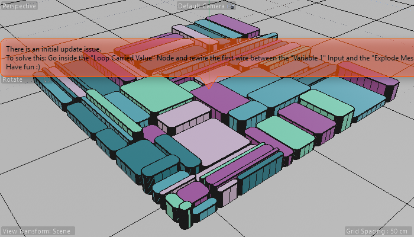 |
| 90 | 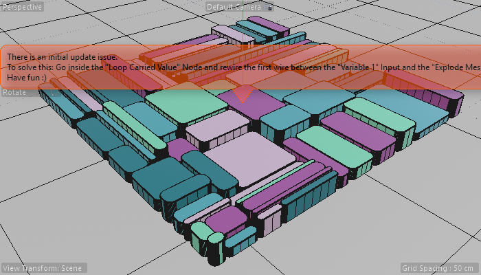 |
| 120 | 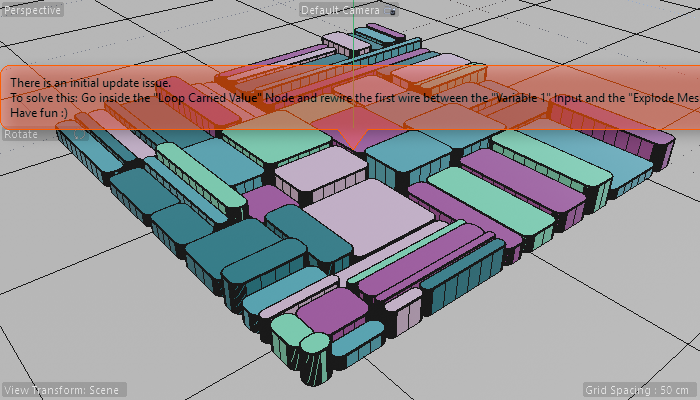 |

The pattern animates subtly over time — block heights and color modulate
because Speed=0.1 progressively offsets the random seed across frames.

## Slider sweeps (visual)

### Iterations: 1 vs 10
| Iterations=1 | Iterations=10 |
|---|---|
| 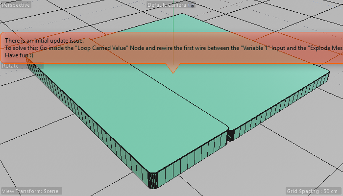 | 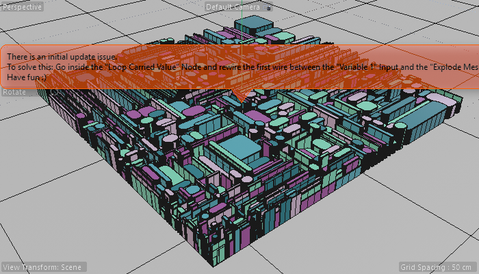 |

**Observation:** the *Iterations* slider IS the recursion-depth knob.
1 = single coarse split. 10 = nested-blocks-inside-nested-blocks fractal.
This is the visual essence of the scene.

### Scale: low vs high (recursion noise frequency)
| Scale=0.005 | Scale=0.05 |
|---|---|
| 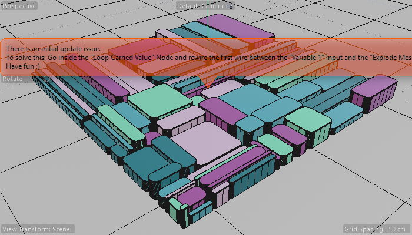 | 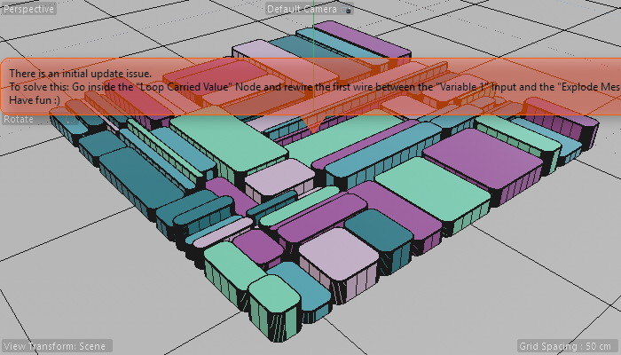 |

**Observation:** at low Scale the block heights are smoother / more
uniform; at high Scale the heights become chaotic per-poly. The Scale
controls the noise sampler's frequency that drives extrude amounts.

### Seed: 1 vs 9999
| Seed=1 | Seed=9999 |
|---|---|
| 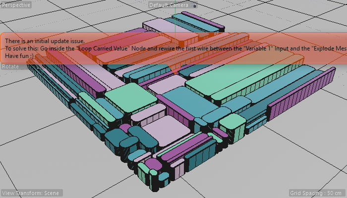 | 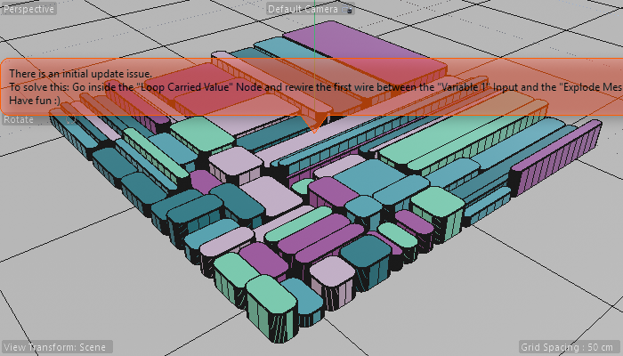 |

**Observation:** completely different which-polys-extruded layout. Same
geometry, different "which subset of polys gets extruded" choice.

### Global Seed: 1 vs 9999
| Global Seed=1 | Global Seed=9999 |
|---|---|
| 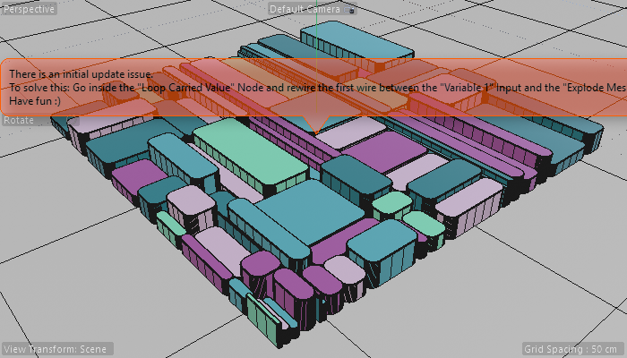 | 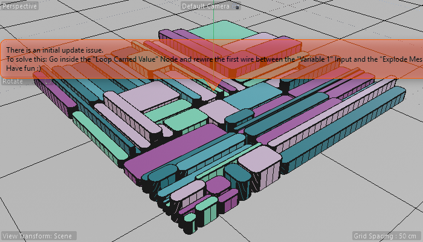 |

**Observation:** Global Seed shifts the WHOLE pattern (likely combined
with Seed via hash inputs). Different "macro" arrangement of where
recursion lands.

### Speed at frame 60: 0 vs 1.0
| Speed=0 (frozen) | Speed=1.0 (animated) |
|---|---|
| 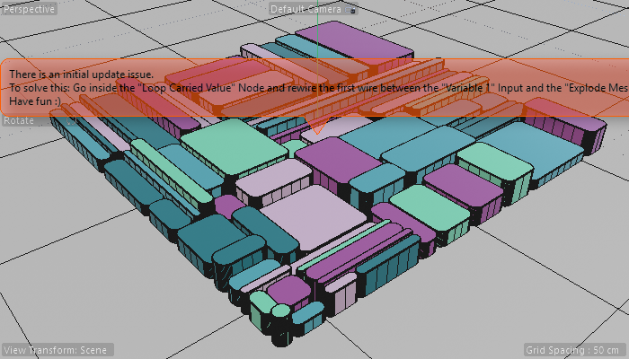 | 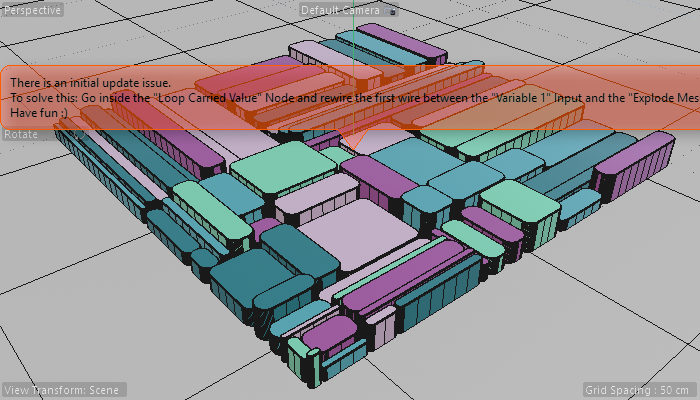 |

**Observation:** Speed is the time-multiplier on the seed offset. At
Speed=0 the geometry is identical at every frame. At Speed=1 every
frame produces a meaningfully-different layout (rapid shimmer).

## Architecture — the 20 functional nodes inside Nodes Mesh

### Core idea node

**`group@`** — the LCV (Loop Carried Value) wrapper. **This is THE node
that does the work.** Everything else is post-processing or scaffolding.
It iterates the geometry through N steps (driven by Iterations) with
auxiliary passthroughs for Chance/Seed/Speed/Scale/Global-Seed, and
emits `final._0` as the post-iteration mesh.

### The geometry output chain (final → root)

Reading backwards from `root.geometryout`:

```
root.geometryout
  ← set_property.geometryout       (tags final geom with named property)
      ← splinechamfer / extrudeline / tessellation chain
          ← assembler.geometryout    (rebuilds geometry from spline data)
              ← buildfromvalue.arrayout  (assembles control points)
                  ← readvalueatindex × 4  (reads accumulated arrays)
                      ← containeriteration (per-island iteration)
                          ← explode_islands.geometriesout
                              ← group.final._0   ← THE LCV OUTPUT
                                  ← plane.geometryout  ← initial source
```

### The 6 auxiliary AM passthroughs

The `group` (LCV) gets 6 auxiliary inputs wired from root.GetInputs():
- `in@bgKgX...` ← `range.out` (current iteration index — internal)
- `in@csrwp...` ← root.in@LdkY... (Global Seed)
- `in@eoqSC...` ← root.in@E1kT... (Noise Type)
- `in@WKvl_...` ← root.in@DPmC... (Speed)
- `in@EKbV1...` ← root.in@Fct6... (Scale)
- `in@J3BK5...` ← root.in@YBvg... (Seed)

These are AVAILABLE inside the LCV body each iteration without re-wiring —
the iteration-aware passthrough pattern from 0360.

### Iteration drivers
- `range` — `range.end ← root.Iterations`. Drives N iterations.
- `range.innerdomain → group.innerdomain` (loop scope binding)
- `arithmetic` — `arithmetic.in1 ← root.Global Seed` (seed mutation)
- `hash` × 2 — `hash.seed ← range.index, hash.salt ← Global Seed` (per-iteration random number generation)

### Post-LCV processing (recursive output of LCV → final geometry)
- `explode_islands` — splits the LCV's output into independent connected components
- `containeriteration` — iterates over those islands
- `get_property` / `readvalueatindex` × 4 / `buildfromvalue` / `type` — array introspection + accumulation
- `assembler` — rebuild geometry from accumulated control points
- `splinechamfer` — round/chamfer spline corners
- `extrudeline` — extrude line/spline shapes
- `tessellation` — refine for smoothness
- `set_property` — final tag → root.geometryout

## What's clever about this topology

1. **The LCV body uses `inset=100` extrude (per scene 0360 dissection)** —
   each iteration creates a new poly INSIDE each existing poly. After N
   iterations you have nested polys at N levels of depth. This is the
   geometric mechanism behind "recursive subdivision" — no actual
   subdivide-the-mesh op is needed; pure extrude with full inset does it.

2. **`explode_islands` after LCV** — splits the result into independent
   pieces so each can be post-processed independently. A "fan-out" pattern
   that lets you treat each recursion island as its own object.

3. **The Spline branch (Nodes Spline 180420700)** — captures the SAME
   recursive geometry as a spline (presumably via `edgetoline`) for
   sweeping in the render variant. **Twin-graph pattern** I documented
   earlier (Mesh + Spline producing the same effect on different stream
   types).

4. **Array-of-iteration accumulators** — `buildfromvalue` + 4×
   `readvalueatindex` is collecting per-iteration state into arrays for
   later inspection. This is how the post-LCV chain knows what the LCV
   did: not by iterating again, but by reading what was accumulated.

## Scaffolding (skip when recreating)

- All `> < context_externaltimeinput context_notime builder` — framework
- `multransform_5 / combine / mat / sqrpart / sqrtrans / vectrans` — Nodes Mesh root template internals (auto-managed)

## What I'd need to know to recreate this from scratch

| Capability | Have? |
|---|---|
| Create Nodes Mesh + add Plane primitive | ✅ |
| Create LCV with `types=[Geometry,Geometry]` and 6 auxiliary inputs | ❓ — I know LCV exists but the auxiliary `in@hash` ports are framework-magic |
| Configure extrude with `inset=100` for recursive nesting | ✅ |
| Wire LCV scope (innerdomain ← range.innerdomain) | ✅ |
| Hook hash(seed, iter_index) for per-iteration randomization inside LCV body | ✅ if hash is wired correctly |
| `explode_islands` + `containeriteration` for fan-out post-processing | ✅ |
| Spline assembler + splinechamfer + extrudeline for refined edges | ✅ |
| set_property on final to tag for material restriction | ✅ |
| Synthesize 6 AM-exposed root.GetInputs typed sliders | ✅ (synthesize_port v2) |
| Make the LCV+extrude→`inset=100`→explode_islands chain WORK on first load (without manual rewire) | ❌ — this is the bug the author documented |

**Recreation difficulty: Medium-Hard.** The mechanical wiring is achievable
with my current toolkit. The LCV-with-auxiliary-passthroughs pattern is
the trickiest part and I'd need to manually verify each `in@hash` port
maps correctly.

## Lessons for cinema4d-mcp

1. **`set_property` is the canonical "final tag + emit" node** — used on
   the geometry just before `root.geometryout` to tag the result with
   any final named selection or property. Should be in any output
   chain.
2. **`explode_islands` + `containeriteration`** is the canonical
   "do something per island/component" pattern. Worth a recipe.
3. **Author-documented bugs in scene annotations are real signal** —
   the LCV-rewire-issue tells me Maxon's framework has a load-order edge
   case in scenes where LCV's `current._0``next._0` self-binding doesn't
   activate until manually re-engaged. Useful gotcha for procedural-tool
   shipping (an asset saved cold may need a re-wire pass on load).
