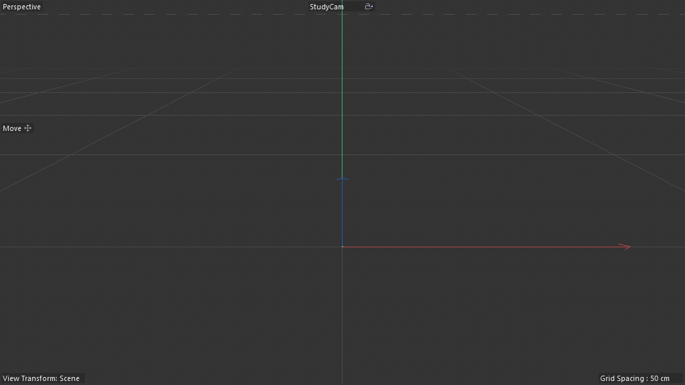
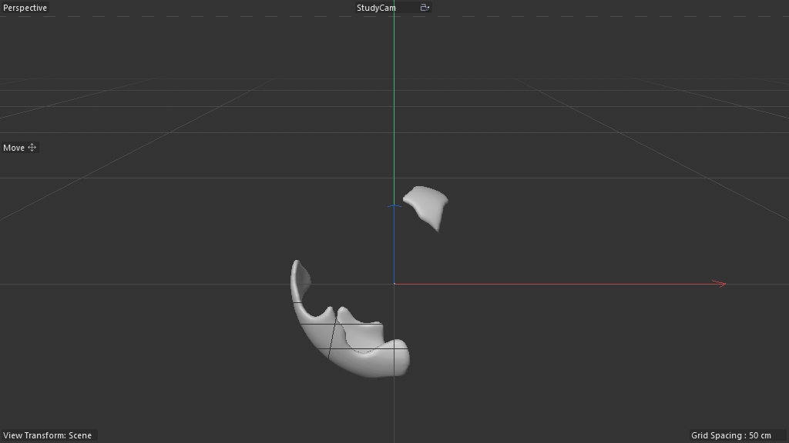
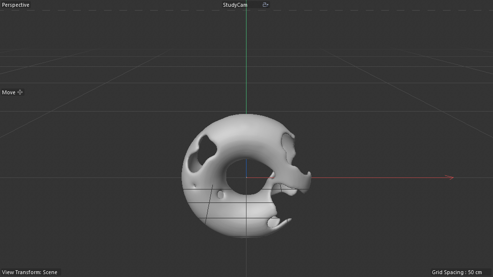
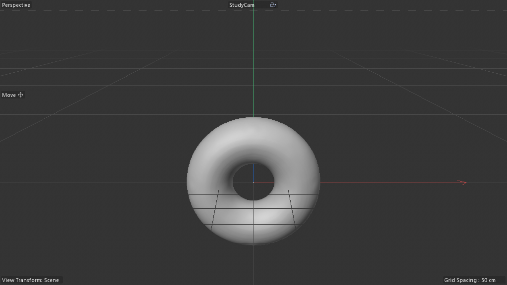

# Scene Study — Volume Infection (Spreading Growth + Volume Pipeline)

**Source:** `the reference build/scene_04_reference/the volume-infection practice scene`
**Studied:** 2026-05-01
**Methodology:** validated 8-step.

## What this scene does

Two seed points (`Point1`, `Point2`) are placed near a Torus. Each
frame, an "infection" spreads outward from those seeds along the
Torus surface — the Memory primitive accumulates a list of "infected"
positions, and each new frame's nearest-neighbor lookup adds more
candidate positions to that list. The infected positions are voxelized
via the `fillgeometry` (Volume Voxel Fill) node, fed into a Volume
Builder + Volume Mesher to produce a polygonized smooth-blobby surface.

Visually: small fleshy growths emerge at the seeds and expand outward
across the torus until the whole surface is enveloped.

## Object tree

```
Point1                  (Null, type 5140 — seed position)
Point2                  (Null, type 5140 — seed position)
Torus                   (5163 — input surface)
Volume Mesher           (1039861 — polygonizes the SDF)
  Volume Builder        (1039859 — builds SDF from voxel data)
    Object Group        (180420500 — Scene Nodes Generator / Neutron, 47 graph nodes)
```

The hierarchy *Volume Mesher → Volume Builder → Object Group* is the
canonical "Scene Nodes drives Volume Pipeline" stack:

1. Object Group's graph emits per-frame **point positions** (the infected set).
2. Volume Builder ingests them as voxel data → SDF.
3. Volume Mesher extracts a polygonal surface from the SDF.

This is the procedural-tool pattern for "growth/erosion/spreading"
effects without authoring any actual geometry — you author point
positions per frame, and the volume pipeline converts that point cloud
into a smooth blobby mesh.

## Frame evolution (default settings, sequentially stepped)

| Frame | Image |
|---|---|
| 0   |  |
| 60  |  |
| 120 |  |
| 200 |  |
| 333 |  |

**What you see:**

- f0: empty (only the seed nulls, hidden in screenshots)
- f60: two distinct fleshy fragments near the seed points
- f120: growths have expanded along the torus surface
- f200: nearly-complete torus envelope with a small residual seam scar
- f333: full envelope

## ⚠️ Critical gotcha — Memory needs sequential frame stepping

**Direct `SetTime(120)` produces 0 points; sequential 0→1→2→...→120
produces a fully evolved infection.** The Memory primitive's
self-feedback only propagates when frames are stepped contiguously —
jumping in time bypasses the per-frame state update.

```python
# WRONG — produces no growth:
doc.SetTime(c4d.BaseTime(120, fps))
doc.ExecutePasses(...)

# RIGHT — sequentially steps, Memory accumulates each frame:
for f in range(0, 121):
    doc.SetTime(c4d.BaseTime(f, fps))
    doc.ExecutePasses(...)
```

Confirmed by checking `Volume Mesher.GetCache().GetPointCount()`:

| Method | Frame | Points |
|---|---|---|
| Direct jump | 120 | 0 |
| Sequential | 5 | 18 |
| Sequential | 15 | 1432 |
| Sequential | 30 | 3858 |

**This is gotcha #57 worth committing.** Any Neutron simulation using
`memory@` requires frame-by-frame evaluation in MCP test loops.

## AM-exposed parameters

**Zero `floatingio` nodes** in this graph. Two parameters surface
directly via `root.in@...` ports without floatingio wrappers:

- `Voxel Size` — wired to `fillgeometry.Voxel Size`
- `Interior Filter` — wired to `fillgeometry.Interior Filter`

This is a **second AM-exposure pattern** (root-direct, no floatingio
wrapper) distinct from the canonical floatingio-routed pattern. Worth
noting that Neutron supports both. The floatingio wrapper is for
labeled/typed sliders; root-direct is for "wire it through and surface
the underlying node's port name."

## Architectural decomposition

### Multi-channel Memory — the discovery

Memory in scene 03 carried ONE state array (Chemical Array). Memory
in this scene carries **TWO state arrays** simultaneously: `Infection`
and `Neighbors`, each with their own self-feedback wire:

```
Memory.Infection.out._0  →  Memory.Infection.in._0
Memory.Neighbors.out._1  →  Memory.Neighbors.in._1
```

Multiple state channels via numbered ports (`_0`, `_1`, …). This means
the Memory primitive is general-purpose: any number of arrays can be
carried as state, each on its own indexed port.

### Append Elements — array growth pattern

The infection grows because each frame adds new positions to the
state array via `append@` ("Append Elements"):

```
append.Value  ←  Get Element._0      (the candidate next-infected position)
append.Count  ←  Greater Than.out    (a 0/1 boolean gate; 0=skip, 1=add)
```

The Greater Than compare gates whether each candidate gets added.
Combined with the Memory's per-frame state, this produces a list-
growth loop:

```
state[t]  =  state[t-1]  ⊕  filter(neighbors(state[t-1]))
```

**This is the `R9_array_growth_per_frame` recipe** — applies to any
spreading/growth/accumulation simulation: fire, infection, vines,
crystal growth, lichen.

### Volume Voxel Fill — graph→Volume Builder bridge

`fillgeometry@` is the magic node that converts the graph's point
cloud into voxel data the Volume Builder can read:

```
fillgeometry.Geometry        ←  Torus.geometry    (the underlying surface)
fillgeometry.Voxel Size      ←  Root AM port
fillgeometry.Interior Filter ←  Root AM port
fillgeometry.Distribution    →  Group.distdataout  (out to Volume Builder)
```

So: at each "infected" position, fill voxels within voxel-size
tolerance, restricted to the Torus interior (the Interior Filter cuts
off voxels that aren't on/in the Torus). The Volume Builder consumes
this `distdataout` stream directly — no intermediate file/cache.

### Closest Points — same K-NN pattern as scene 03

```
nearestneighbor.Geometry        ←  Torus geometry
nearestneighbor.Query Position  ←  per-iteration Iterate Collection
nearestneighbor.Exclude Index   ←  Wire Rerouter (excludes already-infected)
```

The `Exclude Index` input is new vs scene 03 — it lets the K-NN search
SKIP positions you already have, ensuring each query returns FRESH
candidate neighbors. Crucial for spreading simulations where you don't
want to re-infect an already-infected vertex.

### Containers — named state buckets

4× `container@` nodes with semantic names:
- `Strength` — per-position infection strength
- `Infection` — the spreading state (most central)
- `Neighbors` — current-iteration neighbor cache
- `Positions` — point positions array

Container nodes are passive value-holders — they carry a value with a
name, useful for organizing wires when many readers need the same
upstream value.

### Other named nodes

- `noise@` "Voronoi 1" — randomization source (likely jitter for spread direction)
- `spline@` "Spline Mapper" — curve mapping (likely for falloff or strength)
- `color@` "Color Op" — assigns color per voxel (could drive material gradient)
- `cube@` "Cube" — possibly the per-voxel particle shape
- `matrix@` "Matrix Op" — transform composition
- `concat@` "Concatenate" — array join
- `compare@` × 2 ("Greater Than", "Less Than") — threshold gates
- `buildfromvalue@` "Start Points" — initial seed array (Point1+Point2 → Memory.Infection.in initial value)
- `geometry@` "Geometry Op" — final emit
- 3× `legacyobjectaccess@` — Point1, Point2, Torus (OM bridges)
- 4× `containeriteration@` "Iterate Collection" — per-element iterators across multiple stages

## Pattern tags

`feedback_loop`, `simulation_bridge`, `volume_pipeline`,
`point_stream_iteration`, `legacy_object_bridge`, `array_processing`,
`time_animation`, `noise_driven`, `parameter_exposure`

## What's clever

1. **Multi-channel Memory.** Two simultaneously-carried state arrays
   (Infection, Neighbors) prove the primitive is general-purpose.
   Generalizes to: Lotka-Volterra (predator + prey), N-channel cellular
   automata, multi-species growth.

2. **Exclude Index on K-NN.** Ensures freshness of candidates per
   iteration. Without this, the simulation would oscillate between
   already-known neighbors.

3. **Volume Voxel Fill is the graph→volume bridge.** No intermediate
   particle objects, no FBX/Alembic dance — direct point-cloud-to-SDF
   wire. Makes any per-frame point-emitting graph a candidate for
   volumetric output.

4. **Two AM-exposure patterns coexist.** Floatingio (labeled,
   typed slider) AND direct-root-port (no wrapper, surfaces the
   underlying port name). Both produce AM-visible parameters but the
   first is curated and the second is raw passthrough.

5. **Sequential-only Memory evaluation.** This is the framework's
   signature for "this is a real simulation, not just a procedural
   evaluation." It also implies `executePasses` needs a contiguous
   timeline for accurate playback — important to know when shipping
   procedural tools to artists.

## Gotchas (engineering significance)

| # | Issue | Workaround |
|---|---|---|
| 1 | Memory primitive only updates on sequential SetTime; jumps produce stale state | Step contiguously in MCP test loops; never `SetTime(N)` for simulation scenes |
| 2 | `vis_e=2` on every object on fresh load | Force `ID_BASEOBJECT_VISIBILITY_EDITOR=0` per object (same as scene-02-style auto-flip) |
| 3 | No floatingio wrappers for AM ports — they surface as raw `Root.in@<hash>` | Detect both: floatingio.effectivename AND direct root.GetInputs() inspection |

## Rebuild recipe (plain English)

1. Create Volume Mesher → Volume Builder → Scene Nodes Generator (180420500) host stack.
2. Add seed Null objects (Point1, Point2) and an input Torus to the OM, alongside the host.
3. Inside the Neutron graph:
   a. legacyobjectaccess × 3 to read Point1, Point2, Torus.
   b. buildfromvalue (`Start Points`) initializing an array with Point1.position + Point2.position.
   c. memory primitive carrying TWO state channels (Infection, Neighbors).
   d. containeriteration over Memory.Infection — for each currently-infected position:
      - nearestneighbor on Torus geometry with Query Position = current, Exclude Index = already-infected indices
      - compare (Greater Than) gates whether to add the neighbor (e.g., distance < threshold, or random < probability)
      - append (Append Elements) appends the candidate to a working array, gated by compare.out
   e. fillgeometry voxelizes the final infection array (Geometry=Torus, Voxel Size + Interior Filter from root AM ports).
   f. Set the result on Geometry Op → root output.
4. Volume Builder reads `Geometry Op.distdataout` (the voxel stream).
5. Volume Mesher polygonizes the SDF → final visible mesh.
6. Expose Voxel Size + Interior Filter as root AM ports.

## Minimal reproducible subgraph — `R9_array_growth_per_frame`

The crown jewel: spreading-state simulation primitive.

**Purpose:** Per-frame array growth where each frame appends candidates from a neighbor query, gated by a threshold. Generalizes to any "spread" simulation.

**Node count:** 8 (the irreducible core)

**Nodes:**

```
1. legacyobjectaccess  (input surface)
2. legacyobjectaccess  (initial seed null)
3. buildfromvalue      (Start Points - initialize state array)
4. memory              (per-frame state buffer; .out._0 → .in._0 self-feedback)
5. containeriteration  (per-element iterator over current state)
6. nearestneighbor     (with Exclude Index to skip already-known)
7. compare + append    (gate + grow the array)
8. → set + geometry → root.geometry
```

**Exposed AM params:**
- Spread Threshold (Float) — compare's right-hand
- Search Radius (Float) — nearestneighbor's Maximum Distance

**Value proposition:** Spreading-state is the canonical primitive for
fire propagation, infection, lichen growth, crystal nucleation,
flood-fill, BFS/DFS-style traversal on irregular geometry. Combined
with the volume_pipeline pattern (fillgeometry → Volume Builder →
Volume Mesher) it produces production-ready volumetric growth without
any custom particle simulation.

**Recipe candidates from this scene:**

- `R9_array_growth_per_frame` — the spreading-state primitive (8 nodes)
- `R10_volume_pipeline_bridge` — graph→fillgeometry→Volume Builder→Volume Mesher (3-stage host stack)
- `R11_multi_channel_memory` — Memory carrying N state channels via _0/_1/…  (the building block for any multi-species sim)

## Lessons for cinema4d-mcp

1. **`fillgeometry@` is THE graph→volume bridge.** Document and recipe-fy.
2. **Memory's port count is variable** — supports N state channels via numbered ports. Synthesizer needs to handle this.
3. **Sequential-only simulation evaluation** is a runtime constraint that affects: viewport_screenshot(frame=N), render_frame, scene_assert. They must step sequentially, not jump.
4. **Detect AM-exposure WITHOUT floatingio wrapper.** Walk root.GetInputs() directly; not all hosts use the floatingio idiom.
5. **Visibility=2 on fresh load** is universal across the reference build scenes — needs an auto-fix in load helpers.

## Recreation difficulty

**Hard.** Same blockers as scene 03 (Neutron synthesize_port not yet
supported, Memory self-feedback wiring) plus:

- multi-channel Memory (numbered output ports)
- fillgeometry node (volume-bridge primitive — needs MCP exposure)
- Exclude Index pattern on nearestneighbor (port mapping)
- Sequential-step evaluation in test harnesses

But once those are in place, the scene compresses to ~12 nodes worth of
recipe — a real artist-shippable spread simulation in a graph an LLM
can author.
