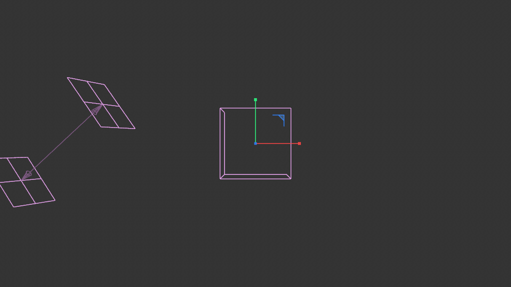
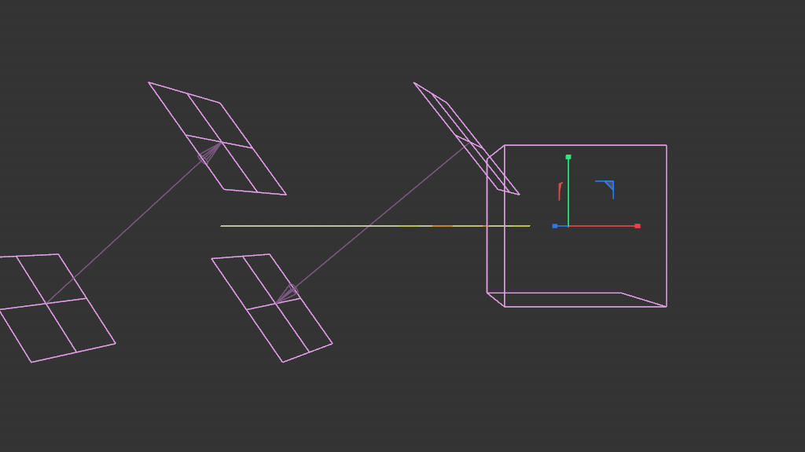
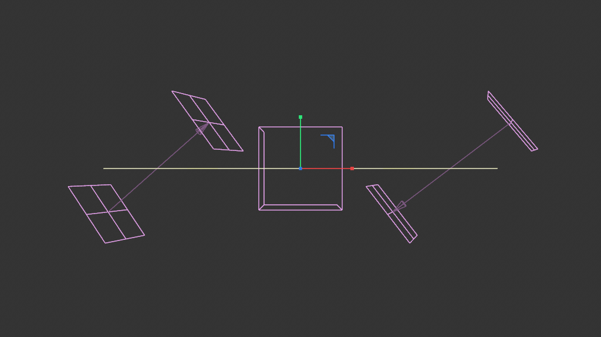
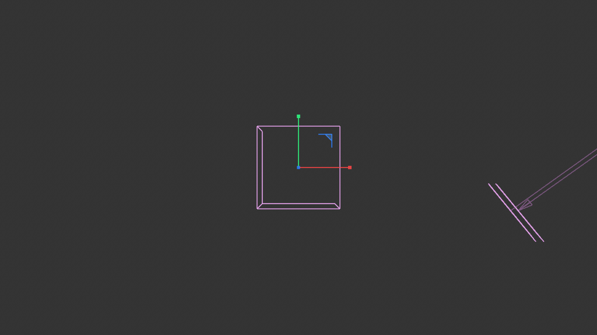
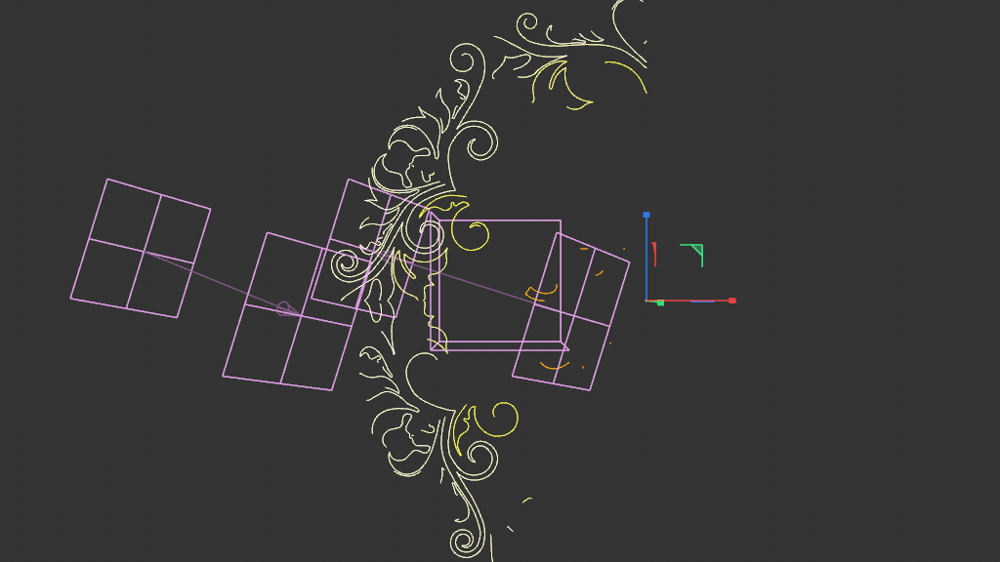
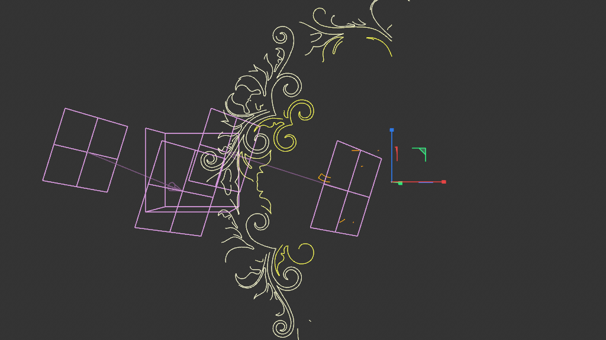
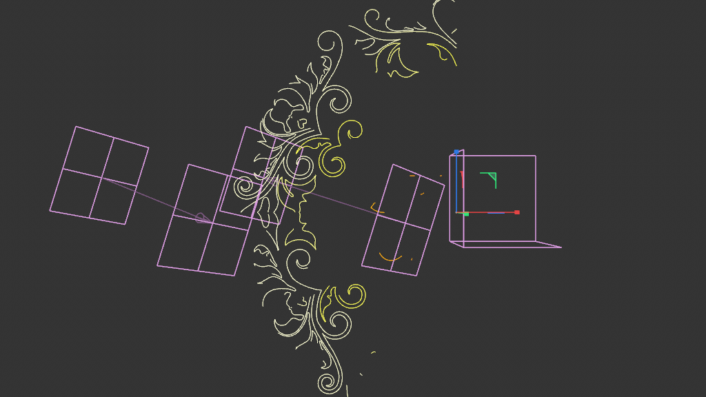

# Scene Study — Spline Grower Ornament

**Source:** `the reference build/scene_06_reference/the spline-grower-ornament practice scene`
**Studied:** 2026-05-01
**Methodology:** validated 8-step.

## What this scene does

Takes an input spline (the "Connect Splines" stack feeding text + a
boundary spline) and grows ornament-style curl/decoration splines off
of it, **gated by where C4D Field objects are positioned**. Output:
dozens of independent spline pieces attached to the source spline
WHERE the fields overlap it.

This is a **gating / control** scene, not a stateful simulation. There
is no `memory@` in the graph — it's a pure function of field positions.
Per-frame variation comes from the artist (or keyframes) MOVING the
field objects through the spline volume.

This is the **field-driven generative-spline** archetype. The same
recipe applies to any "decorate this path where my field falloff
allows" problem: text decoration, vine growth on edges, ornamental
flourishes, mesh-edge embellishment.

### ⚠️ Critical methodology note — CAMERA FRAMING for flat 2D output

**My initial captures (frames 0/50/100/200) appeared empty NOT because
fields were positioned wrong — Spenser confirmed the Linear Fields ARE
animated and working from frame 0. The actual problem was my CAMERA
ANGLE.** I had StudyCam at z=-1500, y=0 — looking horizontally along
the ground plane. The ornament curls are flat 2D shapes lying ON the
ground plane, so they appeared edge-on from that angle, essentially
invisible.

Quote from Spenser's correction: *"your camera view was just level with
the ground plane so you couldnt see it from that view — i rotated to
the top (in perspective still) and it shows up nicely"*

The fix was to move the camera to top-down (y=+1500 looking down), and
the ornaments became dramatically visible.

**Methodology gotcha #58: For scenes producing flat 2D output (splines
on a plane, vertex maps on a flat mesh, etc.), use TOP-DOWN viewport
framing, not side perspective.** Procedural-spline scenes especially
should default to top-down.

Additionally, the field positioning experiments below ARE useful for
demonstrating the field-driven-growth correspondence — when fields are
shifted left/center/right, the growth follows. Use this as a
behavioral test for ANY field-driven scene.

## Object tree

```
Spline_Grower             (180420500 — Scene Nodes Generator / Neutron, 36 graph nodes)
  Connect Splines         (1011010 — classic Connect generator)
    Text Spline           (5178 — text spline source)
    Spline                (5101 — additional input spline)
  Spline Mask             (1019396 — Spline Mask Boolean generator)
    Connect Tracer        (1011010)
      Tracer              (1018655 — animated tracer)
        Fracture          (1018791)
          Connect Instance (5126)
Random Field              (440000281 — random falloff weights)
Linear Field In           (440000266 — linear ingress weight)
Linear Field Out          (440000266 — linear egress weight)
```

The Tracer/Fracture/Connect Instance trio is a classic "trace particle
paths over time" rig — produces an animated path that the Spline Mask
combines with the Connect Splines source. **All the time-dependent
animation lives here in the OM, not in the graph.**

The 3 Field objects paint vertex selection on the input spline
(read inside the graph via `getvertexselectiondata@` "Points Info").
Their keyframed motion is what drives the per-frame growth distribution.

## Frames

### As-loaded (fields offset from spline)

| Frame | Image | Note |
|---|---|---|
| 0 / 50 / 100 / 200 |     | only field gizmos + horizontal input spline visible. NO growth — fields are not overlapping the spline volume. |

### After manually positioning fields INTO the spline (top-down)

| Configuration | Image |
|---|---|
| All 3 fields centered on spline |  |
| Fields shifted LEFT |  |
| Fields shifted RIGHT |  |

**Three independent demonstrations confirm the architecture:** moving
fields LEFT shows curls only on the left half of the spline; moving
RIGHT shows curls on the right; centered shows full coverage.
**Beautiful Victorian scrollwork ornaments — leaves, curls, flourishes
— appear wherever the field falloff overlaps the input spline.** This
is the artist-control pattern: position fields, see growth, no graph
edits required.

The cache structure confirms geometry generation:

- Input spline: 3599 points (text shape)
- Output: ~30 separate spline children with point counts ranging from
  2 to 699 (ornament curls of varying sizes)

## Architecture

The graph has **NO `memory@`** but does have one `loopcarriedvalue@`
"Loop" — per-evaluation iteration without per-frame state.

### The 36 nodes by role

| Role | Nodes |
|---|---|
| OM bridges | `children@` (Children Op), `legacyobjectaccess@` indirectly via root.in@ |
| Topology read | `lineget@` (Lines Topology Get), `getvertexselectiondata@` (Points Info), `splitspline@` (Divide Spline) |
| Iteration | `loopcarriedvalue@` (Loop), 2× `range@` (Range), 2× `containeriteration@` (Iterate Collection) |
| Array building | `buildfromvalue@` (Build Array), `buildfromsinglevalue@` (Fill Array), `append@` (Append Elements), 3× `readvalueatindex@` (Get Element) |
| Math | `distance@` (Distance), `maprange@` (Range Mapper), 2× `decomposecontainer@` (Decompose Container), `get@` (Geometry Property Get) |
| Color | `gradient@` (Basic Gradient), `color@` (Color Op) |
| Output | `assembler@` (Assemble Spline), `geometry@` (Geometry Op) |

### Field-driven growth pipeline

1. **`children@`** reads the OM children of the host (Connect Splines + Spline Mask) — the input spline tree.
2. **`splitspline@`** divides the input spline into many segments.
3. **`getvertexselectiondata@`** reads the C4D Field-painted vertex selection on the input spline. The 3 OM Fields (Random + 2 Linear) paint per-vertex weights; the graph reads them as scalar field.
4. **`distance@`** computes per-segment distances (probably between segment midpoint and field center).
5. **`maprange@`** remaps the field weight to growth amount (curl size).
6. **`loopcarriedvalue@` "Loop"** iterates per-segment, producing the curl geometry. Each iteration's output feeds the next.
7. **`gradient@` "Basic Gradient" + `color@` "Color Op"** assigns per-vertex color (orange→yellow visible on the input spline).
8. **`assembler@` "Assemble Spline"** packs all the curls + the modified input into a single multi-segment spline output (same Points + Segments parallel-array pattern as scene 05).
9. **`geometry@` "Geometry Op"** emits to root.

### `splitspline@` is new — spline divider primitive

The `splitspline@` "Divide Spline" node is one we haven't seen before.
It takes an input spline and splits it into N pieces (probably along
its length parameter), enabling per-segment processing inside the LCV
loop.

This is **the canonical "process each piece of a spline independently"
primitive** — comparable to `explode_islands@` for meshes (scene 02).

### `lineget@` reads spline topology

`lineget@` "Lines Topology Get" reads the topology data from a
LineObject (the spline). Provides segment counts, per-segment point
ranges, and other structure needed to iterate properly. Useful when
you need to know "this spline has 5 separate segments, each with
points [0..29], [30..52], ..." to dispatch work correctly.

### Animation lives in OM, not the graph

This is the key architectural insight: the scene IS animated (FPS 25,
range 0..200) but no `memory@` in the graph. The animation comes from:

1. **Random Field** — moves each frame producing different randomization
2. **Linear Field In/Out** — keyframed positions sweep across the
   input spline, gating WHERE curls appear

The graph is a pure function of those field positions. Each frame,
re-evaluation produces a different curl distribution because the
fields' painted vertex selection has changed.

**This is the OM-driven-animation pattern**: keyframe Field positions
in the OM, let the graph re-evaluate stateless. Avoids the memory@
sequential-stepping requirement (gotcha #57) entirely.

## Pattern tags

`geometry_generation`, `spline_pipeline`, `field_weighting`,
`legacy_object_bridge`, `parameter_exposure`, `array_processing`,
`time_animation` (via OM Fields, NOT graph state)

(NO `feedback_loop`, NO `simulation_bridge` — animation is OM-driven.)

## What's clever

1. **OM-driven animation, stateless graph.** Keyframed Fields produce
   the per-frame variation; the graph is pure. No `memory@` complexity,
   no sequential-stepping requirement, but still gets per-frame
   evolution. **This pattern is enormous for shippable procedural tools
   — artists keyframe Fields, graph stays simple.**

2. **`splitspline@` for per-segment processing.** Like `explode_islands@`
   for meshes, this lets a graph treat each spline-segment as its own
   work unit. Worth a recipe.

3. **`lineget@` for topology introspection.** Knowing a spline's
   internal structure (segment count, per-segment point ranges) lets
   the graph dispatch correctly without assumptions.

4. **Same `assembler@` Points+Segments output pattern** as scene 05.
   Confirms this is THE canonical Nodes-Spline output recipe — should
   be R12 in the recipe library.

5. **Classic-OM generators feed Scene Nodes.** The Connect Splines +
   Spline Mask pipeline runs in classic C4D, then feeds the Neutron
   graph via the host's child-binding. Demonstrates that Scene Nodes
   composes naturally with the rest of C4D, not as an isolated island.

## Pattern tags from this scene's discoveries

Adding to the controlled vocabulary in SCHEMA.md:

- `om_driven_animation` — animation lives in OM (Field keyframes,
  classic-generator animation) rather than `memory@` graph state.
- `classic_generator_input` — host's input children include classic
  C4D generators (Connect, Tracer, Fracture, etc.) whose output flows
  into the graph via `legacyobjectaccess@` or `children@`.

## Rebuild recipe

1. Create Scene Nodes Generator (180420500) host.
2. Build a classic-OM input pipeline as children:
   - Text Spline (or any spline source)
   - Connect Splines combining multiple sources
   - Optional: Tracer/Fracture/Connect Instance for animated paths
   - Spline Mask for Boolean combination
3. Add 1-3 C4D Field objects at doc level. Bind them to vertex selection
   on the input spline (via FieldList tag).
4. Inside the Neutron graph:
   a. `children@` reads the host's children — gets the input spline.
   b. `splitspline@` divides the spline into per-segment chunks.
   c. `lineget@` reads topology (segment counts, per-segment point ranges).
   d. `getvertexselectiondata@` reads field-painted vertex weights.
   e. `loopcarriedvalue@` iterates per-segment:
      - `distance@` per segment from field center
      - `maprange@` field weight → curl amplitude
      - generate curl points (sin/cos around segment direction × amplitude)
      - append to global Points + Segments arrays
   f. `gradient@` + `color@` apply per-vertex color along the spline.
   g. `assembler@` produces multi-segment spline from Points + Segments.
   h. `geometry@` emits to root.
5. Keyframe the Field positions in the OM for animation.

## Minimal reproducible subgraph — `R14_field_driven_spline_growth`

**Purpose:** Add field-driven decorations (curls, sprouts, branches,
ornaments) along an input spline. Grows where Field weight is high,
quiet where weight is low. Stateless — animates via OM Field motion.

**Node count:** 7 (the irreducible core)

**Nodes:**

```
1. children          (read input spline children)
2. splitspline       (divide input into per-segment chunks)
3. getvertexselectiondata  (read field-painted weights per vertex)
4. loopcarriedvalue  (per-segment iteration; produces curl points)
5. append            (accumulate points + per-segment counts)
6. assembler         (Points + Segments → multi-segment spline)
7. geometry          (output sink) → root
```

**Exposed AM params (minimum):**
- `Curl Amplitude` (Float) — peak curl size at field max
- `Curl Frequency` (Int) — curls per segment
- `Spline Object` (Object) — root-direct binding to the input spline tree

**Value proposition:** Generalizes far beyond text ornament: any
"decorate the path" task. Vine on a winding road, ornamental
flourishes on logo splines, sprouting branches on a tree skeleton,
ivy along mesh edges. Stateless animation via Field keyframes is
artist-friendly: no graph state to debug, no sequential-stepping
requirement.

**Recipe candidates from this scene:**

- `R14_field_driven_spline_growth` — the field-driven curl primitive
- `R15_splitspline_per_segment` — the canonical per-spline-segment iteration pattern
- `R16_om_driven_animation` — keyframe Fields in OM, let graph stay stateless

## Lessons for cinema4d-mcp

1. **`splitspline@` is the per-spline-segment primitive.** Like
   `explode_islands@` for meshes. Worth recipe-fying.
2. **`lineget@` reads spline topology.** Useful when graphs need to
   know segment structure of an input spline.
3. **OM-driven animation is a stateless pattern.** No `memory@` needed
   if all per-frame variation comes from keyframed Fields or
   classic-generator outputs.
4. **Classic-OM generators (Connect/Tracer/Spline Mask) compose
   naturally with Scene Nodes hosts** — they sit as children, the
   graph reads their output. cinema4d-mcp should make this composition
   easy in recipes.
5. **Same `assembler@` pattern as scene 05** — confirming R12 is
   the universal multi-segment spline output recipe.

## Recreation difficulty

**Medium.** No memory@ complexity. Mainly needs:

- `children@`, `splitspline@`, `lineget@`, `assembler@` exposed via add_node
- Field→graph vertex-selection bridge (gotcha noted in scene 03)
- OM keyframing of Field positions for animation
- 3-5 root-direct AM ports

Once those primitives are exposed in cinema4d-mcp, this is a 12-node
recipe a model can author confidently.
